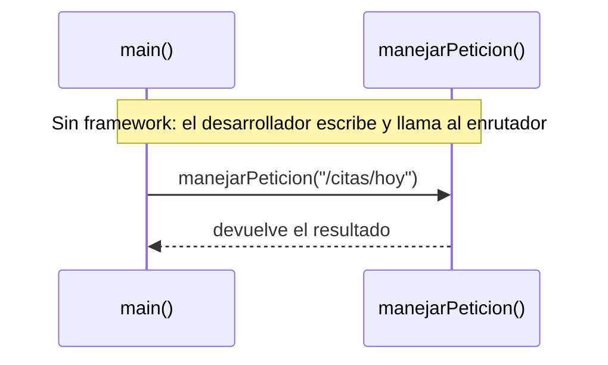
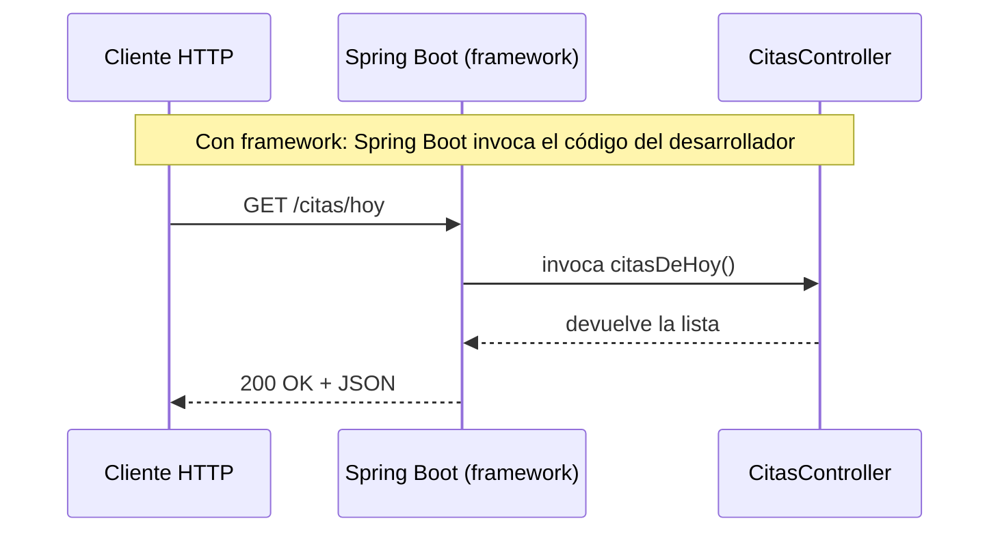

# 💡 Ejemplo 01 — ¿Qué son los frameworks?

## 🌍 Contexto

Antes de escribir la primera línea de Spring Boot conviene entender **qué tipo de
herramienta es**: un framework. Un framework es un entorno de desarrollo que
proporciona una estructura predefinida para construir aplicaciones profesionales,
de forma que resulten escalables, dinámicas y mantenibles. Incluye librerías,
herramientas y utilidades pensadas para reducir el esfuerzo repetitivo en
proyectos grandes, como sería construir desde cero el sistema de citas de
MediSalud o el de préstamos de la Biblioteca Universitaria.

El objetivo principal de un framework es facilitar el **desarrollo ágil de
software**: construir aplicaciones de forma más eficiente y en menos tiempo. Esto
es especialmente valioso en aplicaciones web complejas, donde hay que gestionar
grandes volúmenes de datos e integraciones entre módulos (por ejemplo, citas,
historias clínicas y facturación dentro de un mismo sistema MediSalud).

**Qué busca demostrar este ejemplo**: que resolver el mismo problema (responder
una petición sobre las citas del día) "a mano" y con un framework no es
solamente escribir menos código, sino invertir **quién decide cuándo se ejecuta
el código del desarrollador** — la esencia de la Inversión de Control.

## 🧠 Concepto: las cinco características de un framework

| Característica | Qué significa |
|---|---|
| **Escalabilidad** | Permite expandir y adaptar el proyecto a necesidades nuevas del negocio sin afectar su estructura principal. |
| **Inversión de Control (IoC)** | Desacopla la gestión de dependencias, delegándola a un contenedor del framework; mejora la reutilización de código y la modularidad. |
| **Modelo Vista-Controlador (MVC)** | Estandariza la organización del código, separando responsabilidades (qué se muestra, qué se procesa, qué datos existen) y facilitando el mantenimiento. |
| **Minimizar código repetitivo** | Gracias a su estructura modular y a componentes reutilizables, reduce la necesidad de escribir el mismo código una y otra vez. |
| **Bases generales auto-gestionadas** | Maneja de forma integrada aspectos transversales (seguridad, acceso a datos, presentación de vistas), reduciendo la complejidad del desarrollo. |

## 📖 Historia, en breve

Los frameworks surgieron como respuesta a un problema recurrente: cada equipo que
construía una aplicación empresarial terminaba resolviendo, una y otra vez, los
mismos problemas de base (cómo organizar el código, cómo conectar con una base de
datos, cómo exponer una página web), muchas veces de forma distinta e
incompatible entre proyectos. Los frameworks empaquetan esas soluciones ya
probadas, para que cada equipo parta de una base común en vez de reinventarla. En
el mundo Java, esta evolución llevó primero a frameworks como Struts, luego a
Spring (2003), y más adelante a Spring Boot (2014), que se estudia en detalle más
adelante en este módulo.

## 💻 Código — sin framework (dispatcher manual, Java puro y ejecutable)

Para sentir en carne propia qué resuelve un framework, esta primera versión
**no usa Spring**: el propio programa tiene que decidir, a mano, qué código
ejecutar para cada "ruta" solicitada.

```java
import java.util.List;
import java.util.Map;
import java.util.function.Supplier;

public class SinFrameworkDemo {

    record Cita(String paciente, String especialidad) {}

    // El propio programa debe simular "recibir una petición" y decidir qué hacer
    static List<Cita> citasDeHoy() {
        return List.of(
                new Cita("Ana Gómez", "Cardiología"),
                new Cita("Luis Pérez", "Pediatría")
        );
    }

    // Sin framework, hay que escribir a mano el "enrutador" que decide qué método llamar
    static String manejarPeticion(String ruta) {
        Map<String, Supplier<String>> rutasDisponibles = Map.of(
                "/citas/hoy", () -> citasDeHoy().toString()
        );
        Supplier<String> manejador = rutasDisponibles.get(ruta);
        return manejador != null ? manejador.get() : "404 Not Found";
    }

    public static void main(String[] args) {
        System.out.println(manejarPeticion("/citas/hoy"));
        System.out.println(manejarPeticion("/citas/ayer"));
    }
}
```

## 💻 Código — con framework (Spring Boot: el mismo resultado, sin dispatcher propio)

```java
// Con framework (Spring Boot): el desarrollador solo declara el "qué"
@RestController
public class CitasController {

    @GetMapping("/citas/hoy")
    public List<Cita> citasDeHoy() {
        return servicioCitas.obtenerCitasDeHoy(); // el framework hace el resto
    }
}
```

Nótese que este segundo bloque **no tiene un `main` que llame a `citasDeHoy()`**:
el `main` de la aplicación (`SpringApplication.run(...)`, que se ve completo en
el Ejemplo 07) arranca Spring Boot, y es Spring Boot quien invoca
`citasDeHoy()` automáticamente cuando llega una petición `GET /citas/hoy` real.

## 🗺️ Diagrama: quién llama a quién





En el primer diagrama, `main()` decide cuándo llamar al enrutador: el control
es del desarrollador. En el segundo, nadie en el código del desarrollador
llama a `citasDeHoy()`: es Spring Boot quien lo invoca al recibir la petición
— la inversión de control, vista como flujo de llamadas.

## 🧭 Explicación paso a paso

1. En `SinFrameworkDemo`, el propio `main` arma el mapa de rutas y decide a mano
   qué método corresponde a cada una: ese trabajo de "enrutar" es código que el
   desarrollador debe escribir, mantener y probar.
2. En la versión con Spring Boot, ese mismo trabajo de enrutamiento (y todo el
   manejo de sockets, protocolo HTTP y conversión a JSON) ya está resuelto por el
   framework: el desarrollador solo declara la ruta con `@GetMapping` y el
   framework decide cuándo invocar el método.
3. Esta es la esencia de un framework: no es solo código reutilizable (como
   `Map.of(...)` sería en el primer ejemplo), es una **estructura completa** que
   invierte el control — llama al código del desarrollador en vez de que el
   desarrollador la llame a ella.

## ✅ Resultado esperado

Al ejecutar `SinFrameworkDemo.main(...)`:

```text
[Cita[paciente=Ana Gómez, especialidad=Cardiología], Cita[paciente=Luis Pérez, especialidad=Pediatría]]
404 Not Found
```

Con Spring Boot corriendo (Ejemplo 07), una petición real equivalente se ve así:

```text
GET http://localhost:8080/citas/hoy
→ 200 OK
→ [{"paciente":"Ana Gómez","especialidad":"Cardiología"}, {"paciente":"Luis Pérez","especialidad":"Pediatría"}]
```

## ❓ Preguntas de repaso

**1. [Selección]** ¿Cuál de las siguientes **no** es una característica de un
framework?

- **A.** Escalabilidad.
- **B.** Inversión de Control.
- **C.** Garantiza que el programa se ejecute más rápido.
- **D.** Minimizar código repetitivo.

<details>
<summary>🔑 Ver respuesta</summary>

**Respuesta correcta: C**. Un framework no garantiza velocidad de ejecución; sus
características son estructurales (escalabilidad, IoC, MVC, minimizar
repetición, bases auto-gestionadas), no de rendimiento.

</details>

**2. [Selección múltiple]** Sobre `SinFrameworkDemo`, seleccioná **todas** las
afirmaciones correctas.

- **A.** El propio `main` decide, a través de `manejarPeticion`, qué código
  ejecutar para cada ruta.
- **B.** `manejarPeticion` funciona como un enrutador escrito a mano.
- **C.** En la versión con Spring Boot, el framework invoca `citasDeHoy()` sin
  que el desarrollador lo llame explícitamente en un `main`.
- **D.** Un framework nunca podría resolver el mismo problema que
  `SinFrameworkDemo`.

<details>
<summary>🔑 Ver respuesta</summary>

**Respuestas correctas: A, B, C**. La D es falsa: Spring Boot resuelve
exactamente el mismo problema, solo que invirtiendo quién llama a quién.

</details>

**3. [Abierta]** Con tus propias palabras, explicá qué significa que "un
framework invierte el control", usando como referencia la diferencia entre
`SinFrameworkDemo` y `CitasController`.

<details>
<summary>🔑 Ver respuesta modelo</summary>

**Respuesta modelo**: En `SinFrameworkDemo`, el propio programa decide, dentro
de su `main`, cuándo y qué método ejecutar para cada ruta. En `CitasController`,
el desarrollador no llama a `citasDeHoy()` en ningún lado: escribe el método y
lo anota, y es Spring Boot quien decide cuándo invocarlo (al llegar una petición
HTTP a esa ruta). El control sobre "cuándo se ejecuta mi código" pasó del
desarrollador al framework — eso es la inversión de control.

</details>
