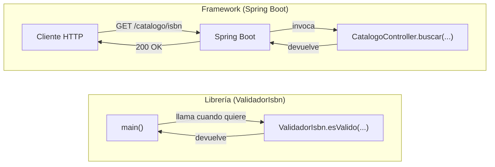

# 💡 Ejemplo 03 — Diferencias entre frameworks y librerías

## 🌍 Contexto

Spring Boot (un framework) y una librería de validación de ISBN (una librería,
Ejemplo 02) conviven en el mismo proyecto de Biblioteca Universitaria, pero
cumplen roles muy distintos. Reconocer esa diferencia evita un error común de
principiante: tratar cualquier dependencia agregada al proyecto como si fuera "lo
mismo".

**Qué busca demostrar este ejemplo**: que el mismo criterio (quién controla el
flujo) permite clasificar sin ambigüedad cualquier herramienta nueva que se
agregue al proyecto, comparando lado a lado un `main` que llama a una librería
por su cuenta contra un método que un framework invoca sin que el desarrollador
lo pida explícitamente.

## 🔍 Análisis comparado

| Criterio | Framework | Librería |
|---|---|---|
| **Quién controla el flujo** | El framework llama al código del desarrollador (Inversión de Control): el desarrollador rellena "huecos" dentro de una estructura ya definida. | El código del desarrollador llama a la librería, cuando y donde la necesita. |
| **Estructura impuesta** | Sí: define paquetes, ciclo de vida, convenciones de nombrado y organización del proyecto. | No: se integra libremente, sin imponer cómo se organiza el resto del programa. |
| **Alcance** | Suele abarcar la aplicación completa (web, datos, seguridad). | Suele resolver una necesidad puntual y acotada (validar un formato, convertir JSON, formatear una fecha). |
| **Reemplazo** | Cambiar de framework generalmente implica reescribir buena parte de la aplicación. | Cambiar de librería suele afectar solo el código que la invoca directamente. |
| **Ejemplo en este curso** | Spring Boot organiza toda la aplicación (controladores, servicios, repositorios). | Una librería de validación de ISBN solo resuelve esa validación puntual. |

## 🧠 La clave: quién llama a quién

Esta diferencia se resume en una idea, ya introducida como Inversión de Control en
el Ejemplo 01: con una librería, el desarrollador tiene el control ("yo llamo a la
librería cuando quiero"); con un framework, el control se invierte ("el framework
me llama a mí cuando corresponde: al recibir una petición HTTP, al arrancar la
aplicación, al inyectar una dependencia").

## 💻 Código completo — el lado "librería" (ejecutable)

```java
public class QuienLlamaAQuienDemo {

    static class ValidadorIsbn {
        static boolean esValido(String isbn) {
            return isbn.replace("-", "").length() == 13;
        }
    }

    public static void main(String[] args) {
        // Librería: el desarrollador decide cuándo llamarla, y en qué orden
        System.out.println("Antes de validar...");
        boolean valido = ValidadorIsbn.esValido("978-3-16-148410-0");
        System.out.println("¿ISBN válido? " + valido);
        System.out.println("Después de validar: el programa sigue su propio flujo.");
    }
}
```

## 💻 Código — el lado "framework" (solo se ejecuta dentro de un contexto Spring)

```java
// Framework (Spring Boot): el framework decide cuándo llamar al código del desarrollador
@RestController
public class CatalogoController {
    @GetMapping("/catalogo/{isbn}")
    public Libro buscar(@PathVariable String isbn) {
        // este método lo invoca Spring Boot al recibir una petición GET,
        // no lo invoca directamente el desarrollador
        return servicioCatalogo.buscarPorIsbn(isbn);
    }
}
```

Este segundo bloque **no tiene un `main` propio que llame a `buscar(...)`**: a
propósito. Ejecutarlo requiere que Spring Boot arranque el contenedor (Ejemplo
07) y reciba una petición HTTP real; el desarrollador nunca escribe
`catalogoController.buscar("...")` en ningún `main`.

## 🗺️ Diagrama: los dos flujos, lado a lado



La flecha que **entra** a la lógica del desarrollador nace en lugares
distintos: en la librería, nace en el propio `main()`; en el framework, nace
afuera (el cliente HTTP), pasando primero por Spring Boot. Ese único detalle
—de dónde viene la flecha que activa el código— es la diferencia completa
entre ambos.

## 🧭 Explicación paso a paso

1. En `QuienLlamaAQuienDemo`, el propio `main` decide, línea por línea, cuándo se
   llama a `ValidadorIsbn.esValido(...)`: antes, después, o ni siquiera llamarlo.
   Ese control es del desarrollador.
2. En `CatalogoController`, el desarrollador **nunca** escribe una llamada a
   `buscar(...)`: ese método existe para que Spring Boot lo invoque cuando llega
   una petición HTTP a `/catalogo/{isbn}`. El control quedó invertido.
3. Ninguna forma es "mejor" en abstracto: una librería es la herramienta correcta
   para una necesidad puntual y acotada; un framework es la herramienta correcta
   cuando se necesita una estructura completa y consistente para toda la
   aplicación.

## ✅ Resultado esperado

Al ejecutar `QuienLlamaAQuienDemo.main(...)`:

```text
Antes de validar...
¿ISBN válido? true
Después de validar: el programa sigue su propio flujo.
```

El lado framework, con Spring Boot corriendo y una petición real:

```text
GET http://localhost:8080/catalogo/978-3-16-148410-0
→ 200 OK
→ { "isbn": "978-3-16-148410-0", ... }
```

## 📌 Idea clave

Spring Boot es un framework porque organiza la aplicación completa e invierte el
control; una librería de validación, de conversión de JSON o de manejo de fechas
sigue siendo una librería aunque se use **dentro** de un proyecto Spring Boot: la
distinción depende de su rol, no del proyecto en el que aparece.

## ❓ Preguntas de repaso

**1. [Selección]** ¿Qué determina, según este ejemplo, si una herramienta es un
framework o una librería?

- **A.** Su tamaño en líneas de código.
- **B.** Quién controla el flujo de ejecución.
- **C.** Si el código tiene anotaciones.
- **D.** El nombre del paquete donde vive.

<details>
<summary>🔑 Ver respuesta</summary>

**Respuesta correcta: B**. El criterio decisivo es la Inversión de Control:
quién llama a quién, no el tamaño, las anotaciones ni el nombre del paquete.

</details>

**2. [Selección múltiple]** Sobre `CatalogoController.buscar(...)` en este
ejemplo, seleccioná **todas** las afirmaciones correctas.

- **A.** El desarrollador lo invoca explícitamente desde un `main`.
- **B.** Spring Boot lo invoca al recibir una petición HTTP `GET`.
- **C.** Es un ejemplo de Inversión de Control.
- **D.** Tiene el mismo tipo de control que `ValidadorIsbn.esValido(...)`.

<details>
<summary>🔑 Ver respuesta</summary>

**Respuestas correctas: B, C**. La A es falsa (a propósito, no hay `main` que lo
llame); la D es falsa: `ValidadorIsbn` la llama el desarrollador, `buscar(...)`
lo llama el framework — es el contraste central del ejemplo.

</details>

**3. [Abierta]** Una utilidad que formatea fechas se agrega como dependencia
dentro de un proyecto Spring Boot. ¿Por qué sigue siendo una librería, y no pasa
a ser parte del framework?

<details>
<summary>🔑 Ver respuesta modelo</summary>

**Respuesta modelo**: Porque la distinción depende del rol que cumple, no de en
qué proyecto se usa. Esa utilidad de fechas sigue siendo invocada explícitamente
por el desarrollador (`FormateadorFecha.formatear(...)`), en el punto exacto
donde se necesita, y no impone ninguna estructura al resto del proyecto ni
decide cuándo se ejecuta el código del desarrollador. Que conviva dentro de un
proyecto Spring Boot no cambia quién controla el flujo cuando se la usa.

</details>
