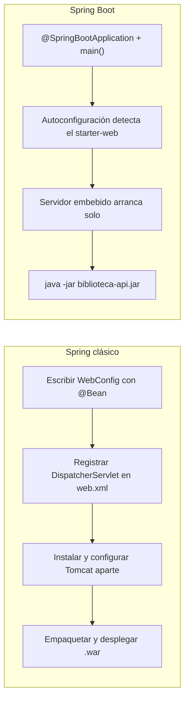

# 💡 Ejemplo 07 — ¿Qué es Spring Boot? Historia y características

## 🌍 Contexto

Spring Boot es un marco de desarrollo moderno que revolucionó la construcción de
aplicaciones Java empresariales. Su propósito es simplificar la creación, la
configuración y el despliegue de aplicaciones, priorizando la **convención sobre
la configuración**: en vez de que el desarrollador declare a mano cada detalle,
Spring Boot asume valores por defecto razonables y solo pide configuración
explícita cuando el proyecto se aparta de esa convención. Esto permite enfocarse
en la lógica de negocio (por ejemplo, las reglas de MediSalud o de Biblioteca
Universitaria) en vez de en configuraciones extensas.

Spring Boot empaqueta las aplicaciones como **ejecutables independientes** en
formato `.jar` o `.war`, lo que facilita el despliegue: no hace falta instalar un
servidor aparte ni copiar archivos sueltos a un servidor externo. Además, se
integra sin fricción con el resto del ecosistema Spring: Spring Data JPA (acceso a
bases de datos), Spring Security (seguridad) y Thymeleaf (vistas web), entre otros
— piezas que se irán viendo en los módulos siguientes del curso.

**Qué busca demostrar este ejemplo**: que, para levantar el mismo endpoint web,
todo lo que Spring clásico exige configurar a mano (beans, `web.xml`, un
servidor externo) se reduce a una anotación y una clase con `main` en Spring
Boot; y que las seis características de Spring Boot no son ideas abstractas,
sino explicaciones concretas de qué automatiza cada paso de esa reducción.

## 📖 Historia, en breve

- **2003 — Spring Framework**: nace para simplificar el desarrollo empresarial en
  Java (J2EE en ese momento), que exigía mucha configuración y código repetitivo
  para tareas básicas.
- **Con el tiempo**: Spring resolvió ese problema original, pero su propia
  configuración (archivos XML, luego clases `@Configuration`) se volvió extensa a
  medida que los proyectos crecían y sumaban módulos (web, datos, seguridad).
- **2014 — Spring Boot**: se publica para resolver ese nuevo problema —la
  configuración del propio Spring— aplicando autoconfiguración, *starters* y un
  servidor embebido. No reemplaza a Spring: lo empaqueta de una forma mucho más
  simple de usar.

## 💻 Código — Spring clásico (configuración manual)

```java
// 1) Configuración explícita del contexto: qué beans existen y cómo se conectan
@Configuration
@EnableWebMvc
public class WebConfig {

    @Bean
    public CatalogoController catalogoController() {
        return new CatalogoController();
    }
}
```

```xml
<!-- 2) web.xml: registrar manualmente el DispatcherServlet de Spring MVC -->
<servlet>
    <servlet-name>dispatcher</servlet-name>
    <servlet-class>org.springframework.web.servlet.DispatcherServlet</servlet-class>
    <init-param>
        <param-name>contextConfigLocation</param-name>
        <param-value>com.biblioteca.config.WebConfig</param-value>
    </init-param>
</servlet>
```

```text
3) Empaquetar como .war e instalar/configurar un servidor de aplicaciones
   (Tomcat, Jetty, WildFly) por separado, con la versión y el puerto correctos.
```

## 💻 Spring Boot (mismo resultado): así se vería en VS Code

```text
📁 biblioteca-api
└── 📁 src/main
    ├── 📁 java/com/biblioteca/api
    │   ├── 📄 BibliotecaApiApplication.java  (▶️ clase con el main que se ejecuta)
    │   └── 📄 CatalogoController.java
    └── 📁 resources
        └── 📄 application.properties
```

### 💻 Archivo: `BibliotecaApiApplication.java`

```java
@SpringBootApplication // agrupa @Configuration + autoconfiguración + escaneo de componentes
public class BibliotecaApiApplication {
    public static void main(String[] args) {
        SpringApplication.run(BibliotecaApiApplication.class, args);
    }
}
```

### 💻 Archivo: `CatalogoController.java`

```java
@RestController
public class CatalogoController {

    @GetMapping("/catalogo")
    public String catalogo() {
        return "Catálogo de la Biblioteca Universitaria";
    }
}
```

### 💻 Archivo: `application.properties`

```properties
# configuración mínima, con valores por defecto razonables
server.port=8080
```

## 🔍 Análisis comparado

| Paso manual en Spring clásico | Qué hace Spring Boot en su lugar |
|---|---|
| Declarar cada bean web a mano (`WebConfig`) | **Autoconfiguración**: detecta `spring-boot-starter-web` en el classpath y configura Spring MVC con valores por defecto razonables |
| Registrar el `DispatcherServlet` en `web.xml` | Ya viene configurado por el *starter*; solo se agregan controladores con `@RestController` |
| Instalar y configurar un servidor externo (Tomcat/Jetty) | **Servidor embebido**: la aplicación se ejecuta con `java -jar`, sin instalar nada aparte |
| Elegir a mano versiones de Spring MVC, Jackson, el servidor, etc. compatibles entre sí | **Starter** (`spring-boot-starter-web`): agrupa dependencias ya probadas como compatibles entre sí |

## 🗺️ Diagrama: los mismos cuatro pasos, antes y después



Los cuatro pasos manuales de la izquierda se resuelven, de a uno, con las
características de la derecha: cada característica de Spring Boot que se
explica a continuación es la respuesta a uno de esos pasos.

## 🧠 Las seis características principales de Spring Boot

### 1. Configuración automática

Spring Boot examina qué dependencias hay en el proyecto y configura la aplicación
según eso: si detecta `spring-boot-starter-web`, configura Spring MVC; si detecta
un driver de base de datos, configura una fuente de datos. Esto es exactamente lo
que se vio en la comparación de arriba.

### 2. Incrustación de servidor

Spring Boot incluye servidores **embebidos** (Tomcat por defecto, o Jetty/Undertow
si se elige explícitamente). La aplicación se ejecuta con `java -jar
biblioteca-api.jar` y el servidor arranca **dentro** del mismo proceso; no es
necesario instalar Tomcat aparte. También es posible empaquetar como `.war`
tradicional si se necesita desplegar en un servidor externo ya existente, pero no
es la forma por defecto.

### 3. Inicio rápido

Con una única anotación (`@SpringBootApplication`) y una clase con un método
`main`, ya existe una aplicación Spring Boot funcional. Agregar un endpoint nuevo
es tan simple como escribir un método anotado `@GetMapping` dentro de una clase
`@RestController`, como se vio arriba.

### 4. Arquitecturas de microservicios

Spring Boot es la base más usada para construir **microservicios**: servicios
pequeños e independientes (por ejemplo, un servicio de citas y otro de
facturación en MediSalud) que se despliegan, escalan y actualizan por separado.
El servidor embebido y el empaquetado como `.jar` ejecutable hacen que cada
microservicio sea una unidad de despliegue autocontenida.

### 5. Gestión de dependencias con *starters*

Un *starter* (por ejemplo `spring-boot-starter-web`, `spring-boot-starter-data-jpa`)
agrupa un conjunto de dependencias ya verificadas como compatibles entre sí para
una necesidad concreta. En vez de elegir manualmente versiones de Spring MVC,
Jackson y un servidor que funcionen bien juntas, se agrega un único starter.

### 6. Monitorización con actuadores

El *starter* `spring-boot-starter-actuator` agrega endpoints de administración y
monitoreo listos para usar, sin escribirlos a mano:

```properties
# pom.xml (fragmento): agregar el starter de actuadores
# <dependency>
#   <groupId>org.springframework.boot</groupId>
#   <artifactId>spring-boot-starter-actuator</artifactId>
# </dependency>
```

```text
GET http://localhost:8080/actuator/health
→ 200 OK
→ {"status":"UP"}
```

## ✅ Resultado esperado

```text
GET http://localhost:8080/catalogo
→ 200 OK
→ Catálogo de la Biblioteca Universitaria
```

## 📌 Idea clave

Spring Boot **no reemplaza** los conceptos de Spring (IoC, DI, beans, MVC): los
empaqueta con seis características que eliminan configuración manual repetitiva
—autoconfiguración, servidor embebido, inicio rápido, aptitud para microservicios,
starters y actuadores— para que el equipo de desarrollo se concentre en la lógica
de negocio.

## ❓ Preguntas de repaso

**1. [Selección]** ¿Por qué nace Spring Boot en 2014?

- **A.** Para reemplazar completamente a Spring con un framework nuevo.
- **B.** Para resolver la configuración que el propio Spring había acumulado
  con el tiempo.
- **C.** Porque Spring dejó de mantenerse.
- **D.** Para eliminar la necesidad de escribir código Java.

<details>
<summary>🔑 Ver respuesta</summary>

**Respuesta correcta: B**. Spring (2003) resolvió la complejidad de J2EE, pero
su propia configuración creció con el tiempo; Spring Boot (2014) automatiza esa
configuración, sin reemplazar los conceptos de Spring.

</details>

**2. [Selección múltiple]** Seleccioná **todas** las que son características
reales de Spring Boot.

- **A.** Configuración automática.
- **B.** Exige instalar Tomcat por separado antes de arrancar.
- **C.** Servidor embebido.
- **D.** *Starters* que agrupan dependencias compatibles entre sí.

<details>
<summary>🔑 Ver respuesta</summary>

**Respuestas correctas: A, C, D**. La B es falsa: el servidor viene embebido,
por eso no hace falta instalar Tomcat aparte.

</details>

**3. [Abierta]** Comparando el bloque "Spring clásico" con el de "Spring Boot"
de este ejemplo, ¿qué tres pasos manuales desaparecen?

<details>
<summary>🔑 Ver respuesta modelo</summary>

**Respuesta modelo**: Desaparecen (1) declarar cada bean web a mano en una clase
`@Configuration` como `WebConfig`, (2) registrar el `DispatcherServlet` en un
`web.xml`, y (3) instalar y configurar un servidor externo (Tomcat/Jetty) por
separado. Spring Boot los reemplaza con autoconfiguración, un starter web, y un
servidor embebido, respectivamente.

</details>
