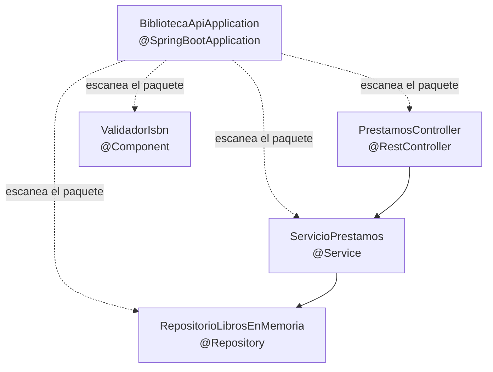

# 💡 Ejemplo 09 — Anotaciones en Spring Boot

## 🌍 Contexto

Las anotaciones en Java son metadatos que agregan información al código fuente
sin afectar directamente su ejecución: son una forma de "etiquetar" una clase o
un método para que una herramienta (en este caso, Spring Boot) sepa qué hacer con
ella. En Spring Boot, las anotaciones son el mecanismo principal para definir
componentes, configurar la aplicación y administrar el ciclo de vida de los
objetos, evitando los archivos de configuración extensos (por ejemplo, XML) que
exigía Spring en sus primeras versiones.

## 🧠 Propósito y ventajas

**Propósito**: reemplazar la configuración manual (archivos XML, registros
explícitos) por marcas directamente sobre el código, para mapear rutas HTTP,
declarar beans, configurar inyección de dependencias y fijar parámetros de
configuración con el mínimo esfuerzo.

**Ventajas**:

- **Menos código repetitivo**: no hace falta declarar cada bean en un archivo de
  configuración aparte.
- **Mayor legibilidad**: el propósito de una clase o método se entiende con solo
  mirar sus anotaciones (`@RestController` ya dice "esta clase expone endpoints
  HTTP").
- **Integración automática con el ecosistema Spring**: al reconocer una
  anotación, Spring Boot activa el comportamiento correspondiente sin
  configuración adicional.

**Qué busca demostrar este ejemplo**: que un conjunto pequeño de anotaciones
(`@Repository`, `@Service`, `@RestController`, un mapeo HTTP y
`@SpringBootApplication`) alcanza para transformar cuatro clases Java comunes en
una API funcional completa —sin un solo archivo de configuración XML—, y que
cada anotación comunica, solo con su nombre, qué responsabilidad cumple esa
clase dentro de la arquitectura por capas.

## 🔍 Anotaciones más comunes en Spring Boot

| Anotación | Dónde se usa | Qué hace |
|---|---|---|
| `@SpringBootApplication` | Clase principal | Combina configuración, autoconfiguración y escaneo de componentes (Ejemplo 07). |
| `@Component` | Cualquier clase | Marca una clase como bean genérico administrado por el contenedor IoC (Ejemplo 10). |
| `@Service` | Clase de lógica de negocio | Es un `@Component` especializado semánticamente: indica que la clase contiene reglas de negocio (por ejemplo, `ServicioPrestamos`). |
| `@Repository` | Clase de acceso a datos | Es un `@Component` especializado para el acceso a datos; en módulos posteriores también traduce excepciones de la base de datos. |
| `@RestController` | Clase que expone una API | Combina `@Controller` (bean web) y `@ResponseBody` (la respuesta de cada método se serializa, por ejemplo a JSON) automáticamente. |
| `@GetMapping`, `@PostMapping`, `@PutMapping`, `@DeleteMapping` | Método dentro de un `@RestController` | Asocian ese método a una ruta HTTP y a un verbo (`GET`, `POST`, `PUT`, `DELETE`). |
| `@Autowired` | Constructor, setter o campo | Le indica a Spring qué dependencia inyectar (Ejemplo 11 la explica en profundidad). |
| `@Configuration` | Clase de configuración | Marca una clase como fuente de definición de beans mediante métodos `@Bean`. |

## 🌳 Árbol de archivos (como se vería en VS Code)

```text
📁 biblioteca-api
└── 📁 src
    ├── 📄 ValidadorIsbn.java
    ├── 📄 RepositorioLibrosEnMemoria.java
    ├── 📄 ServicioPrestamos.java
    ├── 📄 PrestamosController.java
    └── 📄 BibliotecaApiApplication.java   (▶️ clase con el main que se ejecuta)
```

## 💻 Archivo: `ValidadorIsbn.java`

```java
@Component // bean genérico administrado por el contenedor
public class ValidadorIsbn {
    public boolean esValido(String isbn) { /* ... */ return true; }
}
```

## 💻 Archivo: `RepositorioLibrosEnMemoria.java`

```java
@Repository // especialización de @Component para acceso a datos
public class RepositorioLibrosEnMemoria implements RepositorioLibros {
    @Override
    public Optional<Libro> buscarPorIsbn(String isbn) { /* ... */ return Optional.empty(); }
}
```

## 💻 Archivo: `ServicioPrestamos.java`

```java
@Service // especialización de @Component para lógica de negocio
public class ServicioPrestamos {

    private final RepositorioLibros repositorioLibros;

    public ServicioPrestamos(RepositorioLibros repositorioLibros) { // ver Ejemplo 11
        this.repositorioLibros = repositorioLibros;
    }

    public boolean prestar(String isbn) {
        return repositorioLibros.buscarPorIsbn(isbn).isPresent();
    }
}
```

## 💻 Archivo: `PrestamosController.java`

```java
@RestController // expone endpoints HTTP
public class PrestamosController {

    private final ServicioPrestamos servicioPrestamos;

    public PrestamosController(ServicioPrestamos servicioPrestamos) {
        this.servicioPrestamos = servicioPrestamos;
    }

    @GetMapping("/prestamos/{isbn}") // GET /prestamos/{isbn}
    public boolean prestar(@PathVariable String isbn) {
        return servicioPrestamos.prestar(isbn);
    }
}
```

## 💻 Archivo: `BibliotecaApiApplication.java`

```java
@SpringBootApplication // clase principal: arranca el contenedor y escanea los @Component de arriba
public class BibliotecaApiApplication {
    public static void main(String[] args) {
        SpringApplication.run(BibliotecaApiApplication.class, args);
    }
}
```

## 🗺️ Diagrama: qué anotación tiene cada bean, y cómo se conectan



`ValidadorIsbn` queda aislado en el diagrama a propósito: es un `@Component`
genérico que ningún otro bean de este ejemplo usa todavía, mientras que
`PrestamosController → ServicioPrestamos → RepositorioLibrosEnMemoria` forma
la cadena real que atiende una petición HTTP. La flecha punteada desde
`BibliotecaApiApplication` no es una dependencia: representa el escaneo que
descubre y registra a los otros cuatro como beans.

## 🧭 Explicación paso a paso

1. `@Component`, `@Service` y `@Repository` hacen exactamente lo mismo a nivel
   técnico (registran la clase como bean), pero comunican una **intención**
   distinta: qué tipo de responsabilidad tiene cada clase dentro de la
   arquitectura por capas del Ejemplo 08.
2. El constructor de `ServicioPrestamos` no necesita escribir `@Autowired`
   explícitamente: desde Spring 4.3, si una clase tiene un **único** constructor,
   Spring lo usa automáticamente para inyectar sus dependencias (Ejemplo 11).
3. `@RestController` sobre `PrestamosController` es lo que le permite a Spring
   Boot invocar el método `prestar(...)` cuando llega una petición `GET` a
   `/prestamos/{isbn}` — el mismo mecanismo de inversión de control explicado en
   el Ejemplo 03: el framework llama al método, no el desarrollador.
4. `@PathVariable` es una anotación adicional, a nivel de parámetro, que le indica
   a Spring de dónde extraer el valor `isbn` (de la propia URL).
5. `BibliotecaApiApplication` es la clase principal: su `main` (`SpringApplication.run(...)`)
   es lo único que el desarrollador ejecuta directamente; a partir de ahí, Spring
   Boot escanea el paquete, registra los cuatro `@Component` de arriba como beans,
   y queda esperando peticiones HTTP.

## ✅ Resultado esperado

```text
GET http://localhost:8080/prestamos/978-3-16-148410-0
→ 200 OK
→ true   (o false, según si el libro existe en el repositorio)
```

## 📌 Idea clave

Ninguna de estas anotaciones ejecuta código por sí misma en el momento en que
Java compila la clase: son leídas por Spring Boot al arrancar la aplicación, que
decide qué hacer según cada anotación. Por eso son "metadatos": describen el
código, y es el framework quien actúa en consecuencia.

## ❓ Preguntas de repaso

**1. [Selección]** ¿Qué anotación combina `@Controller` (bean web) y
`@ResponseBody` (serializar la respuesta) automáticamente?

- **A.** `@Service`.
- **B.** `@Component`.
- **C.** `@RestController`.
- **D.** `@Configuration`.

<details>
<summary>🔑 Ver respuesta</summary>

**Respuesta correcta: C**. `@RestController` es exactamente esa combinación,
pensada para exponer una API.

</details>

**2. [Selección múltiple]** Sobre `@Autowired` en este ejemplo, seleccioná
**todas** las afirmaciones correctas.

- **A.** Es obligatorio agregarlo si la clase tiene un único constructor.
- **B.** Le indica a Spring qué dependencia inyectar.
- **C.** Puede usarse sobre un constructor, un setter o un campo.
- **D.** Nunca puede aparecer junto a `@Service` en la misma clase.

<details>
<summary>🔑 Ver respuesta</summary>

**Respuestas correctas: B, C**. La A es falsa (desde Spring 4.3 es opcional con
un único constructor); la D es falsa: `ServicioPrestamos` de este mismo ejemplo
tiene `@Service` y podría llevar `@Autowired`.

</details>

**3. [Abierta]** ¿Por qué se dice que una anotación es un "metadato" y no
código que se ejecuta?

<details>
<summary>🔑 Ver respuesta modelo</summary>

**Respuesta modelo**: Porque escribir `@Service` sobre una clase no hace que
pase nada en el momento de compilar ni de cargar esa clase: es solo información
adicional adjunta al código. Esa información recién produce un efecto cuando
algo la **lee e interpreta** — en este caso, Spring Boot al escanear el paquete
al arrancar la aplicación, que decide entonces registrar esa clase como bean,
mapear una ruta, etc.

</details>
