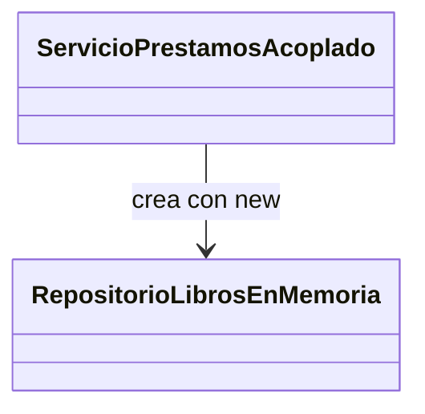
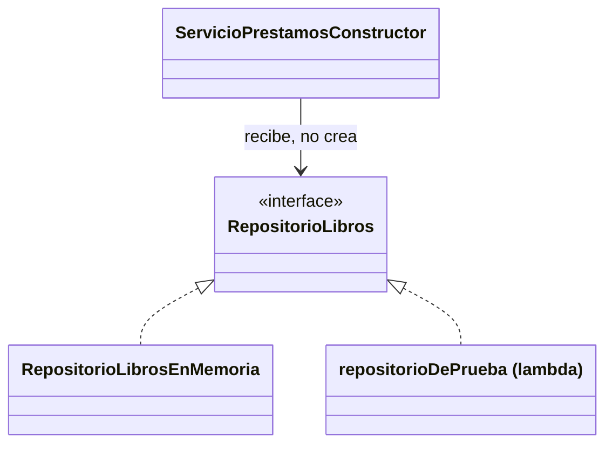

# 💡 Ejemplo 02 — Inyección de Dependencias: de la clase acoplada a la clase desacoplada

## 🌍 Contexto

La Inyección de Dependencias (DI) es un patrón de diseño que permite a una
clase **recibir** los objetos que necesita para funcionar, en vez de crearlos
o gestionarlos ella misma. Esto promueve el desacoplamiento: la clase ya no
depende de una implementación concreta, sino de una abstracción (una
interfaz). En el Módulo 1 ya usaste este patrón (Ejemplo 11); acá se explica
**por qué** funciona, partiendo del problema que resuelve.

**Qué busca demostrar este ejemplo**: que sin Inyección de Dependencias, una
clase que crea su propia dependencia con `new` queda fuertemente acoplada a
una implementación concreta —cualquier cambio en esa implementación, o la
necesidad de reemplazarla en un test, obliga a modificar la clase—; y que
recibiendo esa misma dependencia desde afuera (por constructor o por
propiedades), la clase queda desacoplada, sin cambiar en nada su lógica de
negocio.

## 📚 Caso de estudio

Biblioteca Universitaria: `ServicioPrestamos`, que necesita un
`RepositorioLibros` para funcionar.

## 🌳 Árbol de archivos (como se vería en VS Code)

En Java, cada clase o interfaz pública va en su propio archivo `.java`. Si
abrieras este ejemplo como una carpeta en VS Code, el panel `EXPLORER` se
vería así:

```text
📁 ejemplo-02-inyeccion-dependencias
└── 📁 src
    ├── 📄 RepositorioLibros.java           (interfaz — del Módulo 1, Ejemplo 11)
    ├── 📄 Libro.java                       (record — del Módulo 1, Ejemplo 11)
    ├── 📄 RepositorioLibrosEnMemoria.java  (del Módulo 1, Ejemplo 11)
    ├── 📄 ServicioPrestamosAcoplado.java   (nuevo — versión con el problema)
    ├── 📄 ServicioPrestamosConstructor.java (nuevo — inyección por constructor)
    ├── 📄 ServicioPrestamosSetter.java     (nuevo — inyección por setter)
    └── 📄 Main.java                        (nuevo — ▶️ clase con el main que se ejecuta)
```

Los primeros tres archivos se reutilizan tal cual del Módulo 1 (Ejemplo 11),
sin modificar una línea; se repiten completos abajo para que este ejemplo sea
autocontenido, aunque no hayas resuelto ese ejercicio antes. Los cuatro
archivos nuevos son los que se muestran a continuación, cada uno con el
nombre exacto del archivo en el que iría.

<details>
<summary>📄 Ver código completo de <code>RepositorioLibros.java</code>, <code>Libro.java</code> y <code>RepositorioLibrosEnMemoria.java</code> (reutilizados del Módulo 1, Ejemplo 11)</summary>

## 💻 Archivo: `RepositorioLibros.java`

```java
public interface RepositorioLibros {
    Optional<Libro> buscarPorIsbn(String isbn);
}
```

## 💻 Archivo: `Libro.java`

```java
public record Libro(String isbn, String titulo) {}
```

## 💻 Archivo: `RepositorioLibrosEnMemoria.java`

```java
public class RepositorioLibrosEnMemoria implements RepositorioLibros {

    private final List<Libro> libros = List.of(
            new Libro("978-3-16-148410-0", "Estructuras de Datos")
    );

    @Override
    public Optional<Libro> buscarPorIsbn(String isbn) {
        return libros.stream().filter(libro -> libro.isbn().equals(isbn)).findFirst();
    }
}
```

</details>

## 💻 Archivo: `ServicioPrestamosAcoplado.java`

```java
public class ServicioPrestamosAcoplado {

    // La clase crea su propia dependencia: queda acoplada a esta implementación concreta
    private final RepositorioLibros repositorioLibros = new RepositorioLibrosEnMemoria();

    public boolean prestar(String isbn) {
        return repositorioLibros.buscarPorIsbn(isbn).isPresent();
    }
}
```

## 🚧 El problema de esta versión

Si quisieras probar `ServicioPrestamosAcoplado` con datos de prueba (por
ejemplo, un repositorio falso que siempre encuentra el libro pedido), no
podrías: la clase decidió, en su propio código, que usa
`RepositorioLibrosEnMemoria`, y no hay forma de cambiar eso desde afuera sin
modificar `ServicioPrestamosAcoplado`. Este es exactamente el problema que
tendría una clase `Vehículo` que crea su propio `Motor` con `new`: queda
acoplada a esa implementación concreta de motor.

## 💻 Archivo: `ServicioPrestamosConstructor.java`

```java
public class ServicioPrestamosConstructor {

    private final RepositorioLibros repositorioLibros; // recibido, no creado

    public ServicioPrestamosConstructor(RepositorioLibros repositorioLibros) {
        this.repositorioLibros = repositorioLibros;
    }

    public boolean prestar(String isbn) {
        return repositorioLibros.buscarPorIsbn(isbn).isPresent();
    }
}
```

## 💻 Archivo: `ServicioPrestamosSetter.java`

```java
public class ServicioPrestamosSetter {

    private RepositorioLibros repositorioLibros; // no puede ser final

    public void setRepositorioLibros(RepositorioLibros repositorioLibros) {
        this.repositorioLibros = repositorioLibros;
    }

    public boolean prestar(String isbn) {
        return repositorioLibros.buscarPorIsbn(isbn).isPresent();
    }
}
```

## 🗺️ Diagrama: acoplada vs. desacoplada

### 🚧 Con acoplamiento (`ServicioPrestamosAcoplado.java`)



La flecha apunta a una **clase concreta**: no hay forma de cambiar el destino
sin editar `ServicioPrestamosAcoplado.java`.

### 💡 Sin acoplamiento (`ServicioPrestamosConstructor.java`)



La flecha apunta a la **interfaz**, no a una clase concreta: cualquiera de las
dos implementaciones de abajo puede conectarse, elegida desde afuera —eso es
lo que permite enchufar `repositorioDePrueba` en un test, sin tocar
`ServicioPrestamosConstructor.java`.

## 💻 Archivo: `Main.java` (▶️ clic derecho → "Run Java" en VS Code)

```java
public class Main {
    public static void main(String[] args) {
        RepositorioLibros repositorioReal = new RepositorioLibrosEnMemoria();
        RepositorioLibros repositorioDePrueba = isbn -> Optional.of(new Libro(isbn, "Libro simulado"));

        // Por constructor: se puede elegir qué repositorio recibe, desde afuera
        ServicioPrestamosConstructor conRepositorioReal =
                new ServicioPrestamosConstructor(repositorioReal);
        ServicioPrestamosConstructor conRepositorioDePrueba =
                new ServicioPrestamosConstructor(repositorioDePrueba);

        System.out.println("Con repositorio real: " + conRepositorioReal.prestar("978-3-16-148410-0"));
        System.out.println("Con repositorio de prueba: " + conRepositorioDePrueba.prestar("cualquier-isbn"));

        // Por propiedades: se arma en dos pasos, pero también permite elegir desde afuera
        ServicioPrestamosSetter conSetter = new ServicioPrestamosSetter();
        conSetter.setRepositorioLibros(repositorioDePrueba);
        System.out.println("Por setter, con repositorio de prueba: " + conSetter.prestar("otro-isbn"));
    }
}
```

## 🧭 Explicación paso a paso

1. `ServicioPrestamosAcoplado` decide, en su propio código, qué implementación
   de `RepositorioLibros` usar: no hay forma de cambiarla sin modificar la
   clase.
2. `ServicioPrestamosConstructor` y `ServicioPrestamosSetter` no crean su
   dependencia: la **reciben**, ya sea en el constructor o mediante un método
   `set...`. En ambos casos, la clase depende de la interfaz
   `RepositorioLibros`, no de una implementación concreta.
3. En `Main.java`, `repositorioDePrueba` es una implementación mínima (una
   lambda, porque `RepositorioLibros` es una interfaz funcional) que siempre
   encuentra el libro pedido: eso es exactamente lo que se necesita en un
   test, y solo es posible porque ambas clases reciben la dependencia desde
   afuera.
4. La diferencia entre constructor y propiedades es **cuándo** se entrega la
   dependencia: por constructor, la clase nunca existe sin ella (no puede
   construirse a medias); por propiedades, la clase puede existir un instante
   sin la dependencia asignada, hasta que se llama al *setter*.

## 🔍 Beneficios de la Inyección de Dependencias

| Beneficio | Cómo se ve en este ejemplo |
|---|---|
| Mejora la modularidad | `ServicioPrestamosConstructor` no necesita saber cómo se almacenan los libros por dentro. |
| Reduce la complejidad | El código de `prestar(...)` es idéntico en las tres versiones; la complejidad de crear el repositorio correcto se resuelve una sola vez, en `Main.java`. |
| Aumenta la flexibilidad | El mismo `ServicioPrestamosConstructor` funciona con `repositorioReal` o con `repositorioDePrueba`, sin cambiar su código. |
| Facilita las pruebas unitarias | `repositorioDePrueba` reemplaza al repositorio real sin tocar `ServicioPrestamosConstructor`, algo imposible con `ServicioPrestamosAcoplado`. |

## ✅ Resultado esperado

En VS Code, al abrir `Main.java` aparece un botón **▶ Run** arriba del método
`main`; al hacer clic, el panel `TERMINAL` muestra:

```text
Con repositorio real: true
Con repositorio de prueba: true
Por setter, con repositorio de prueba: true
```

## ❓ Preguntas de repaso

**1. [Selección]** ¿Qué problema tiene `ServicioPrestamosAcoplado` al crear su
propia dependencia con `new`?

- **A.** No compila.
- **B.** Queda acoplado a una implementación concreta y no se puede reemplazar sin modificar la clase.
- **C.** Se ejecuta más lento que las otras versiones.
- **D.** No puede tener métodos públicos.

<details>
<summary>🔑 Ver respuesta</summary>

**Respuesta correcta: B**. El acoplamiento a `RepositorioLibrosEnMemoria` es
el problema central; no hay forma de sustituirlo sin tocar el código de la
clase.

</details>

**2. [Selección múltiple]** Sobre `ServicioPrestamosConstructor` y
`ServicioPrestamosSetter`, seleccioná **todas** las afirmaciones correctas.

- **A.** Ambas reciben `RepositorioLibros` desde afuera, en vez de crearlo.
- **B.** Ambas pueden probarse con un repositorio de prueba sin modificar su código.
- **C.** `ServicioPrestamosSetter` puede existir momentáneamente sin la dependencia asignada.
- **D.** Ambas dependen de `RepositorioLibrosEnMemoria` directamente.

<details>
<summary>🔑 Ver respuesta</summary>

**Respuestas correctas: A, B, C**. La D es falsa: ambas dependen de la
interfaz `RepositorioLibros`, no de una implementación concreta.

</details>

**3. [Abierta]** Explicá con tus palabras por qué la Inyección de Dependencias
"facilita las pruebas unitarias", usando el ejemplo de `repositorioDePrueba`
de este `Main.java`.

<details>
<summary>🔑 Ver respuesta modelo</summary>

**Respuesta modelo**: Porque `ServicioPrestamosConstructor` no sabe ni le
importa qué implementación concreta de `RepositorioLibros` recibe; en un test,
se le puede pasar `repositorioDePrueba` (una implementación mínima que
devuelve siempre un resultado conocido) en vez de conectarse a datos reales.
Esto permite probar la lógica de `prestar(...)` de forma aislada y
predecible, sin depender de una base de datos ni de datos reales — algo que
`ServicioPrestamosAcoplado` no permite, porque siempre usa
`RepositorioLibrosEnMemoria`.

</details>
