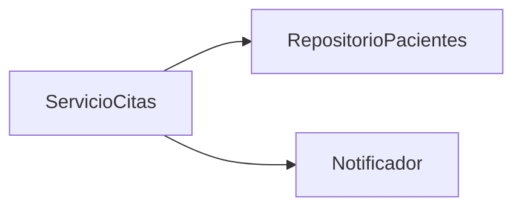

# 💡 Ejemplo 03 — Estructura básica de una dependencia y buenas prácticas de diseño

## 🌍 Contexto

Toda dependencia tiene una estructura mínima: un módulo **dependiente**, un
módulo **dependencia**, y (idealmente) una **abstracción** de por medio a
través de la cual se relacionan. Diseñar bien esa estructura no es automático:
requiere aplicar criterios concretos, no solo "hacer que compile".

**Qué busca demostrar este ejemplo**: que dos diseños que resuelven el mismo
problema de negocio pueden tener una calidad de dependencias muy distinta, y
que un puñado de buenas prácticas (depender de abstracciones, minimizar
dependencias transitivas expuestas, evitar dependencias circulares) explica
esa diferencia de forma concreta, no como reglas abstractas.

## 🏥 Caso de estudio

MediSalud: dos diseños alternativos para que `ServicioCitas` avise al
paciente cuando agenda una cita.

## 🔍 Estructura básica de una dependencia

```text
Módulo dependiente  →  (a través de una abstracción)  →  Módulo dependencia
   ServicioCitas     →         Notificador            →   NotificadorSms
```

`ServicioCitas` (dependiente) necesita enviar avisos; `NotificadorSms`
(dependencia) sabe cómo hacerlo. La abstracción `Notificador` es lo que
conecta a ambos sin que `ServicioCitas` conozca los detalles de cómo se envía
un SMS.

## 🚧 Diseño A (con una dependencia circular — anti-patrón)

Este diseño se muestra solo como código ilustrativo, **no** como un proyecto
para armar en VS Code: es intencionalmente el ejemplo de lo que *no* hay que
hacer, y ni siquiera llega a compilar con inyección por constructor.

```java
public class ServicioCitas {
    private final ServicioHistorialMedico servicioHistorialMedico;

    public ServicioCitas(ServicioHistorialMedico servicioHistorialMedico) {
        this.servicioHistorialMedico = servicioHistorialMedico;
    }

    public void agendar(String codigoPaciente) {
        servicioHistorialMedico.registrarCita(codigoPaciente);
    }
}

public class ServicioHistorialMedico {
    private final ServicioCitas servicioCitas; // ← depende de quien depende de él

    public ServicioHistorialMedico(ServicioCitas servicioCitas) {
        this.servicioCitas = servicioCitas;
    }

    public void registrarCita(String codigoPaciente) {
        // necesita reagendar si hay conflicto, así que "vuelve" a llamar a ServicioCitas
        servicioCitas.agendar(codigoPaciente);
    }
}
```

`ServicioCitas` depende de `ServicioHistorialMedico`, y
`ServicioHistorialMedico` depende de `ServicioCitas`: ninguno de los dos puede
construirse sin que el otro ya exista. Esto es una **dependencia circular**, y
ni siquiera compila con inyección por constructor (no hay forma de construir
el primero sin el segundo, ni viceversa).


El ciclo cerrado del diagrama **es** el problema: no hay ningún punto de
entrada por donde empezar a construir ninguna de las dos clases.

## 💻 Diseño B (sin dependencia circular, aplicando buenas prácticas)

A diferencia del Diseño A, este sí es un proyecto completo y ejecutable. Así
se vería su carpeta en VS Code:

```text
📁 ejemplo-03-diseno-b
└── 📁 src
    ├── 📄 Paciente.java                      (del Módulo 1, reutilizado)
    ├── 📄 RepositorioPacientes.java          (interfaz — del Ejemplo 01 de este módulo)
    ├── 📄 RepositorioPacientesEnMemoria.java (del Ejemplo 01 de este módulo)
    ├── 📄 Notificador.java                   (interfaz — del Módulo 1, Ejercicio Avanzado 01)
    ├── 📄 NotificadorSms.java                (del Módulo 1, Ejercicio Avanzado 01)
    ├── 📄 ServicioCitas.java                 (nuevo, para este ejemplo)
    └── 📄 Main.java                          (nuevo — ▶️ clase con el main que se ejecuta)
```

<details>
<summary>📄 Ver código completo de <code>Paciente.java</code>, <code>RepositorioPacientes.java</code> y <code>RepositorioPacientesEnMemoria.java</code> (reutilizados del Ejemplo 01 de este módulo) y de <code>NotificadorSms.java</code> (reutilizado del Módulo 1, Ejercicio Avanzado 01)</summary>

### 💻 Archivo: `Paciente.java`

```java
public record Paciente(String codigo, String nombre) {}
```

### 💻 Archivo: `RepositorioPacientes.java`

```java
public interface RepositorioPacientes {
    Optional<Paciente> buscarPorCodigo(String codigo);
}
```

### 💻 Archivo: `RepositorioPacientesEnMemoria.java`

```java
public class RepositorioPacientesEnMemoria implements RepositorioPacientes {
    private final Map<String, Paciente> pacientes = Map.of(
            "P-001", new Paciente("P-001", "Ana Gómez")
    );

    @Override
    public Optional<Paciente> buscarPorCodigo(String codigo) {
        return Optional.ofNullable(pacientes.get(codigo));
    }
}
```

### 💻 Archivo: `NotificadorSms.java`

```java
public class NotificadorSms implements Notificador {
    @Override
    public void enviar(String destinatario, String mensaje) {
        System.out.println("SMS a " + destinatario + ": " + mensaje);
    }
}
```

</details>

### 💻 Archivo: `Notificador.java`

```java
public interface Notificador {
    void enviar(String destinatario, String mensaje);
}
```

### 💻 Archivo: `ServicioCitas.java`

```java
public class ServicioCitas {

    private final RepositorioPacientes repositorioPacientes; // depende de una abstracción
    private final Notificador notificador;                   // depende de una abstracción

    public ServicioCitas(RepositorioPacientes repositorioPacientes, Notificador notificador) {
        this.repositorioPacientes = repositorioPacientes;
        this.notificador = notificador;
    }

    public void agendar(String codigoPaciente) {
        Paciente paciente = repositorioPacientes.buscarPorCodigo(codigoPaciente).orElseThrow();
        notificador.enviar(paciente.nombre(), "Tu cita fue agendada.");
    }
}
```

### 💻 Archivo: `Main.java` (▶️ clic derecho → "Run Java" en VS Code)

```java
public class Main {
    public static void main(String[] args) {
        RepositorioPacientes repositorioPacientes = new RepositorioPacientesEnMemoria();
        Notificador notificador = new NotificadorSms();
        ServicioCitas servicioCitas = new ServicioCitas(repositorioPacientes, notificador);

        servicioCitas.agendar("P-001");
        System.out.println("ServicioCitas ensamblado con RepositorioPacientes y Notificador: sin dependencias circulares.");
    }
}
```

`ServicioHistorialMedico` no existe en este diseño: registrar el historial es
una responsabilidad separada que se resuelve en otra capa (por ejemplo, un
evento que `ServicioCitas` publica, sin llamar directamente a nada que
dependa de él). El resultado: ninguna dependencia circular, y `ServicioCitas`
solo depende de dos abstracciones (`RepositorioPacientes`, `Notificador`).



Sin ciclos: todas las flechas salen de `ServicioCitas` y ninguna vuelve a
entrar. Comparado con el diagrama del Diseño A, la diferencia visual es
directa: un grafo con un ciclo cerrado vs. un grafo sin ciclos.

## 🧭 Explicación paso a paso

1. En el **Diseño A**, el error de diseño no es técnico (no es que Java "no
   permita" esto), es de **reparto de responsabilidades**: `ServicioCitas` y
   `ServicioHistorialMedico` se necesitan mutuamente porque cada uno quedó con
   una tarea que en realidad pertenece al otro.
2. La forma de resolver una dependencia circular casi nunca es "inyectarla
   igual, con algún truco": es **reorganizar responsabilidades** para que la
   relación quede en un solo sentido.
3. En el **Diseño B**, `ServicioCitas` depende de **interfaces**
   (`RepositorioPacientes`, `Notificador`), no de clases concretas: se puede
   cambiar cómo se guardan los pacientes o cómo se notifica sin tocar
   `ServicioCitas`.
4. `ServicioCitas` tampoco expone sus dependencias transitivas: quien use
   `ServicioCitas` no necesita saber que, por dentro, depende de un
   `Notificador` — esa dependencia queda encapsulada.

## 🔍 Buenas prácticas de diseño de dependencias

| Buena práctica | En el Diseño B |
|---|---|
| Depender de abstracciones, no de implementaciones concretas | `ServicioCitas` depende de `RepositorioPacientes` y `Notificador` (interfaces), no de sus implementaciones. |
| Minimizar las dependencias transitivas expuestas | Nadie que use `ServicioCitas` necesita conocer `Notificador` para poder llamarlo. |
| Evitar dependencias circulares | No existe ninguna clase que dependa, directa o transitivamente, de sí misma. |

## ✅ Resultado esperado

El Diseño A ni siquiera se puede ensamblar con inyección por constructor (no
hay un punto de partida: cada clase exige que la otra ya exista). El Diseño B
se ensambla sin problemas; al ejecutar `Main.java`:

```text
SMS a Ana Gómez: Tu cita fue agendada.
ServicioCitas ensamblado con RepositorioPacientes y Notificador: sin dependencias circulares.
```

## ❓ Preguntas de repaso

**1. [Selección]** ¿Qué caracteriza a una dependencia circular?

- **A.** Una clase que depende de una interfaz en vez de una clase concreta.
- **B.** Dos (o más) clases que dependen mutuamente entre sí, directa o transitivamente.
- **C.** Una clase con más de tres dependencias.
- **D.** Una clase que no tiene ninguna dependencia.

<details>
<summary>🔑 Ver respuesta</summary>

**Respuesta correcta: B**. La dependencia circular es, específicamente, una
relación mutua (A necesita a B y B necesita a A), no simplemente "muchas"
dependencias.

</details>

**2. [Selección múltiple]** Seleccioná **todas** las buenas prácticas de
diseño de dependencias mencionadas en este ejemplo.

- **A.** Depender de abstracciones en vez de implementaciones concretas.
- **B.** Maximizar la cantidad de dependencias transitivas expuestas.
- **C.** Evitar dependencias circulares.
- **D.** Minimizar las dependencias transitivas expuestas.

<details>
<summary>🔑 Ver respuesta</summary>

**Respuestas correctas: A, C, D**. La B es lo opuesto a la buena práctica
real (minimizar, no maximizar, lo que se expone).

</details>

**3. [Abierta]** El Diseño A no se puede resolver "agregando más código" (por
ejemplo, un *setter* en vez de un constructor). Explicá por qué el problema
real está en el reparto de responsabilidades y no en la forma de inyección
elegida.

<details>
<summary>🔑 Ver respuesta modelo</summary>

**Respuesta modelo**: Cambiar de constructor a *setter* no elimina la
dependencia mutua: `ServicioCitas` seguiría necesitando a
`ServicioHistorialMedico` y viceversa, solo que el error de construcción se
movería a otro momento. El problema de fondo es que ambas clases tienen una
responsabilidad que en realidad pertenece a la otra (agendar y, al mismo
tiempo, reagendar llamando de vuelta a quien la llamó). La solución real es
reorganizar esas responsabilidades (por ejemplo, separando "registrar
historial" de "reagendar") para que la dependencia quede en un solo sentido.

</details>
