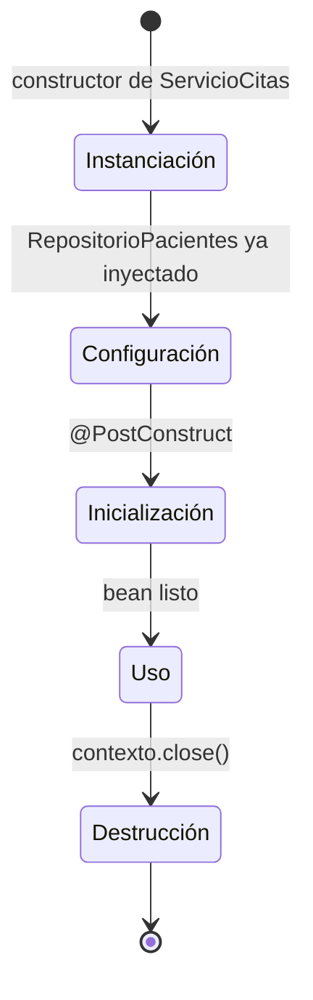

# 💡 Ejemplo 06 — Ciclo de vida de un bean: la fase de configuración, en detalle

## 🌍 Contexto

En el Módulo 1 (Ejemplo 10) ya viste el ciclo de vida de un bean con
`ServicioCitas`, pero esa versión no tenía ninguna dependencia, así que la
fase de **inyección de dependencias** no se podía observar por separado de la
instanciación. El ciclo de vida completo de Spring Boot distingue **cinco**
fases: instanciación, **configuración** (inyección de dependencias),
inicialización, listo para su uso, y destrucción.

**Qué busca demostrar este ejemplo**: que la fase de configuración es un paso
propio y observable, distinto de la instanciación —ocurre después de que el
objeto ya existe, pero antes de que esté listo para usarse—, extendiendo el
mismo `ServicioCitas` del Módulo 1 con una dependencia real.

## 🏥 Caso de estudio

MediSalud: `ServicioCitas`, ahora con una dependencia (`RepositorioPacientes`)
que permite observar la fase de configuración.

## 🌳 Árbol de archivos (como se vería en VS Code)

```text
📁 ejemplo-06-ciclo-de-vida
└── 📁 src
    ├── 📄 Paciente.java                      (record — del Módulo 1, reutilizado)
    ├── 📄 RepositorioPacientes.java          (interfaz — del Ejemplo 01 de este módulo)
    ├── 📄 RepositorioPacientesEnMemoria.java (modificada, con println en el constructor)
    ├── 📄 ServicioCitas.java                 (extendida respecto del Módulo 1, Ejemplo 10)
    ├── 📄 ConfiguracionApp.java
    └── 📄 Main.java                          (▶️ clase con el main que se ejecuta)
```

## 💻 Archivo: `Paciente.java`

```java
public record Paciente(String codigo, String nombre) {}
```

## 💻 Archivo: `RepositorioPacientes.java` (interfaz — del Ejemplo 01 de este módulo)

```java
public interface RepositorioPacientes {
    Optional<Paciente> buscarPorCodigo(String codigo);
}
```

## 💻 Archivo: `RepositorioPacientesEnMemoria.java`

```java
@Repository
public class RepositorioPacientesEnMemoria implements RepositorioPacientes {
    public RepositorioPacientesEnMemoria() {
        System.out.println("0) RepositorioPacientes ya instanciado (se resuelve antes de ServicioCitas)");
    }

    @Override
    public Optional<Paciente> buscarPorCodigo(String codigo) {
        return Optional.of(new Paciente(codigo, "Paciente de ejemplo"));
    }
}
```

## 💻 Archivo: `ServicioCitas.java`

```java
@Component
public class ServicioCitas {

    private final RepositorioPacientes repositorioPacientes;

    public ServicioCitas(RepositorioPacientes repositorioPacientes) {
        System.out.println("1) Instanciación: el contenedor crea el objeto ServicioCitas");
        this.repositorioPacientes = repositorioPacientes;
        System.out.println("2) Configuración: la dependencia RepositorioPacientes ya fue inyectada");
    }

    @PostConstruct
    public void inicializar() {
        System.out.println("3) Inicialización: @PostConstruct — el bean ya está configurado");
    }

    public void agendar(String codigoPaciente) {
        repositorioPacientes.buscarPorCodigo(codigoPaciente).orElseThrow();
        System.out.println("4) Uso: agendando cita para " + codigoPaciente);
    }

    @PreDestroy
    public void liberar() {
        System.out.println("5) Destrucción: @PreDestroy — el contenedor libera el bean antes de apagarse");
    }
}
```

## 💻 Archivo: `ConfiguracionApp.java`

```java
@Configuration
@ComponentScan(basePackages = "com.medisalud")
public class ConfiguracionApp {
}
```

## 💻 Archivo: `Main.java` (▶️ clic derecho → "Run Java" en VS Code)

```java
public class Main {
    public static void main(String[] args) {
        ConfigurableApplicationContext contexto =
                new AnnotationConfigApplicationContext(ConfiguracionApp.class);

        ServicioCitas servicioCitas = contexto.getBean(ServicioCitas.class);
        servicioCitas.agendar("P-001");

        contexto.close();
    }
}
```

## 🗺️ Diagrama: las cinco fases (con la configuración separada)



Comparado con el ciclo de vida del Módulo 1 (Ejemplo 10), acá aparece un
estado nuevo entre instanciación e inicialización: **Configuración**. En el
Módulo 1 no se podía dibujar por separado porque `ServicioCitas` no tenía
ninguna dependencia que inyectar.

## 🧭 Explicación paso a paso

1. El contenedor primero resuelve `RepositorioPacientes`, porque
   `ServicioCitas` lo necesita para poder construirse (el mensaje `0)`
   aparece antes que el `1)`).
2. **Instanciación**: el contenedor llama al constructor de `ServicioCitas`.
3. **Configuración**: en este ejemplo, esa misma llamada al constructor es
   donde se le entrega `repositorioPacientes` ya resuelto — por eso los
   mensajes `1)` y `2)` aparecen dentro del mismo constructor, uno justo
   después del otro: instanciación y configuración están **muy cerca en el
   tiempo**, pero son fases distintas (primero existe el objeto, después
   queda configurado con lo que necesita).
4. **Inicialización**: `@PostConstruct` se ejecuta una sola vez, cuando el
   bean ya está completamente configurado — es el primer punto en el que el
   código puede confiar en que `repositorioPacientes` ya está disponible para
   lógica de arranque más compleja (por ejemplo, precargar datos).
5. **Uso**: mientras la aplicación corre, se puede llamar a `agendar(...)` las
   veces que haga falta.
6. **Destrucción**: al cerrar el contexto, se ejecuta `@PreDestroy`.

## ✅ Resultado esperado

```text
0) RepositorioPacientes ya instanciado (se resuelve antes de ServicioCitas)
1) Instanciación: el contenedor crea el objeto ServicioCitas
2) Configuración: la dependencia RepositorioPacientes ya fue inyectada
3) Inicialización: @PostConstruct — el bean ya está configurado
4) Uso: agendando cita para P-001
5) Destrucción: @PreDestroy — el contenedor libera el bean antes de apagarse
```

## ❓ Preguntas de repaso

**1. [Selección]** ¿En qué fase del ciclo de vida de un bean ocurre la
inyección de dependencias?

- **A.** Instanciación.
- **B.** Configuración.
- **C.** Inicialización.
- **D.** Uso.

<details>
<summary>🔑 Ver respuesta</summary>

**Respuesta correcta: B**. La configuración es, específicamente, la fase en
la que el contenedor entrega sus dependencias al bean.

</details>

**2. [Selección múltiple]** Sobre este ejemplo, seleccioná **todas** las
afirmaciones correctas.

- **A.** `RepositorioPacientesEnMemoria` se instancia antes que `ServicioCitas`.
- **B.** La fase de configuración ocurre antes que la instanciación.
- **C.** `@PostConstruct` se ejecuta solo después de que la dependencia ya fue inyectada.
- **D.** `contexto.close()` dispara la fase de destrucción.

<details>
<summary>🔑 Ver respuesta</summary>

**Respuestas correctas: A, C, D**. La B es falsa: el orden correcto es
instanciación → configuración, no al revés.

</details>

**3. [Abierta]** En este ejemplo, instanciación y configuración ocurren dentro
del mismo constructor, casi al mismo tiempo. Explicá por qué, aun así, siguen
siendo dos fases distintas del ciclo de vida.

<details>
<summary>🔑 Ver respuesta modelo</summary>

**Respuesta modelo**: Son fases distintas porque describen momentos lógicos
diferentes, aunque ocurran muy cerca en el tiempo: primero el contenedor crea
el objeto `ServicioCitas` (instanciación) — en ese instante, el objeto existe
pero todavía no tiene su dependencia asignada dentro del constructor —, y
recién después le entrega `repositorioPacientes` (configuración). Con
inyección por *setter*, esta separación sería mucho más visible: el objeto
podría existir un tiempo perceptible antes de que se le asigne la
dependencia.

</details>
