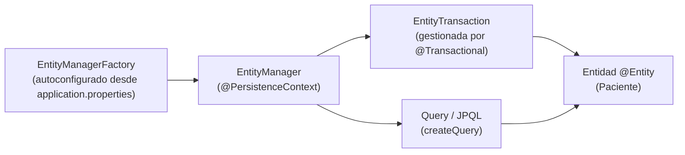

# 💡 Ejemplo 02 — Arquitectura de JPA

## 🌍 Contexto

En el Ejemplo 01 ya usaste un `EntityManager` sin nombrar formalmente de
dónde sale ni qué otros componentes participan. La arquitectura de JPA tiene
cinco piezas:

- **`EntityManagerFactory`**: el punto de entrada; crea y administra
  instancias de `EntityManager`.
- **`EntityManager`**: el componente central — persiste, actualiza, elimina
  y consulta entidades.
- **Entidades (`@Entity`)**: los objetos que se mapean a una tabla.
- **`EntityTransaction`**: agrupa una o más operaciones para que se
  confirmen o reviertan como una unidad.
- **`Query`/JPQL** y la **unidad de persistencia**: la interfaz para
  consultar entidades, y la configuración (proveedor de JPA, entidades
  mapeadas, conexión) sobre la que trabaja todo lo anterior.

En JPA "puro" (sin Spring), la unidad de persistencia se declara en un
archivo `persistence.xml`. **En Spring Boot, ese archivo no existe**: la
unidad de persistencia se autoconfigura a partir de `application.properties`
—la conexión a H2, el `ddl-auto`, etc., que ya usaste en el Ejemplo 01—, y
Spring te entrega el `EntityManager` ya resuelto con `@PersistenceContext`,
sin que necesites crear el `EntityManagerFactory` a mano.

**Qué busca demostrar este ejemplo**: que `EntityTransaction` no es un
concepto abstracto, sino lo que `@Transactional` gestiona por vos —dos
operaciones sobre `Paciente` que se confirman juntas o ninguna—, y que el
`EntityManager` sigue siendo el mismo objeto central detrás de esa
anotación.

## 🏥 Caso de estudio

MediSalud: dos altas de `Paciente` agrupadas en una sola transacción.

## 🌳 Árbol de archivos (como se vería en VS Code)

```text
📁 ejemplo-02-arquitectura-de-jpa
└── 📁 src/main
    ├── 📁 java/com/medisalud
    │   ├── 📄 Paciente.java           (del Ejemplo 01, reutilizada)
    │   ├── 📄 ServicioPacientes.java  (extendida respecto del Ejemplo 01)
    │   └── 📄 Main.java               (▶️ clic derecho → "Run Java" en VS Code)
    └── 📁 resources
        └── 📄 application.properties  (igual que en el Ejemplo 01/Ejemplo 07)
```

<details>
<summary>📄 Ver código completo de <code>Paciente.java</code> y <code>application.properties</code> (reutilizados del Ejemplo 01)</summary>

## 💻 Archivo: `Paciente.java`

```java
@Entity
public class Paciente {

    @Id
    @GeneratedValue(strategy = GenerationType.IDENTITY)
    private Long id;

    @Column(unique = true)
    private String codigo;

    private String nombre;

    protected Paciente() {
    }

    public Paciente(String codigo, String nombre) {
        this.codigo = codigo;
        this.nombre = nombre;
    }

    public Long getId() {
        return id;
    }

    public String getCodigo() {
        return codigo;
    }

    public String getNombre() {
        return nombre;
    }
}
```

## 💻 Archivo: `application.properties`

```properties
spring.datasource.url=jdbc:h2:mem:medisalud;DB_CLOSE_DELAY=-1
spring.datasource.driver-class-name=org.h2.Driver
spring.datasource.username=sa
spring.datasource.password=
spring.jpa.database-platform=org.hibernate.dialect.H2Dialect
spring.jpa.hibernate.ddl-auto=update
spring.h2.console.enabled=true
```

</details>

## 💻 Archivo: `ServicioPacientes.java`

```java
@Service
public class ServicioPacientes {

    @PersistenceContext
    private EntityManager entityManager; // el componente central de la arquitectura de JPA

    @Transactional // delimita la EntityTransaction: ambas altas se confirman juntas, o ninguna
    public void registrarDosPacientes() {
        entityManager.persist(new Paciente("P-002", "Bruno Díaz"));
        entityManager.persist(new Paciente("P-003", "Carla Ruiz"));
        // si esta línea lanzara una excepción, ninguna de las dos altas se confirmaría
    }

    public long contarPacientes() {
        return entityManager
                .createQuery("SELECT COUNT(p) FROM Paciente p", Long.class)
                .getSingleResult();
    }
}
```

## 💻 Archivo: `Main.java` (▶️ clic derecho → "Run Java" en VS Code)

```java
@SpringBootApplication
public class Main implements CommandLineRunner {

    private final ServicioPacientes servicioPacientes;

    public Main(ServicioPacientes servicioPacientes) {
        this.servicioPacientes = servicioPacientes;
    }

    public static void main(String[] args) {
        SpringApplication.run(Main.class, args);
    }

    @Override
    public void run(String... args) {
        servicioPacientes.registrarDosPacientes();
        System.out.println("Total de pacientes: " + servicioPacientes.contarPacientes());
    }
}
```

## 🗺️ Diagrama: flujo de la arquitectura de JPA



`EntityManagerFactory` no aparece en el código de `ServicioPacientes` porque
Spring Boot ya lo creó al arrancar, a partir de `application.properties`; lo
único que el código pide explícitamente es el `EntityManager` que esa
fábrica ya produjo.

## 🧭 Explicación paso a paso

1. `Main` arranca la aplicación Spring Boot; Spring Boot lee
   `application.properties`, crea la conexión a H2 y, con ella, el
   `EntityManagerFactory` — sin que ningún archivo `persistence.xml`
   intervenga.
2. `ServicioPacientes` recibe un `EntityManager` (con `@PersistenceContext`),
   el mismo tipo de objeto que ya usaste en el Ejemplo 01: es el componente
   central para operar con entidades.
3. `@Transactional` delimita una `EntityTransaction`: las dos llamadas a
   `entityManager.persist(...)` dentro de `registrarDosPacientes()` se
   confirman como una sola unidad al terminar el método, sin que el código
   tenga que llamar explícitamente a "empezar" o "confirmar" la transacción.
4. `contarPacientes()` usa `Query`/JPQL de nuevo (`SELECT COUNT(p) FROM
   Paciente p`), esta vez para contar en vez de buscar, mostrando que
   `Query` no se limita a devolver listas de entidades.

## ✅ Resultado esperado

Al ejecutar `Main.java`:

```text
Total de pacientes: 2
```

## ❓ Preguntas de repaso

**1. [Selección]** ¿Cuál es el punto de entrada de la arquitectura de JPA
para obtener un `EntityManager`?

- **A.** `EntityTransaction`.
- **B.** `EntityManagerFactory`.
- **C.** `Query`.
- **D.** `@Entity`.

<details>
<summary>🔑 Ver respuesta</summary>

**Respuesta correcta: B**. `EntityManagerFactory` crea y administra las
instancias de `EntityManager`; los otros tres son componentes distintos de
la arquitectura.

</details>

**2. [Selección múltiple]** Sobre este ejemplo, seleccioná **todas** las
afirmaciones correctas.

- **A.** `@Transactional` gestiona la `EntityTransaction` sin que el código llame explícitamente a "confirmar".
- **B.** En Spring Boot, la unidad de persistencia se declara en un archivo `persistence.xml`.
- **C.** El mismo `EntityManager` sirve tanto para `persist(...)` como para ejecutar una consulta JPQL.
- **D.** `EntityManagerFactory` se autoconfigura a partir de `application.properties`.

<details>
<summary>🔑 Ver respuesta</summary>

**Respuestas correctas: A, C, D**. La B es falsa: esa es la forma de JPA
"puro" fuera de Spring; en Spring Boot no hay `persistence.xml`.

</details>

**3. [Abierta]** En este escenario:

- `registrarDosPacientes()` inserta dos pacientes con `entityManager.persist(...)`.
- El método está anotado `@Transactional`.

**Pregunta**: ¿Qué garantiza `EntityTransaction` en este caso, y qué pasaría
si la segunda llamada a `persist(...)` lanzara una excepción?

<details>
<summary>🔑 Ver respuesta modelo</summary>

**Respuesta modelo**: `EntityTransaction` garantiza que las operaciones
dentro del método se confirmen como una única unidad atómica: o se guardan
las dos altas, o no se guarda ninguna. Si la segunda llamada a `persist(...)`
lanzara una excepción, `@Transactional` revertiría (*rollback*) toda la
transacción, incluida la primera alta que ya se había ejecutado — evitando
que la base de datos quede con solo uno de los dos pacientes.

</details>
