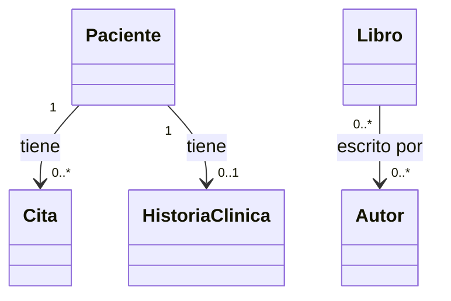

# 💡 Ejemplo 03 — Relacionamiento entre clases

## 🌍 Contexto

Las entidades casi nunca viven aisladas: un `Paciente` tiene citas, y un
`Libro` tiene autores. Antes de ver las anotaciones concretas que declaran
esas relaciones en JPA (eso llega en el Ejemplo 08, una vez que ya conocés
Spring Data JPA), conviene identificar **conceptualmente** qué tipo de
relación existe entre dos clases. Hay tres tipos:

- **Uno a uno**: cada instancia de A se relaciona con **como máximo una**
  instancia de B, y viceversa.
- **Uno a muchos** (o su inversa, muchos a uno): una instancia de A se
  relaciona con **varias** instancias de B, pero cada instancia de B se
  relaciona con **una sola** instancia de A.
- **Muchos a muchos**: varias instancias de A se relacionan con varias
  instancias de B, sin ese límite de "una sola" en ningún sentido.

**Qué busca demostrar este ejemplo**: que identificar el tipo de relación es
un ejercicio de leer el dominio de negocio (¿cuántas citas puede tener un
paciente? ¿un libro puede tener más de un autor?), no de memorizar sintaxis
— la sintaxis (`@OneToMany`, `@ManyToOne`, etc.) es solo la traducción de
esa lectura, y llega recién en el Ejemplo 08.

## 🏥📚 Caso de estudio

Las tres relaciones que vas a mapear con código a lo largo del resto del
módulo:

- MediSalud: `Paciente` ↔ `Cita` (uno a muchos) y `Paciente` ↔
  `HistoriaClinica` (uno a uno).
- Biblioteca Universitaria: `Libro` ↔ `Autor` (muchos a muchos).

## 🗺️ Diagrama: las tres relaciones del módulo

## 🧭 Explicación paso a paso

1. **`Paciente` ↔ `Cita` — uno a muchos**: un `Paciente` puede tener varias
   `Cita` a lo largo del tiempo, pero cada `Cita` pertenece a un único
   `Paciente`. La "flecha múltiple" (`0..*`) está del lado de `Cita`; el
   lado "uno" es `Paciente`.
2. **`Paciente` ↔ `HistoriaClinica` — uno a uno**: cada `Paciente` tiene, a
   lo sumo, una `HistoriaClinica`, y cada `HistoriaClinica` pertenece a un
   único `Paciente`. Ningún lado admite "varios".
3. **`Libro` ↔ `Autor` — muchos a muchos**: un `Libro` puede tener varios
   `Autor` (coautoría), y un `Autor` puede haber escrito varios `Libro`. Ni
   `Libro` ni `Autor` tienen un límite de "uno" en ningún sentido — por eso,
   a diferencia de las otras dos, esta relación va a necesitar una tabla
   intermedia para representarse en una base de datos relacional (se ve en
   el Ejemplo 08).
4. En los tres casos, identificar el tipo de relación es el primer paso;
   recién después se decide qué anotación de JPA la representa y **qué lado
   es el propietario** de la relación (el que declara la clave foránea) —
   ambas cosas se cubren en el Ejemplo 08.

## ❓ Preguntas de repaso

**1. [Selección]** En este escenario:

- Un `Paciente` puede tener varias `Cita`.
- Cada `Cita` pertenece a un único `Paciente`.

**Pregunta**: ¿Qué tipo de relación es?

- **A.** Uno a uno.
- **B.** Uno a muchos.
- **C.** Muchos a muchos.
- **D.** No es una relación, son clases independientes.

🔑 Ver respuesta

**Respuesta correcta: B**. `Paciente` es el lado "uno" y `Cita` es el lado
"muchos".

**2. [Selección múltiple]** Sobre `Libro` y `Autor` en este ejemplo,
seleccioná **todas** las afirmaciones correctas.

- **A.** Un `Libro` puede tener más de un `Autor`.
- **B.** Un `Autor` solo puede haber escrito un `Libro`.
- **C.** La relación entre `Libro` y `Autor` es muchos a muchos.
- **D.** Representar esta relación en una base de datos relacional va a necesitar una tabla intermedia.

🔑 Ver respuesta

**Respuestas correctas: A, C, D**. La B es falsa: un `Autor` puede haber
escrito varios `Libro`, eso es justamente lo que hace muchos a muchos a la
relación (si un `Autor` solo pudiera escribir un `Libro`, sería uno a
muchos, no muchos a muchos).

**3. [Abierta]** `Paciente` y `HistoriaClinica` tienen una relación uno a
uno.

**Pregunta**: ¿En qué se diferencia una relación uno a uno de una relación
uno a muchos, en términos de cuántas instancias pueden relacionarse entre
sí?

🔑 Ver respuesta modelo

**Respuesta modelo**: En una relación uno a uno, ningún lado admite más de
una instancia relacionada: un `Paciente` tiene, a lo sumo, una
`HistoriaClinica`, y una `HistoriaClinica` pertenece a un único `Paciente`.
En una relación uno a muchos, el lado "muchos" sí admite varias instancias
relacionadas con una misma instancia del lado "uno" (varias `Cita` para un
mismo `Paciente`), mientras que el lado "uno" sigue admitiendo solo una.

