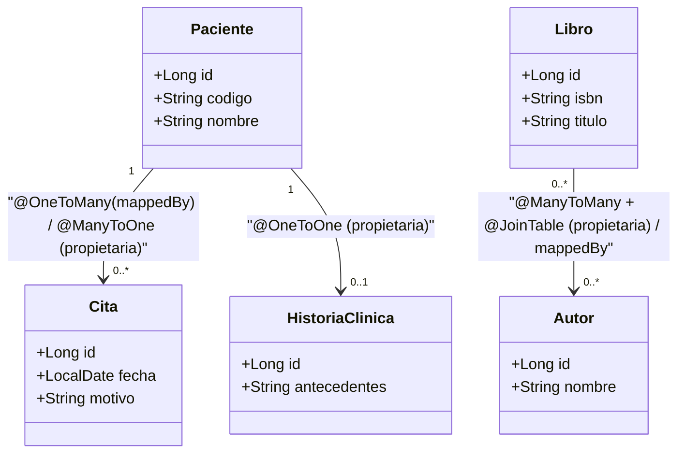

# 💡 Ejemplo 08 — Anotaciones en JPA

## 🌍 Contexto

Ya usaste `@Entity`, `@Id`, `@GeneratedValue`, `@Column` y `@Transactional`
desde el Ejemplo 01. En este bloque, el último del módulo, vas a ver la
tabla completa de anotaciones de JPA —incluidas las que faltan— y, sobre
todo, vas a **mapear con código real** las tres relaciones que identificaste
de forma conceptual en el Ejemplo 03: `Paciente`↔`Cita` (uno a muchos),
`Paciente`↔`HistoriaClinica` (uno a uno) y `Libro`↔`Autor` (muchos a
muchos).

**Qué busca demostrar este ejemplo**: que cada tipo de relación tiene una
anotación concreta, que una de las dos entidades es siempre el **lado
propietario** (la que declara la clave foránea), y que `@Transactional`
también resuelve el problema de acceder a una colección cargada de forma
perezosa (*LAZY*) fuera de una sesión abierta.

## 🏥📚 Caso de estudio

MediSalud (`Paciente`↔`Cita`, `Paciente`↔`HistoriaClinica`) y Biblioteca
Universitaria (`Libro`↔`Autor`).

## 🔍 Anotaciones principales de JPA

| Anotación | ¿Dónde se usa? | ¿Para qué sirve? |
|---|---|---|
| `@Entity` | Clase | Marca la clase como entidad persistente (tabla). |
| `@Table(name = "...")` | Clase | Define el nombre de la tabla (si no, usa el nombre de la clase). |
| `@Id` | Atributo | Indica la clave primaria. |
| `@GeneratedValue(strategy = ...)` | Atributo | Define cómo se genera el ID (`IDENTITY`, `SEQUENCE`, `AUTO`). |
| `@Column(...)` | Atributo | Configura la columna: `nullable`, `unique`, `length`, etc. |
| `@ManyToOne` | Atributo | Relación muchos a uno (el lado "muchos" de una 1-N). |
| `@OneToMany(mappedBy = "...")` | Atributo | Relación uno a muchos (el lado "uno", inverso). |
| `@OneToOne` | Atributo | Relación uno a uno. |
| `@ManyToMany` | Atributo | Relación muchos a muchos (necesita una tabla intermedia). |
| `@JoinColumn(name = "...")` | Atributo | Define la columna de clave foránea que hace el *join*. |
| `@Transactional` | Método/Clase | Asegura una transacción (*commit*/*rollback*) y mantiene la sesión abierta para cargas `LAZY`. |

## 🌳 Árbol de archivos (como se vería en VS Code)

```text
📁 ejemplo-08-anotaciones-en-jpa
└── 📁 src/main
    ├── 📁 java/com/medisalud
    │   ├── 📄 Paciente.java          (del Ejemplo 01/07, extendida con las relaciones)
    │   ├── 📄 Cita.java              (nuevo — @ManyToOne hacia Paciente)
    │   ├── 📄 HistoriaClinica.java   (nuevo)
    │   ├── 📄 RepositorioPacientes.java (del Ejemplo 07, reutilizada)
    │   └── 📄 RepositorioCitas.java  (nuevo)
    ├── 📁 java/com/biblioteca
    │   ├── 📄 Libro.java             (del Ejercicio Intermedio 01, extendida con la relación)
    │   ├── 📄 Autor.java             (nuevo — @ManyToMany hacia Libro)
    │   └── 📄 RepositorioLibros.java (del Ejercicio Intermedio 01, reutilizada)
    ├── 📁 java
    │   └── 📄 Main.java              (▶️ clic derecho → "Run Java" en VS Code)
    └── 📁 resources
        └── 📄 application.properties (igual que en el Ejemplo 07)
```

<details>
<summary>📄 Ver código completo de <code>RepositorioPacientes.java</code>, <code>RepositorioLibros.java</code> y <code>application.properties</code> (reutilizados del Ejemplo 07 / Ejercicio Intermedio 01)</summary>

## 💻 Archivo: `RepositorioPacientes.java`

```java
public interface RepositorioPacientes extends JpaRepository<Paciente, Long> {
    Optional<Paciente> findByCodigo(String codigo);

    @Query("SELECT p FROM Paciente p WHERE p.nombre LIKE %:fragmento%")
    List<Paciente> buscarPorFragmentoDeNombre(String fragmento);
}
```

## 💻 Archivo: `RepositorioLibros.java`

```java
public interface RepositorioLibros extends JpaRepository<Libro, Long> {
    Optional<Libro> findByIsbn(String isbn);
}
```

## 💻 Archivo: `application.properties`

```properties
spring.datasource.url=jdbc:h2:mem:medisalud;DB_CLOSE_DELAY=-1
spring.datasource.driver-class-name=org.h2.Driver
spring.datasource.username=sa
spring.datasource.password=
spring.jpa.database-platform=org.hibernate.dialect.H2Dialect
spring.jpa.hibernate.ddl-auto=update
spring.h2.console.enabled=true
```

</details>

## 💻 Archivo: `Paciente.java` (extendida con las relaciones de este ejemplo)

```java
@Entity
public class Paciente {

    @Id
    @GeneratedValue(strategy = GenerationType.IDENTITY)
    private Long id;

    @Column(unique = true)
    private String codigo;

    private String nombre;

    @OneToMany(mappedBy = "paciente") // lado inverso: la FK vive en Cita
    private List<Cita> citas = new ArrayList<>();

    @OneToOne
    @JoinColumn(name = "historia_clinica_id") // Paciente es el lado propietario
    private HistoriaClinica historiaClinica;

    protected Paciente() {
    }

    public Paciente(String codigo, String nombre) {
        this.codigo = codigo;
        this.nombre = nombre;
    }

    public Long getId() { return id; }
    public String getCodigo() { return codigo; }
    public String getNombre() { return nombre; }
    public List<Cita> getCitas() { return citas; }

    public void asignarHistoriaClinica(HistoriaClinica historiaClinica) {
        this.historiaClinica = historiaClinica;
    }
}
```

## 💻 Archivo: `Cita.java`

```java
@Entity
public class Cita {

    @Id
    @GeneratedValue(strategy = GenerationType.IDENTITY)
    private Long id;

    private LocalDate fecha;

    private String motivo;

    @ManyToOne // lado propietario: esta tabla tiene la columna paciente_id
    @JoinColumn(name = "paciente_id")
    private Paciente paciente;

    protected Cita() {
    }

    public Cita(LocalDate fecha, String motivo, Paciente paciente) {
        this.fecha = fecha;
        this.motivo = motivo;
        this.paciente = paciente;
    }

    public LocalDate getFecha() { return fecha; }
    public String getMotivo() { return motivo; }
    public Paciente getPaciente() { return paciente; }
}
```

## 💻 Archivo: `HistoriaClinica.java`

```java
@Entity
public class HistoriaClinica {

    @Id
    @GeneratedValue(strategy = GenerationType.IDENTITY)
    private Long id;

    private String antecedentes;

    protected HistoriaClinica() {
    }

    public HistoriaClinica(String antecedentes) {
        this.antecedentes = antecedentes;
    }

    public String getAntecedentes() { return antecedentes; }
}
```

## 💻 Archivo: `RepositorioCitas.java`

```java
public interface RepositorioCitas extends JpaRepository<Cita, Long> {
}
```

## 💻 Archivo: `Libro.java` (extendida con la relación de este ejemplo)

```java
@Entity
public class Libro {

    @Id
    @GeneratedValue(strategy = GenerationType.IDENTITY)
    private Long id;

    @Column(unique = true)
    private String isbn;

    private String titulo;

    @ManyToMany // Libro es el lado propietario: declara la tabla intermedia
    @JoinTable(
            name = "libro_autor",
            joinColumns = @JoinColumn(name = "libro_id"),
            inverseJoinColumns = @JoinColumn(name = "autor_id")
    )
    private Set<Autor> autores = new HashSet<>();

    protected Libro() {
    }

    public Libro(String isbn, String titulo) {
        this.isbn = isbn;
        this.titulo = titulo;
    }

    public Long getId() { return id; }
    public String getIsbn() { return isbn; }
    public String getTitulo() { return titulo; }
    public Set<Autor> getAutores() { return autores; }

    public void agregarAutor(Autor autor) {
        this.autores.add(autor);
    }
}
```

## 💻 Archivo: `Autor.java`

```java
@Entity
public class Autor {

    @Id
    @GeneratedValue(strategy = GenerationType.IDENTITY)
    private Long id;

    private String nombre;

    @ManyToMany(mappedBy = "autores") // lado inverso: no repite la tabla intermedia
    private Set<Libro> libros = new HashSet<>();

    protected Autor() {
    }

    public Autor(String nombre) {
        this.nombre = nombre;
    }

    public String getNombre() { return nombre; }
}
```

## 💻 Archivo: `Main.java` (▶️ clic derecho → "Run Java" en VS Code)

```java
@SpringBootApplication
public class Main implements CommandLineRunner {

    private final RepositorioPacientes repositorioPacientes;
    private final RepositorioCitas repositorioCitas;
    private final RepositorioLibros repositorioLibros;

    public Main(RepositorioPacientes repositorioPacientes,
                RepositorioCitas repositorioCitas,
                RepositorioLibros repositorioLibros) {
        this.repositorioPacientes = repositorioPacientes;
        this.repositorioCitas = repositorioCitas;
        this.repositorioLibros = repositorioLibros;
    }

    public static void main(String[] args) {
        SpringApplication.run(Main.class, args);
    }

    @Override
    @Transactional // necesario para poder leer paciente.getCitas() más abajo (colección LAZY)
    public void run(String... args) {
        Paciente paciente = repositorioPacientes.save(new Paciente("P-006", "Fabián Ríos"));
        paciente.asignarHistoriaClinica(new HistoriaClinica("Sin antecedentes relevantes"));
        repositorioPacientes.save(paciente);

        repositorioCitas.save(new Cita(LocalDate.of(2026, 10, 1), "Control anual", paciente));
        repositorioCitas.save(new Cita(LocalDate.of(2026, 11, 15), "Seguimiento", paciente));

        Paciente recargado = repositorioPacientes.findByCodigo("P-006").orElseThrow();
        System.out.println("Citas de " + recargado.getNombre() + ": " + recargado.getCitas().size());

        Autor autor1 = new Autor("Grace Hopper");
        Autor autor2 = new Autor("Ada Lovelace");
        Libro libro = new Libro("978-0-13-468599-1", "Fundamentos de Persistencia");
        libro.agregarAutor(autor1);
        libro.agregarAutor(autor2);
        repositorioLibros.save(libro);

        System.out.println("Autores de \"" + libro.getTitulo() + "\": " + libro.getAutores().size());
    }
}
```

## 🗺️ Diagrama: las tres relaciones, con su lado propietario



## 🧭 Explicación paso a paso

1. **`Paciente`↔`Cita` (uno a muchos)**: `Cita` es el lado **propietario**
   —tiene la columna `paciente_id` (`@ManyToOne` + `@JoinColumn`)—;
   `Paciente` es el lado inverso, con `@OneToMany(mappedBy = "paciente")`
   apuntando al nombre del campo en `Cita` que ya declara la relación. Si
   ambos lados declararan la FK, Hibernate generaría una tabla intermedia
   no deseada; `mappedBy` evita eso.
2. **`Paciente`↔`HistoriaClinica` (uno a uno)**: `Paciente` es el lado
   propietario, con `@OneToOne` + `@JoinColumn(name = "historia_clinica_id")`.
   Es unidireccional: `HistoriaClinica` no necesita saber de qué `Paciente`
   es, para este ejemplo.
3. **`Libro`↔`Autor` (muchos a muchos)**: como ningún lado tiene un límite
   de "uno", ninguna de las dos tablas puede guardar la relación en una sola
   columna — hace falta una **tabla intermedia** (`libro_autor`), declarada
   con `@JoinTable` en el lado propietario (`Libro`). `Autor` es el lado
   inverso, con `@ManyToMany(mappedBy = "autores")`.
4. `run(...)` está anotado `@Transactional` porque `recargado.getCitas()`
   accede a una colección `@OneToMany`, que por defecto se carga de forma
   perezosa (*LAZY*): fuera de una transacción/sesión abierta, esa llamada
   lanzaría una excepción de sesión cerrada. `@Transactional` mantiene la
   sesión abierta durante todo el método, permitiendo que
   `recargado.getCitas()` se resuelva sin error.

## ✅ Resultado esperado

Al ejecutar `Main.java`:

```text
Citas de Fabián Ríos: 2
Autores de "Fundamentos de Persistencia": 2
```

## ❓ Preguntas de repaso

**1. [Selección]** En la relación `Paciente`↔`Cita` de este ejemplo, ¿cuál
es el lado propietario?

- **A.** `Paciente`, porque es el lado "uno".
- **B.** `Cita`, porque tiene la columna de clave foránea (`paciente_id`).
- **C.** Ninguno; ambos son propietarios por igual.
- **D.** Depende de cuál se guarde primero en tiempo de ejecución.

<details>
<summary>🔑 Ver respuesta</summary>

**Respuesta correcta: B**. El lado propietario es siempre el que declara la
clave foránea con `@JoinColumn`; acá es `Cita`, con `@ManyToOne`.

</details>

**2. [Selección múltiple]** Sobre las relaciones de este ejemplo, seleccioná
**todas** las afirmaciones correctas.

- **A.** `Paciente.citas` usa `mappedBy` porque `Paciente` es el lado inverso de la relación con `Cita`.
- **B.** La relación `Libro`↔`Autor` necesita una tabla intermedia porque ningún lado tiene un límite de "uno".
- **C.** `HistoriaClinica` debe declarar `mappedBy` para relacionarse con `Paciente`.
- **D.** `@JoinTable` se declara en el lado propietario de una relación `@ManyToMany`.

<details>
<summary>🔑 Ver respuesta</summary>

**Respuestas correctas: A, B, D**. La C es falsa: la relación
`Paciente`↔`HistoriaClinica` es unidireccional, con `Paciente` como único
lado propietario; `HistoriaClinica` no declara nada sobre `Paciente`.

</details>

**3. [Abierta]** En este escenario:

- `recargado.getCitas()` accede a una colección `@OneToMany`, cargada de
  forma perezosa (*LAZY*) por defecto.
- El método `run(...)` está anotado `@Transactional`.

**Pregunta**: ¿Qué pasaría si se quitara `@Transactional` de `run(...)`, y
por qué?

<details>
<summary>🔑 Ver respuesta modelo</summary>

**Respuesta modelo**: Sin `@Transactional`, la sesión de persistencia se
cerraría apenas terminara la consulta `findByCodigo(...)`. Como `citas` es
una colección `LAZY`, Hibernate no la carga en ese momento, sino recién
cuando se llama a `recargado.getCitas()` — pero para entonces la sesión ya
estaría cerrada, y esa llamada lanzaría una excepción (típicamente
`LazyInitializationException` o equivalente). `@Transactional` evita esto
manteniendo la sesión abierta durante todo el método.

</details>
