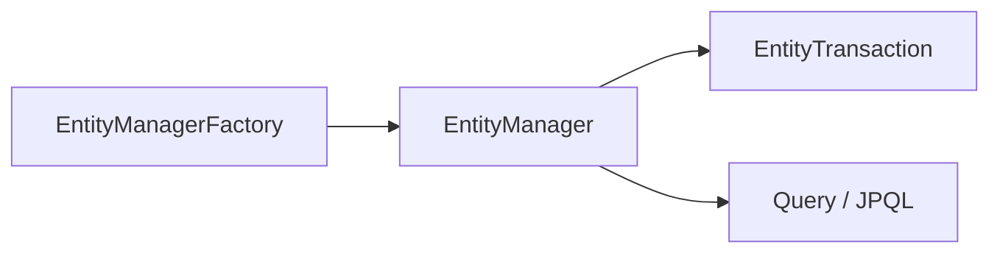
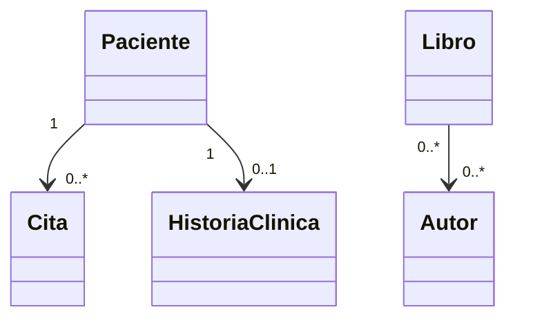

# 🖥️ Presentación — Módulo 3: Introducción a JPA

## Slide 1 — Título

**Módulo 3 — Introducción a JPA**
Curso Spring Boot para Aplicaciones Empresariales

## Slide 2 — Objetivos del módulo

Al finalizar, vas a poder mapear las clases de MediSalud y Biblioteca
Universitaria a una base de datos relacional real, usando JPA, Hibernate y
Spring Data JPA.

## Slide 3 — Ruta de la sesión

8 bloques: ¿Qué es JPA? → Arquitectura → Relacionamiento entre clases → ¿Qué
es ORM? → Hibernate → ¿Qué es Spring Data JPA? → Uso básico → Anotaciones.

## Slide 4 — De la memoria a la persistencia real

Hasta el Módulo 2, todo vivía en memoria. Este módulo agrega la primera base
de datos real del curso: H2, en memoria, sin infraestructura externa.

## Slide 5 — ¿Qué es JPA?

Java Persistence API: especificación estándar para mapear objetos Java a una
base de datos relacional, sin escribir SQL a mano.

## Slide 6 — Tres características de JPA

Abstracción de la base de datos · Estandarización (independencia de la
implementación) · Flexibilidad en el mapeo de entidades.

## Slide 7 — Tres funcionalidades clave

Anotaciones para el mapeo · JPQL (consultas orientadas a objetos) · API de
persistencia para operaciones CRUD.

## Slide 8 — Ejemplo: `Paciente` como entidad

```java
@Entity
public class Paciente {
    @Id @GeneratedValue(strategy = GenerationType.IDENTITY)
    private Long id;
    // ...
}
```

## Slide 9 — Componentes de la arquitectura de JPA

`EntityManagerFactory` · `EntityManager` · Entidades (`@Entity`) ·
`EntityTransaction` · `Query`/JPQL · Unidad de persistencia.

## Slide 10 — Diagrama de arquitectura



## Slide 11 — Sin `persistence.xml`

En Spring Boot, la unidad de persistencia se autoconfigura desde
`application.properties`. No hay archivo `persistence.xml` manual.

## Slide 12 — `@Transactional` = `EntityTransaction`

Agrupa operaciones para que se confirmen o reviertan como una unidad, sin
llamar explícitamente a "begin"/"commit".

## Slide 13 — Relacionamiento entre clases: tres tipos

Uno a uno · Uno a muchos · Muchos a muchos. Se identifican leyendo el
dominio de negocio, antes de ver la sintaxis.

## Slide 14 — Las tres relaciones del módulo

`Paciente`↔`Cita` (1-N) · `Paciente`↔`HistoriaClinica` (1-1) ·
`Libro`↔`Autor` (N-N).

## Slide 15 — Diagrama de relaciones



## Slide 16 — ¿Qué es ORM?

Mapeo Objeto-Relacional: técnica que convierte objetos en filas de tabla, y
viceversa, sin SQL manual.

## Slide 17 — Sin ORM vs. con ORM

Sin ORM: `INSERT INTO paciente ...` a mano. Con ORM:
`entityManager.persist(paciente)`.

## Slide 18 — ¿Qué es Hibernate?

Framework de mapeo objeto-relacional para Java: convierte clases en tablas,
atributos en columnas, y genera el SQL necesario.

## Slide 19 — JPA vs. Hibernate

**JPA define el qué. Hibernate define el cómo.** JPA es la especificación;
Hibernate es una de sus implementaciones.

## Slide 20 — Ver el SQL generado

`spring.jpa.show-sql=true` muestra, en consola, el `INSERT`/`SELECT` real
que Hibernate ejecuta por debajo.

## Slide 21 — ¿Qué es Spring Data JPA?

Módulo de Spring que evita implementar a mano el acceso a datos: se declara
una interfaz de repositorio, y Spring genera su implementación.

## Slide 22 — Ventajas de Spring Data JPA

Menos código repetitivo · Consultas automáticas por convención de nombres ·
Paginación y ordenamiento · Consultas personalizadas (`@Query`) ·
Compatibilidad multi-BD.

## Slide 23 — De `EntityManager` a un repositorio

```java
public interface RepositorioPacientes extends JpaRepository<Paciente, Long> {
    Optional<Paciente> findByCodigo(String codigo);
}
```

## Slide 24 — Dependencias del proyecto

`spring-boot-starter-data-jpa` (JPA + Hibernate + Spring Data JPA) +
`com.h2database:h2` (base de datos en memoria del curso).

## Slide 25 — `application.properties`

Conexión a H2 (`spring.datasource.*`) + configuración de JPA/Hibernate
(`spring.jpa.database-platform`, `spring.jpa.hibernate.ddl-auto`).

## Slide 26 — Los cinco valores de `ddl-auto`

`none` · `validate` · `update` (desarrollo) · `create` · `create-drop`
(riesgo de pérdida de datos los dos últimos).

## Slide 27 — Actividad práctica: Taller 01

Biblioteca Universitaria: mapear `Libro`/`Etiqueta` con `@ManyToMany`, y
verificar con una consulta derivada.

## Slide 28 — Anotaciones principales de JPA

`@Entity` · `@Table` · `@Id` · `@GeneratedValue` · `@Column` · `@ManyToOne`
· `@OneToMany` · `@OneToOne` · `@ManyToMany` · `@JoinColumn` ·
`@Transactional`.

## Slide 29 — Lado propietario vs. lado inverso

El lado propietario declara la clave foránea (`@JoinColumn`) o la tabla
intermedia (`@JoinTable`); el lado inverso usa `mappedBy`.

## Slide 30 — Uno a muchos: `Paciente`↔`Cita`

`Cita` (propietaria): `@ManyToOne @JoinColumn(name = "paciente_id")`.
`Paciente` (inversa): `@OneToMany(mappedBy = "paciente")`.

## Slide 31 — Muchos a muchos: `Libro`↔`Autor`

`Libro` (propietaria): `@ManyToMany @JoinTable(...)`. `Autor` (inversa):
`@ManyToMany(mappedBy = "autores")`.

## Slide 32 — `@Transactional` y carga LAZY

Las colecciones `@OneToMany`/`@ManyToMany` se cargan de forma perezosa por
defecto; acceder a ellas fuera de una transacción falla.

## Slide 33 — Resumen del módulo

JPA (especificación) → Hibernate (implementación) → Spring Data JPA
(abstracción de alto nivel) → anotaciones de mapeo y relación.

## Slide 34 — Evaluación

Quiz de 16 ítems + 8 ejercicios + 1 Desafío, cubriendo los 12 resultados de
aprendizaje del módulo.

## Slide 35 — Próximo módulo

El curso sigue con la capa web (REST) sobre las entidades ya mapeadas en
este módulo.
