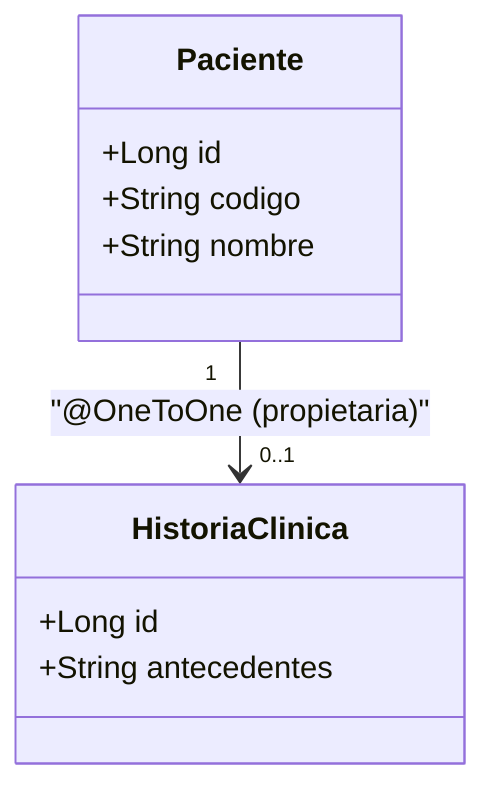

# 💡 Ejemplo 02 — `@OneToOne` y el lado dueño de la relación

## 🌍 Contexto

**¿Qué es una relación en JPA?** En términos simples: una relación en JPA
es la **representación en Java** de una relación entre tablas de una base
de datos relacional. Ejemplos reales, del día a día de cualquier sistema:

- Un paciente tiene una historia clínica.
- Un paciente tiene muchas citas.
- Un libro puede tener muchos autores.
- Un usuario puede tener muchos préstamos.

Este módulo recorre los tres tipos de relación (uno a uno, uno a muchos,
muchos a muchos) profundizando algo que el Módulo 3 solo tocó de pasada: en
**toda** relación, uno de los dos lados es el "dueño" — el que tiene la
clave foránea real en su tabla. El otro lado es el "inverso": solo refleja
la relación, sin tener esa columna.

**Qué busca demostrar este ejemplo**: retomando `Paciente`↔`HistoriaClinica`
del Módulo 3, generalizar el concepto de "lado dueño" más allá de esta
relación puntual, como una idea que se aplica igual a `@OneToMany`/
`@ManyToOne` y a `@ManyToMany` (Ejemplos 03 y 04).

## 🏥 Caso de estudio

MediSalud: `Paciente`↔`HistoriaClinica`, una relación uno a uno.

## 🌳 Árbol de archivos (como se vería en VS Code)

```text
📁 ejemplo-02-oneToOne-y-lado-dueno
└── 📁 src/main
    ├── 📁 java/com/medisalud
    │   ├── 📄 Paciente.java           (del Módulo 3, reutilizada)
    │   ├── 📄 HistoriaClinica.java    (del Módulo 3, reutilizada)
    │   ├── 📄 RepositorioPacientes.java (del Módulo 3, reutilizada)
    │   └── 📄 Main.java               (▶️ clic derecho → "Run Java" en VS Code)
    └── 📁 resources
        └── 📄 application.properties  (igual que en el Ejemplo 01)
```

<details>
<summary>📄 Ver código completo de <code>RepositorioPacientes.java</code> y <code>application.properties</code> (reutilizados del Módulo 3)</summary>

## 💻 Archivo: `RepositorioPacientes.java`

```java
public interface RepositorioPacientes extends JpaRepository<Paciente, Long> {
    Optional<Paciente> findByCodigo(String codigo);
}
```

## 💻 Archivo: `application.properties`

```properties
spring.datasource.url=jdbc:h2:mem:medisalud;DB_CLOSE_DELAY=-1
spring.datasource.driver-class-name=org.h2.Driver
spring.datasource.username=sa
spring.datasource.password=
spring.jpa.database-platform=org.hibernate.dialect.H2Dialect
spring.jpa.hibernate.ddl-auto=update
```

</details>

## 💻 Archivo: `Paciente.java`

```java
@Entity
public class Paciente {

    @Id
    @GeneratedValue(strategy = GenerationType.IDENTITY)
    private Long id;

    @Column(unique = true)
    private String codigo;

    private String nombre;

    @OneToOne
    @JoinColumn(name = "historia_clinica_id") // Paciente es el lado dueño: tiene la FK
    private HistoriaClinica historiaClinica;

    protected Paciente() {
    }

    public Paciente(String codigo, String nombre) {
        this.codigo = codigo;
        this.nombre = nombre;
    }

    public Long getId() { return id; }
    public String getCodigo() { return codigo; }
    public String getNombre() { return nombre; }
    public HistoriaClinica getHistoriaClinica() { return historiaClinica; }

    public void asignarHistoriaClinica(HistoriaClinica historiaClinica) {
        this.historiaClinica = historiaClinica;
    }
}
```

## 💻 Archivo: `HistoriaClinica.java`

```java
@Entity
public class HistoriaClinica {

    @Id
    @GeneratedValue(strategy = GenerationType.IDENTITY)
    private Long id;

    private String antecedentes;

    protected HistoriaClinica() {
    }

    public HistoriaClinica(String antecedentes) {
        this.antecedentes = antecedentes;
    }

    public String getAntecedentes() { return antecedentes; }
}
```

## 💻 Archivo: `Main.java` (▶️ clic derecho → "Run Java" en VS Code)

```java
@SpringBootApplication
public class Main implements CommandLineRunner {

    private final RepositorioPacientes repositorioPacientes;

    public Main(RepositorioPacientes repositorioPacientes) {
        this.repositorioPacientes = repositorioPacientes;
    }

    public static void main(String[] args) {
        SpringApplication.run(Main.class, args);
    }

    @Override
    public void run(String... args) {
        Paciente paciente = new Paciente("P-011", "Julián Ortiz");
        paciente.asignarHistoriaClinica(new HistoriaClinica("Alergia a la penicilina"));
        repositorioPacientes.save(paciente);

        Paciente recargado = repositorioPacientes.findByCodigo("P-011").orElseThrow();
        System.out.println("Antecedentes: " + recargado.getHistoriaClinica().getAntecedentes());
    }
}
```

## 🗺️ Diagrama: `Paciente`↔`HistoriaClinica`



## 🧭 Explicación paso a paso

1. **Concepto general de relación**: `Paciente`↔`HistoriaClinica` es, en la
   base de datos, una tabla `paciente` con una columna `historia_clinica_id`
   que apunta a una fila de la tabla `historia_clinica`. Eso es, literalmente,
   lo que `@OneToOne`/`@JoinColumn` representan en Java.
2. **Lado dueño**: `Paciente` es el lado dueño de esta relación porque es
   quien declara `@JoinColumn` — la anotación que crea la columna de clave
   foránea. `HistoriaClinica` no sabe nada de `Paciente`: no tiene ningún
   campo ni anotación que la relacione de vuelta (relación unidireccional).
3. **Por qué importa distinguirlo**: si accidentalmente `HistoriaClinica`
   también declarara una relación hacia `Paciente` con su propio
   `@JoinColumn`, Hibernate generaría **dos** columnas de clave foránea
   (una en cada tabla) en vez de una sola relación coherente — de ahí que
   "solo uno de los dos lados" sea la regla, no una posibilidad entre
   varias.
4. Este mismo criterio —identificar cuál lado tiene la columna real— es
   exactamente lo que se aplica en los Ejemplos 03 (`@OneToMany`/
   `@ManyToOne`) y 04 (`@ManyToMany`), aunque la sintaxis cambie.

## ✅ Resultado esperado

Al ejecutar `Main.java`:

```text
Antecedentes: Alergia a la penicilina
```

## ❓ Preguntas de repaso

**1. [Selección]** ¿Cuál de las siguientes describe mejor qué es una
relación en JPA?

- **A.** Un tipo de consulta JPQL.
- **B.** La representación en Java de una relación entre tablas de una base de datos relacional.
- **C.** Una anotación exclusiva de Spring Data JPA.
- **D.** Un mecanismo para evitar declarar claves primarias.

<details>
<summary>🔑 Ver respuesta</summary>

**Respuesta correcta: B**. Esa es la definición general de relación en
JPA, válida para los tres tipos que cubre este módulo.

</details>

**2. [Selección]** En la relación `Paciente`↔`HistoriaClinica` de este
ejemplo, ¿qué entidad es el lado dueño?

- **A.** `HistoriaClinica`, porque tiene menos atributos.
- **B.** `Paciente`, porque declara `@JoinColumn`.
- **C.** Ninguna; ambas son dueñas por igual en una relación `@OneToOne`.
- **D.** Depende del orden en que se guarden en la base de datos.

<details>
<summary>🔑 Ver respuesta</summary>

**Respuesta correcta: B**. El lado dueño es siempre el que declara
`@JoinColumn` (la clave foránea real); acá es `Paciente`.

</details>

**3. [Abierta]** En este escenario:

- `HistoriaClinica` agrega, por error, su propia relación `@OneToOne` hacia
  `Paciente`, con su propio `@JoinColumn`.
- `Paciente` sigue teniendo también su `@JoinColumn` hacia
  `HistoriaClinica`.

**Pregunta**: ¿Qué problema genera esto, y cómo se corrige?

<details>
<summary>🔑 Ver respuesta modelo</summary>

**Respuesta modelo**: Con ambos lados declarando `@JoinColumn`, Hibernate
generaría dos columnas de clave foránea (una en cada tabla) que no se
sincronizan entre sí automáticamente — dos relaciones independientes, en
vez de una relación uno a uno coherente entre las dos entidades. La
corrección es que solo un lado declare la clave foránea (el dueño, acá
`Paciente`); si `HistoriaClinica` necesitara referenciar a `Paciente`
también, debería hacerlo con el lado inverso (`mappedBy`), no con su propio
`@JoinColumn`.

</details>
