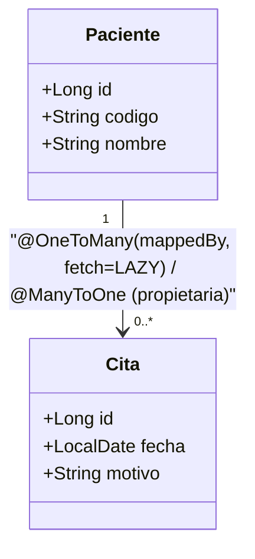

# 💡 Ejemplo 03 — `@OneToMany`/`@ManyToOne` y `fetch`

## 🌍 Contexto

`@OneToMany`/`@ManyToOne` son las relaciones más comunes en sistemas
reales: un `Paciente` tiene muchas `Cita`; muchas `Cita` pertenecen a un
`Paciente`. Ya viste esta relación en el Módulo 3 (Ejemplo 08); ahí, `Cita`
es el lado dueño (declara `@JoinColumn`) y `Paciente` es el lado inverso
(`mappedBy`) — el mismo patrón del Ejemplo 02, aplicado a "muchos" en vez
de a "uno".

Lo que el Módulo 3 no hizo explícito es **cuándo** se cargan esas citas: el
atributo `fetch` de `@OneToMany` define si los datos relacionados se traen
apenas se carga el `Paciente` (`FetchType.EAGER`) o recién cuando se accede
a ellos (`FetchType.LAZY`, el valor por defecto de `@OneToMany`).

**Qué busca demostrar este ejemplo**: hacer explícito `fetch =
FetchType.LAZY` sobre la misma relación `Paciente`↔`Cita` del Módulo 3, y
contrastar conceptualmente qué cambiaría con `EAGER`.

## 🏥 Caso de estudio

MediSalud: `Paciente`↔`Cita`, retomada del Módulo 3.

## 🌳 Árbol de archivos (como se vería en VS Code)

```text
📁 ejemplo-03-oneToMany-fetch
└── 📁 src/main
    ├── 📁 java/com/medisalud
    │   ├── 📄 Paciente.java           (del Módulo 3, extendida con fetch explícito)
    │   ├── 📄 Cita.java               (del Módulo 3, reutilizada)
    │   ├── 📄 RepositorioPacientes.java (del Módulo 3, reutilizada)
    │   ├── 📄 RepositorioCitas.java   (del Módulo 3, reutilizada)
    │   └── 📄 Main.java               (▶️ clic derecho → "Run Java" en VS Code)
    └── 📁 resources
        └── 📄 application.properties  (igual que en el Ejemplo 01)
```

<details>
<summary>📄 Ver código completo de <code>Cita.java</code>, <code>RepositorioPacientes.java</code>, <code>RepositorioCitas.java</code> y <code>application.properties</code> (reutilizados del Módulo 3)</summary>

## 💻 Archivo: `Cita.java`

```java
@Entity
public class Cita {

    @Id
    @GeneratedValue(strategy = GenerationType.IDENTITY)
    private Long id;

    private LocalDate fecha;

    private String motivo;

    @ManyToOne
    @JoinColumn(name = "paciente_id")
    private Paciente paciente;

    protected Cita() {
    }

    public Cita(LocalDate fecha, String motivo, Paciente paciente) {
        this.fecha = fecha;
        this.motivo = motivo;
        this.paciente = paciente;
    }

    public LocalDate getFecha() { return fecha; }
    public String getMotivo() { return motivo; }
    public Paciente getPaciente() { return paciente; }
}
```

## 💻 Archivo: `RepositorioPacientes.java`

```java
public interface RepositorioPacientes extends JpaRepository<Paciente, Long> {
    Optional<Paciente> findByCodigo(String codigo);
}
```

## 💻 Archivo: `RepositorioCitas.java`

```java
public interface RepositorioCitas extends JpaRepository<Cita, Long> {
}
```

## 💻 Archivo: `application.properties`

```properties
spring.datasource.url=jdbc:h2:mem:medisalud;DB_CLOSE_DELAY=-1
spring.datasource.driver-class-name=org.h2.Driver
spring.datasource.username=sa
spring.datasource.password=
spring.jpa.database-platform=org.hibernate.dialect.H2Dialect
spring.jpa.hibernate.ddl-auto=update
```

</details>

## 💻 Archivo: `Paciente.java`

```java
@Entity
public class Paciente {

    @Id
    @GeneratedValue(strategy = GenerationType.IDENTITY)
    private Long id;

    @Column(unique = true)
    private String codigo;

    private String nombre;

    @OneToMany(mappedBy = "paciente", fetch = FetchType.LAZY) // LAZY explícito
    private List<Cita> citas = new ArrayList<>();

    protected Paciente() {
    }

    public Paciente(String codigo, String nombre) {
        this.codigo = codigo;
        this.nombre = nombre;
    }

    public Long getId() { return id; }
    public String getCodigo() { return codigo; }
    public String getNombre() { return nombre; }
    public List<Cita> getCitas() { return citas; }
}
```

## 💻 Archivo: `Main.java` (▶️ clic derecho → "Run Java" en VS Code)

```java
@SpringBootApplication
public class Main implements CommandLineRunner {

    private final RepositorioPacientes repositorioPacientes;
    private final RepositorioCitas repositorioCitas;

    public Main(RepositorioPacientes repositorioPacientes, RepositorioCitas repositorioCitas) {
        this.repositorioPacientes = repositorioPacientes;
        this.repositorioCitas = repositorioCitas;
    }

    public static void main(String[] args) {
        SpringApplication.run(Main.class, args);
    }

    @Override
    @Transactional // necesario para leer paciente.getCitas() más abajo (colección LAZY)
    public void run(String... args) {
        Paciente paciente = repositorioPacientes.save(new Paciente("P-012", "Karina Nuñez"));
        repositorioCitas.save(new Cita(LocalDate.of(2027, 1, 10), "Consulta general", paciente));

        Paciente recargado = repositorioPacientes.findByCodigo("P-012").orElseThrow();
        System.out.println("Citas cargadas (LAZY, dentro de la transacción): " + recargado.getCitas().size());
    }
}
```

## 🗺️ Diagrama: `Paciente`↔`Cita` con `fetch`



## 🧭 Explicación paso a paso

1. `Cita` sigue siendo el lado dueño (`@ManyToOne` + `@JoinColumn`);
   `Paciente` sigue siendo el lado inverso (`mappedBy`) — el mismo patrón
   del Ejemplo 02, ahora sobre una relación uno a muchos.
2. `fetch = FetchType.LAZY` en `Paciente.citas` es, en este caso, el mismo
   valor que Hibernate ya usaba por defecto — se lo hace explícito para que
   quede documentado en el código, no implícito.
3. Con `LAZY`, la colección `citas` no se trae de la base de datos hasta
   que algo la usa (`recargado.getCitas()`); por eso el método necesita
   `@Transactional`: la sesión debe seguir abierta en ese momento.
4. **Contraste con `EAGER`** (no aplicado en este código, solo conceptual):
   si `Paciente.citas` tuviera `fetch = FetchType.EAGER`, cada vez que se
   cargara un `Paciente` —incluso si nunca se necesitan sus citas—
   Hibernate ejecutaría automáticamente una consulta adicional para
   traerlas todas. Sobre una tabla con miles de citas por paciente, eso es
   trabajo desperdiciado en la mayoría de los casos.
5. Por eso la recomendación general es **`LAZY` por defecto**, y reservar
   `EAGER` para el caso poco común en que casi siempre se necesita la
   colección completa junto con la entidad principal.

## ✅ Resultado esperado

Al ejecutar `Main.java`:

```text
Citas cargadas (LAZY, dentro de la transacción): 1
```

## ❓ Preguntas de repaso

**1. [Selección]** ¿Cuál es el valor por defecto de `fetch` en una relación
`@OneToMany`?

- **A.** `FetchType.EAGER`.
- **B.** `FetchType.LAZY`.
- **C.** No tiene valor por defecto; siempre hay que declararlo.
- **D.** Depende de la base de datos usada.

<details>
<summary>🔑 Ver respuesta</summary>

**Respuesta correcta: B**. `@OneToMany` es `LAZY` por defecto (a diferencia
de `@ManyToOne`/`@OneToOne`, que son `EAGER` por defecto).

</details>

**2. [Selección múltiple]** Sobre `fetch = FetchType.EAGER`, seleccioná
**todas** las afirmaciones correctas.

- **A.** Carga los datos relacionados inmediatamente, junto con la entidad principal.
- **B.** Es la opción recomendada por defecto para cualquier colección.
- **C.** Puede traer datos que el código nunca termina usando, si se aplica sin necesidad real.
- **D.** Es una excepción justificada solo cuando los datos relacionados casi siempre se necesitan junto con la entidad principal.

<details>
<summary>🔑 Ver respuesta</summary>

**Respuestas correctas: A, C, D**. La B es falsa: `LAZY` es la
recomendación por defecto; `EAGER` es la excepción justificada.

</details>

**3. [Abierta]** Un compañero configura `fetch = FetchType.EAGER` en
`Paciente.citas` "para no tener que acordarse de `@Transactional`".

**Pregunta**: ¿Qué le dirías sobre esa decisión?

<details>
<summary>🔑 Ver respuesta modelo</summary>

**Respuesta modelo**: Le diría que resuelve el síntoma (el error si se
accede a `citas` fuera de una transacción) pero no de la forma recomendada:
con `EAGER`, cada vez que se cargue un `Paciente` —incluso en código que
nunca usa sus citas— Hibernate va a ejecutar una consulta adicional para
traerlas, sin que se pueda evitar. La alternativa correcta es mantener
`LAZY` (el valor recomendado) y agregar `@Transactional` en los métodos que
sí necesitan acceder a la colección, que es exactamente lo que ya se hace
en este ejemplo.

</details>
