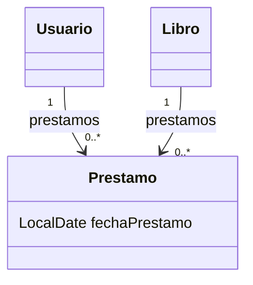

# 💡 Ejemplo 04 — `@ManyToMany` y cuándo usar una entidad intermedia

## 🌍 Contexto

`@ManyToMany` modela relaciones donde muchas entidades de un lado se
relacionan con muchas del otro (por ejemplo, `Libro`↔`Autor`, ya visto en
el Módulo 3). Pero hay un caso en que la anotación simple no alcanza:
cuando la relación en sí necesita un **atributo propio**, algo que no
pertenece a ninguna de las dos entidades, sino a la asociación entre ellas.

Ejemplo real: un `Usuario` puede pedir prestados varios `Libro`, y un
`Libro` puede haber sido prestado a varios `Usuario` a lo largo del tiempo
— eso ya es muchos a muchos. Pero cada préstamo tiene su propia
`fechaPrestamo`, un dato que no es del `Usuario` ni del `Libro`, sino del
**préstamo en sí**.

**Qué busca demostrar este ejemplo**: mostrar primero por qué
`@ManyToMany` simple no puede guardar `fechaPrestamo`, y luego resolverlo
con una entidad intermedia explícita, `Prestamo`.

## 🏥📚 Caso de estudio

Biblioteca Universitaria: `Usuario`↔`Libro`, con `Prestamo` como entidad
intermedia. `Libro` se reutiliza del Módulo 3.

## 🧭 Forma simple (sin atributos propios) — solo ilustrativa, no se implementa

```java
// Así se vería @ManyToMany simple entre Usuario y Libro:
@Entity
public class Usuario {
    // ...
    @ManyToMany
    private List<Libro> librosPrestados;
    // ¿Dónde guardarías la fecha de cada préstamo? No hay ningún lugar.
}
```

Esta forma alcanza cuando la relación no necesita más información que "estos
dos están relacionados" (como `Libro`↔`Autor`). En cuanto aparece un dato
propio de la relación —acá, `fechaPrestamo`— esta forma deja de ser
suficiente.

## 🌳 Árbol de archivos (como se vería en VS Code)

```text
📁 ejemplo-04-manyToMany-entidad-intermedia
└── 📁 src/main
    ├── 📁 java/com/biblioteca
    │   ├── 📄 Libro.java             (del Módulo 3, reutilizada)
    │   ├── 📄 Usuario.java           (nuevo)
    │   ├── 📄 Prestamo.java          (nuevo — entidad intermedia)
    │   ├── 📄 RepositorioLibros.java (del Módulo 3, reutilizada)
    │   ├── 📄 RepositorioUsuarios.java (nuevo)
    │   └── 📄 RepositorioPrestamos.java (nuevo)
    ├── 📁 java
    │   └── 📄 Main.java              (▶️ clic derecho → "Run Java" en VS Code)
    └── 📁 resources
        └── 📄 application.properties (igual que en el Ejemplo 01, base "biblioteca")
```

<details>
<summary>📄 Ver código completo de <code>Libro.java</code>, <code>RepositorioLibros.java</code> y <code>application.properties</code> (reutilizados del Módulo 3)</summary>

## 💻 Archivo: `Libro.java`

```java
@Entity
public class Libro {

    @Id
    @GeneratedValue(strategy = GenerationType.IDENTITY)
    private Long id;

    @Column(unique = true)
    private String isbn;

    private String titulo;

    protected Libro() {
    }

    public Libro(String isbn, String titulo) {
        this.isbn = isbn;
        this.titulo = titulo;
    }

    public Long getId() { return id; }
    public String getIsbn() { return isbn; }
    public String getTitulo() { return titulo; }
}
```

## 💻 Archivo: `RepositorioLibros.java`

```java
public interface RepositorioLibros extends JpaRepository<Libro, Long> {
    Optional<Libro> findByIsbn(String isbn);
}
```

## 💻 Archivo: `application.properties`

```properties
spring.datasource.url=jdbc:h2:mem:biblioteca;DB_CLOSE_DELAY=-1
spring.datasource.driver-class-name=org.h2.Driver
spring.datasource.username=sa
spring.datasource.password=
spring.jpa.database-platform=org.hibernate.dialect.H2Dialect
spring.jpa.hibernate.ddl-auto=update
```

</details>

## 💻 Archivo: `Usuario.java`

```java
@Entity
public class Usuario {

    @Id
    @GeneratedValue(strategy = GenerationType.IDENTITY)
    private Long id;

    private String nombre;

    protected Usuario() {
    }

    public Usuario(String nombre) {
        this.nombre = nombre;
    }

    public Long getId() { return id; }
    public String getNombre() { return nombre; }
}
```

## 💻 Archivo: `Prestamo.java`

```java
@Entity
public class Prestamo {

    @Id
    @GeneratedValue(strategy = GenerationType.IDENTITY)
    private Long id;

    private LocalDate fechaPrestamo; // atributo propio de la relación

    @ManyToOne
    @JoinColumn(name = "usuario_id")
    private Usuario usuario;

    @ManyToOne
    @JoinColumn(name = "libro_id")
    private Libro libro;

    protected Prestamo() {
    }

    public Prestamo(LocalDate fechaPrestamo, Usuario usuario, Libro libro) {
        this.fechaPrestamo = fechaPrestamo;
        this.usuario = usuario;
        this.libro = libro;
    }

    public LocalDate getFechaPrestamo() { return fechaPrestamo; }
    public Usuario getUsuario() { return usuario; }
    public Libro getLibro() { return libro; }
}
```

## 💻 Archivo: `RepositorioUsuarios.java`

```java
public interface RepositorioUsuarios extends JpaRepository<Usuario, Long> {
}
```

## 💻 Archivo: `RepositorioPrestamos.java`

```java
public interface RepositorioPrestamos extends JpaRepository<Prestamo, Long> {
    List<Prestamo> findByUsuario(Usuario usuario);
}
```

## 💻 Archivo: `Main.java` (▶️ clic derecho → "Run Java" en VS Code)

```java
@SpringBootApplication
public class Main implements CommandLineRunner {

    private final RepositorioUsuarios repositorioUsuarios;
    private final RepositorioLibros repositorioLibros;
    private final RepositorioPrestamos repositorioPrestamos;

    public Main(RepositorioUsuarios repositorioUsuarios,
                RepositorioLibros repositorioLibros,
                RepositorioPrestamos repositorioPrestamos) {
        this.repositorioUsuarios = repositorioUsuarios;
        this.repositorioLibros = repositorioLibros;
        this.repositorioPrestamos = repositorioPrestamos;
    }

    public static void main(String[] args) {
        SpringApplication.run(Main.class, args);
    }

    @Override
    public void run(String... args) {
        Usuario usuario = repositorioUsuarios.save(new Usuario("Marcos Bravo"));
        Libro libro = repositorioLibros.save(new Libro("978-0-262-03384-8", "Introducción a los Algoritmos"));

        repositorioPrestamos.save(new Prestamo(LocalDate.of(2027, 2, 1), usuario, libro));

        List<Prestamo> prestamosDeUsuario = repositorioPrestamos.findByUsuario(usuario);
        System.out.println("Préstamos de " + usuario.getNombre() + ": " + prestamosDeUsuario.size());
        System.out.println("Fecha del primer préstamo: " + prestamosDeUsuario.get(0).getFechaPrestamo());
    }
}
```

## 🗺️ Diagrama: de `@ManyToMany` simple a entidad intermedia



`Prestamo` reemplaza lo que hubiera sido una relación `@ManyToMany` directa
entre `Usuario` y `Libro`: ahora son dos relaciones `@ManyToOne` (`Usuario`
↔`Prestamo` y `Libro`↔`Prestamo`), con `fechaPrestamo` viviendo donde
corresponde: en la propia entidad `Prestamo`.

## 🧭 Explicación paso a paso

1. Si `Usuario`↔`Libro` fuera `@ManyToMany` simple, no habría ningún campo
   de la relación en sí donde guardar `fechaPrestamo` — solo existirían
   `Usuario` y `Libro`, sin un tercer lugar para ese dato.
2. `Prestamo` resuelve esto convirtiendo la relación muchos a muchos en dos
   relaciones uno a muchos: `Usuario` (1) — `Prestamo` (N) y `Libro` (1) —
   `Prestamo` (N). Cada `Prestamo` es dueño de sus dos relaciones
   (`@ManyToOne` hacia `Usuario` y hacia `Libro`).
3. `fechaPrestamo` ahora tiene un lugar natural: es un atributo más de
   `Prestamo`, igual que `id`.
4. `RepositorioPrestamos.findByUsuario(...)` es un método derivado de
   Spring Data JPA: permite consultar todos los préstamos de un usuario sin
   escribir JPQL manualmente.

## ✅ Resultado esperado

Al ejecutar `Main.java`:

```text
Préstamos de Marcos Bravo: 1
Fecha del primer préstamo: 2027-02-01
```

## ❓ Preguntas de repaso

**1. [Selección]** ¿Cuándo conviene reemplazar `@ManyToMany` simple por una
entidad intermedia explícita?

- **A.** Siempre; `@ManyToMany` simple nunca debería usarse.
- **B.** Cuando la relación necesita un atributo propio que no pertenece a ninguna de las dos entidades.
- **C.** Solo cuando hay más de 1000 registros relacionados.
- **D.** Nunca; `@ManyToMany` simple siempre alcanza.

<details>
<summary>🔑 Ver respuesta</summary>

**Respuesta correcta: B**. El criterio es la necesidad de un atributo
propio de la relación (como `fechaPrestamo`), no el volumen de datos.

</details>

**2. [Selección múltiple]** Sobre `Prestamo` en este ejemplo, seleccioná
**todas** las afirmaciones correctas.

- **A.** `Prestamo` es el lado dueño tanto de su relación con `Usuario` como de su relación con `Libro`.
- **B.** `fechaPrestamo` no podría guardarse en una relación `@ManyToMany` simple entre `Usuario` y `Libro`.
- **C.** `Prestamo` reemplaza una relación `@ManyToMany` por dos relaciones `@ManyToOne`.
- **D.** `RepositorioPrestamos` necesita implementación manual para poder consultar por usuario.

<details>
<summary>🔑 Ver respuesta</summary>

**Respuestas correctas: A, B, C**. La D es falsa: `findByUsuario` es un
método derivado, Spring Data JPA lo implementa automáticamente.

</details>

**3. [Abierta]** En este escenario:

- `Usuario` y `Curso` tienen una relación `@ManyToMany` simple
  (inscripciones).
- Ahora se pide registrar la fecha en la que cada estudiante se inscribió a
  cada curso.

**Pregunta**: ¿Cómo resolverías este cambio, aplicando el mismo criterio de
este ejemplo?

<details>
<summary>🔑 Ver respuesta modelo</summary>

**Respuesta modelo**: Reemplazaría la relación `@ManyToMany` simple entre
`Usuario` y `Curso` por una entidad intermedia explícita, por ejemplo
`Inscripcion`, con un campo `fechaInscripcion` propio, y dos relaciones
`@ManyToOne`: una hacia `Usuario` y otra hacia `Curso`. Es exactamente el
mismo criterio aplicado a `Prestamo`: la fecha es un atributo de la
relación en sí, no de ninguna de las dos entidades por separado, así que
necesita su propia entidad.

</details>
