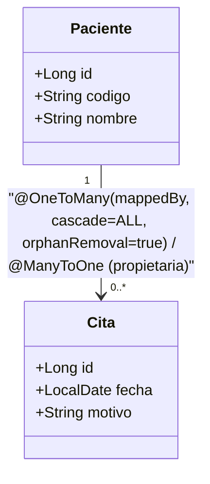

# 💡 Ejemplo 05 — `cascade` y `orphanRemoval`

## 🌍 Contexto

Hasta ahora, cada vez que guardaste un `Paciente` con `Cita` nuevas, tuviste
que guardar cada `Cita` por separado con su propio repositorio (Módulo 3,
Ejemplo 08). `cascade` evita eso: propaga automáticamente una operación
(guardar, actualizar, eliminar) desde una entidad padre hacia sus entidades
relacionadas.

`orphanRemoval` resuelve el problema inverso: cuando una `Cita` deja de
estar en la colección `citas` de un `Paciente` (porque se la quitó de la
lista), ¿debería seguir existiendo en la base de datos, huérfana, sin
ningún padre? Con `orphanRemoval = true`, la respuesta es no: se elimina
automáticamente.

**Qué busca demostrar este ejemplo**: extender `Paciente`↔`Cita` del
Módulo 3 con `cascade = CascadeType.ALL` y `orphanRemoval = true`, y
mostrar ambos comportamientos con código ejecutable.

## 🏥 Caso de estudio

MediSalud: `Paciente`↔`Cita`, ahora con propagación automática de
operaciones.

## 🌳 Árbol de archivos (como se vería en VS Code)

```text
📁 ejemplo-05-cascade-orphanRemoval
└── 📁 src/main
    ├── 📁 java/com/medisalud
    │   ├── 📄 Paciente.java           (del Módulo 3, extendida con cascade/orphanRemoval)
    │   ├── 📄 Cita.java               (del Módulo 3, reutilizada)
    │   └── 📄 RepositorioPacientes.java (del Módulo 3, reutilizada)
    ├── 📁 java
    │   └── 📄 Main.java               (▶️ clic derecho → "Run Java" en VS Code)
    └── 📁 resources
        └── 📄 application.properties  (igual que en el Ejemplo 01)
```

<details>
<summary>📄 Ver código completo de <code>Cita.java</code>, <code>RepositorioPacientes.java</code> y <code>application.properties</code> (reutilizados del Módulo 3)</summary>

## 💻 Archivo: `Cita.java`

```java
@Entity
public class Cita {

    @Id
    @GeneratedValue(strategy = GenerationType.IDENTITY)
    private Long id;

    private LocalDate fecha;

    private String motivo;

    @ManyToOne
    @JoinColumn(name = "paciente_id")
    private Paciente paciente;

    protected Cita() {
    }

    public Cita(LocalDate fecha, String motivo, Paciente paciente) {
        this.fecha = fecha;
        this.motivo = motivo;
        this.paciente = paciente;
    }

    public LocalDate getFecha() { return fecha; }
    public String getMotivo() { return motivo; }
    public Paciente getPaciente() { return paciente; }
}
```

## 💻 Archivo: `RepositorioPacientes.java`

```java
public interface RepositorioPacientes extends JpaRepository<Paciente, Long> {
    Optional<Paciente> findByCodigo(String codigo);
}
```

## 💻 Archivo: `application.properties`

```properties
spring.datasource.url=jdbc:h2:mem:medisalud;DB_CLOSE_DELAY=-1
spring.datasource.driver-class-name=org.h2.Driver
spring.datasource.username=sa
spring.datasource.password=
spring.jpa.database-platform=org.hibernate.dialect.H2Dialect
spring.jpa.hibernate.ddl-auto=update
```

</details>

## 💻 Archivo: `Paciente.java`

```java
@Entity
public class Paciente {

    @Id
    @GeneratedValue(strategy = GenerationType.IDENTITY)
    private Long id;

    @Column(unique = true)
    private String codigo;

    private String nombre;

    @OneToMany(mappedBy = "paciente", cascade = CascadeType.ALL, orphanRemoval = true)
    private List<Cita> citas = new ArrayList<>();

    protected Paciente() {
    }

    public Paciente(String codigo, String nombre) {
        this.codigo = codigo;
        this.nombre = nombre;
    }

    public Long getId() { return id; }
    public String getCodigo() { return codigo; }
    public String getNombre() { return nombre; }
    public List<Cita> getCitas() { return citas; }

    public void agregarCita(Cita cita) {
        citas.add(cita);
    }

    public void quitarCita(Cita cita) {
        citas.remove(cita);
    }
}
```

## 💻 Archivo: `Main.java` (▶️ clic derecho → "Run Java" en VS Code)

```java
@SpringBootApplication
public class Main implements CommandLineRunner {

    private final RepositorioPacientes repositorioPacientes;

    public Main(RepositorioPacientes repositorioPacientes) {
        this.repositorioPacientes = repositorioPacientes;
    }

    public static void main(String[] args) {
        SpringApplication.run(Main.class, args);
    }

    @Override
    @Transactional
    public void run(String... args) {
        Paciente paciente = new Paciente("P-013", "Laura Prieto");
        paciente.agregarCita(new Cita(LocalDate.of(2027, 3, 1), "Control", paciente));
        paciente.agregarCita(new Cita(LocalDate.of(2027, 3, 15), "Seguimiento", paciente));

        // cascade: guardar el paciente ya guarda sus dos citas, sin llamar a RepositorioCitas
        repositorioPacientes.save(paciente);
        System.out.println("Citas guardadas con cascade: " + paciente.getCitas().size());

        // orphanRemoval: quitar una cita de la colección y volver a guardar la elimina de la BD
        Cita citaAEliminar = paciente.getCitas().get(0);
        paciente.quitarCita(citaAEliminar);
        repositorioPacientes.save(paciente);
        System.out.println("Citas después de quitar una con orphanRemoval: " + paciente.getCitas().size());
    }
}
```

## 🗺️ Diagrama: `Paciente`↔`Cita` con `cascade`/`orphanRemoval`



## 🧭 Explicación paso a paso

1. `cascade = CascadeType.ALL` sobre `Paciente.citas` significa que
   cualquier operación (`persist`, `merge`, `remove`, entre otras) aplicada
   al `Paciente` se propaga automáticamente a sus `Cita`. Por eso
   `repositorioPacientes.save(paciente)` alcanza para guardar también las
   dos citas recién agregadas, sin necesitar `RepositorioCitas`.
2. `orphanRemoval = true` vigila la colección `citas`: en cuanto una `Cita`
   deja de estar en esa lista (`paciente.quitarCita(...)`), y se vuelve a
   guardar el `Paciente`, Hibernate la elimina de la base de datos — no
   queda "huérfana" apuntando a un padre que ya no la reconoce.
3. Sin `cascade`, el primer `save` habría fallado o habría dejado las citas
   sin guardar (según la configuración); sin `orphanRemoval`, la cita
   quitada de la lista seguiría existiendo en la base de datos, solo que
   sin ninguna referencia visible desde `Paciente`.
4. Los cuatro tipos de `cascade` (se puede usar cualquier combinación, no
   solo `ALL`):

   | Tipo | Qué propaga |
   |---|---|
   | `PERSIST` | `save` (crear) |
   | `MERGE` | actualizar |
   | `REMOVE` | eliminar |
   | `ALL` | todo lo anterior |

## ✅ Resultado esperado

Al ejecutar `Main.java`:

```text
Citas guardadas con cascade: 2
Citas después de quitar una con orphanRemoval: 1
```

## ❓ Preguntas de repaso

**1. [Selección]** ¿Qué operación propaga `CascadeType.PERSIST`?

- **A.** `save` (crear).
- **B.** Actualizar.
- **C.** Eliminar.
- **D.** Ninguna; solo lee datos.

<details>
<summary>🔑 Ver respuesta</summary>

**Respuesta correcta: A**. `PERSIST` propaga la creación; `MERGE` propaga
actualizaciones y `REMOVE` propaga eliminaciones.

</details>

**2. [Selección múltiple]** Sobre `orphanRemoval` en este ejemplo,
seleccioná **todas** las afirmaciones correctas.

- **A.** Si se quita una `Cita` de `paciente.getCitas()` y no se vuelve a guardar el `Paciente`, la `Cita` no se elimina todavía de la base de datos.
- **B.** `orphanRemoval` requiere que la colección también tenga `cascade` configurado; de lo contrario, no compila.
- **C.** `orphanRemoval = true` elimina automáticamente una entidad hija que dejó de estar en la colección de su padre.
- **D.** Sin `orphanRemoval`, quitar una `Cita` de la lista no la elimina de la base de datos.

<details>
<summary>🔑 Ver respuesta</summary>

**Respuestas correctas: A, C, D**. La B es falsa: `orphanRemoval` es un
atributo independiente de `cascade` (aunque suelen combinarse en la
práctica).

</details>

**3. [Abierta]** En este escenario:

- Un compañero guarda un `Paciente` con dos `Cita` nuevas, usando
  `repositorioPacientes.save(paciente)`.
- `Paciente.citas` **no** tiene `cascade` configurado.
- Las citas no aparecen guardadas en la base de datos.

**Pregunta**: ¿Qué está pasando, y cómo lo corregirías?

<details>
<summary>🔑 Ver respuesta modelo</summary>

**Respuesta modelo**: Sin `cascade`, guardar el `Paciente` no propaga
ninguna operación hacia sus `Cita`: cada `Cita` necesita guardarse
explícitamente con su propio repositorio (`RepositorioCitas.save(...)`),
como se hacía en el Módulo 3. La corrección es agregar
`cascade = CascadeType.ALL` (o al menos `CascadeType.PERSIST`) a
`Paciente.citas`, para que guardar el `Paciente` guarde también las citas
nuevas automáticamente.

</details>
