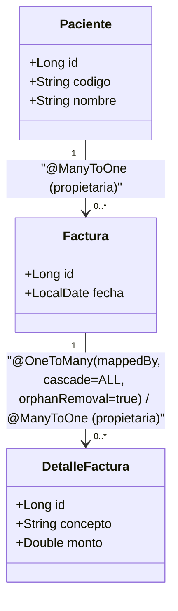

# 💡 Ejemplo 08 — Vista previa: un padre con varias líneas de detalle

## 🌍 Contexto

El Taller 01 te pide construir un caso completo con un padre (`Factura`) y
sus líneas de detalle (`DetalleFactura`), usando `cascade`/`orphanRemoval`
igual que en el Ejemplo 05, pero sobre entidades nuevas. Antes de que lo
resuelvas por tu cuenta, este ejemplo muestra una vista previa compacta del
mismo patrón, con un único `DetalleFactura`, para que veas la forma general
antes de aplicarla al caso completo del taller.

**Qué busca demostrar este ejemplo**: el mismo patrón padre-hijas de
`Paciente`↔`Cita` (Ejemplo 05), aplicado a `Paciente`→`Factura`→
`DetalleFactura`, con `cascade`/`orphanRemoval` entre `Factura` y sus
`DetalleFactura`.

## 🏥 Caso de estudio

MediSalud: `Paciente` (Módulo 3, reutilizado) tiene `Factura`, y cada
`Factura` tiene varias `DetalleFactura`.

## 🌳 Árbol de archivos (como se vería en VS Code)

```text
📁 ejemplo-08-vista-previa
└── 📁 src/main
    ├── 📁 java/com/medisalud
    │   ├── 📄 Paciente.java           (del Módulo 3, reutilizada)
    │   ├── 📄 Factura.java
    │   ├── 📄 DetalleFactura.java
    │   ├── 📄 RepositorioPacientes.java (del Módulo 3, reutilizada)
    │   └── 📄 RepositorioFacturas.java
    ├── 📁 java
    │   └── 📄 Main.java               (▶️ clic derecho → "Run Java" en VS Code)
    └── 📁 resources
        └── 📄 application.properties  (igual que en el Ejemplo 01)
```

<details>
<summary>📄 Ver código completo de <code>Paciente.java</code> y <code>application.properties</code> (reutilizados del Módulo 3)</summary>

## 💻 Archivo: `Paciente.java`

```java
@Entity
public class Paciente {

    @Id
    @GeneratedValue(strategy = GenerationType.IDENTITY)
    private Long id;

    @Column(unique = true)
    private String codigo;

    private String nombre;

    protected Paciente() {
    }

    public Paciente(String codigo, String nombre) {
        this.codigo = codigo;
        this.nombre = nombre;
    }

    public Long getId() { return id; }
    public String getCodigo() { return codigo; }
    public String getNombre() { return nombre; }
}
```

## 💻 Archivo: `application.properties`

```properties
spring.datasource.url=jdbc:h2:mem:medisalud;DB_CLOSE_DELAY=-1
spring.datasource.driver-class-name=org.h2.Driver
spring.datasource.username=sa
spring.datasource.password=
spring.jpa.database-platform=org.hibernate.dialect.H2Dialect
spring.jpa.hibernate.ddl-auto=update
```

</details>

## 💻 Archivo: `RepositorioPacientes.java` (del Módulo 3, reutilizada)

```java
public interface RepositorioPacientes extends JpaRepository<Paciente, Long> {
    Optional<Paciente> findByCodigo(String codigo);
}
```

## 💻 Archivo: `RepositorioFacturas.java`

```java
public interface RepositorioFacturas extends JpaRepository<Factura, Long> {
}
```

## 💻 Archivo: `Factura.java`

```java
@Entity
public class Factura {

    @Id
    @GeneratedValue(strategy = GenerationType.IDENTITY)
    private Long id;

    private LocalDate fecha;

    @ManyToOne
    @JoinColumn(name = "paciente_id")
    private Paciente paciente;

    @OneToMany(mappedBy = "factura", cascade = CascadeType.ALL, orphanRemoval = true)
    private List<DetalleFactura> detalles = new ArrayList<>();

    protected Factura() {
    }

    public Factura(LocalDate fecha, Paciente paciente) {
        this.fecha = fecha;
        this.paciente = paciente;
    }

    public Long getId() { return id; }
    public LocalDate getFecha() { return fecha; }
    public Paciente getPaciente() { return paciente; }
    public List<DetalleFactura> getDetalles() { return detalles; }

    public void agregarDetalle(DetalleFactura detalle) {
        detalles.add(detalle);
    }
}
```

## 💻 Archivo: `DetalleFactura.java`

```java
@Entity
public class DetalleFactura {

    @Id
    @GeneratedValue(strategy = GenerationType.IDENTITY)
    private Long id;

    private String concepto;

    private Double monto;

    @ManyToOne
    @JoinColumn(name = "factura_id")
    private Factura factura;

    protected DetalleFactura() {
    }

    public DetalleFactura(String concepto, Double monto, Factura factura) {
        this.concepto = concepto;
        this.monto = monto;
        this.factura = factura;
    }

    public String getConcepto() { return concepto; }
    public Double getMonto() { return monto; }
}
```

## 💻 Archivo: `Main.java` (▶️ clic derecho → "Run Java" en VS Code)

```java
@SpringBootApplication
public class Main implements CommandLineRunner {

    private final RepositorioPacientes repositorioPacientes;
    private final RepositorioFacturas repositorioFacturas;

    public Main(RepositorioPacientes repositorioPacientes, RepositorioFacturas repositorioFacturas) {
        this.repositorioPacientes = repositorioPacientes;
        this.repositorioFacturas = repositorioFacturas;
    }

    public static void main(String[] args) {
        SpringApplication.run(Main.class, args);
    }

    @Override
    public void run(String... args) {
        Paciente paciente = repositorioPacientes.save(new Paciente("P-021", "Marcos Ríos"));

        Factura factura = new Factura(LocalDate.now(), paciente);
        factura.agregarDetalle(new DetalleFactura("Consulta general", 25.0, factura));

        // cascade: guardar la factura guarda también su detalle, sin repositorio propio
        repositorioFacturas.save(factura);
        System.out.println("Detalles guardados con cascade: " + factura.getDetalles().size());
    }
}
```

## 🗺️ Diagrama: `Paciente`→`Factura`→`DetalleFactura`



## 🧭 Explicación paso a paso

1. `Factura`↔`DetalleFactura` es el mismo patrón de `Paciente`↔`Cita`
   (Ejemplo 05): `DetalleFactura` es el lado propietario (`@ManyToOne` +
   `@JoinColumn`), `Factura` es el lado inverso (`@OneToMany(mappedBy =
   "factura")`) con `cascade = CascadeType.ALL` y `orphanRemoval = true`.
2. `Factura` a su vez es hija de `Paciente` (`@ManyToOne` hacia
   `Paciente`), pero esa relación **no** lleva `cascade`: cada `Factura` se
   guarda explícitamente con `RepositorioFacturas`, mientras que sus
   `DetalleFactura` se propagan automáticamente.
3. El Taller 01 pide construir este mismo patrón completo, con más de un
   `DetalleFactura`, su propio proyecto Spring Boot desde cero, y
   operaciones de alta y edición — esta vista previa solo muestra la forma
   general con el mínimo código necesario.

## ✅ Resultado esperado

Al ejecutar `Main.java`:

```text
Detalles guardados con cascade: 1
```
