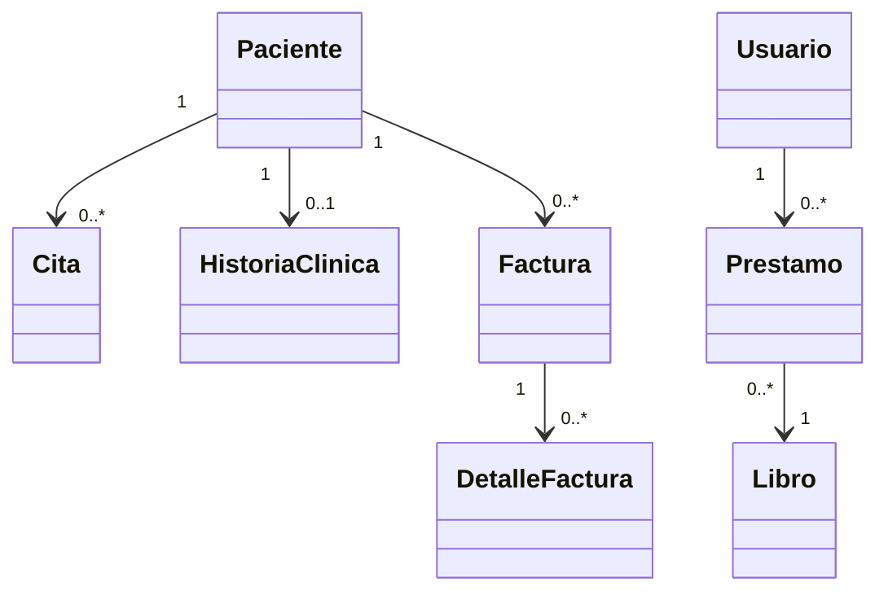

# 🖥️ Presentación — Módulo 4: Gestión de Bases de Datos mediante JPA

## Slide 1 — Título

**Módulo 4 — Gestión de Bases de Datos mediante JPA**
Curso Spring Boot para Aplicaciones Empresariales

## Slide 2 — Objetivos del módulo

Al finalizar, vas a poder crear un proyecto Spring Boot desde cero, mapear
relaciones JPA con control fino sobre carga y propagación, implementar un
CRUD completo, y resolver un caso integrador aplicado.

## Slide 3 — Ruta de la sesión

5 bloques: Creación del proyecto y conexión → Mapeo de relaciones → CRUD
completo → Inicialización del servidor → Ejercicio de JPA aplicado.

## Slide 4 — De un proyecto ya armado a crear el tuyo

En los Módulos 1-3 siempre partiste de un proyecto ya armado. Este módulo
empieza justo ahí: cómo nace un proyecto Spring Boot desde cero.

## Slide 5 — Spring Initializr

`start.spring.io`: formulario para generar un proyecto Spring Boot
(dependencias, versión, lenguaje) sin instalar nada adicional.

## Slide 6 — Dependencias necesarias para persistencia

`spring-boot-starter-data-jpa` (JPA + Hibernate + repositorios) y el driver
de la base de datos (H2 para el curso).

## Slide 7 — Ejemplo: creando el proyecto

```text
Project: Maven · Language: Java · Spring Boot: 3.x
Dependencies: Spring Data JPA, H2 Database
```

## Slide 8 — Actividad práctica: Ejemplo 01 y Básico 03

Crear un proyecto Spring Boot con persistencia, para MediSalud y luego para
Biblioteca Universitaria.

## Slide 9 — ¿Qué es una relación en JPA?

La representación en Java de una relación entre tablas de una base de
datos relacional. Ejemplos reales: un cliente tiene muchos pedidos, un
libro puede tener muchos autores.

## Slide 10 — Los tres tipos de relación (repaso del Módulo 3)

`@OneToOne` · `@OneToMany`/`@ManyToOne` · `@ManyToMany`. Este módulo
profundiza en cada uno más allá de la sintaxis básica.

## Slide 11 — `@OneToOne` y el lado dueño

`Paciente`↔`HistoriaClinica`: el lado dueño declara `@JoinColumn` (la clave
foránea real); el otro lado usa `mappedBy`.

## Slide 12 — El concepto general de lado dueño

`mappedBy` siempre apunta al atributo del otro lado. Aplica a los tres
tipos de relación, no solo a `@OneToOne`.

## Slide 13 — `@OneToMany`/`@ManyToOne` y `fetch`

`Paciente`↔`Cita`: el lado `@ManyToOne` es el dueño. `fetch` decide cuándo
se cargan los datos relacionados.

## Slide 14 — `LAZY` vs. `EAGER`

| Tipo | Qué hace |
|---|---|
| `LAZY` | Carga solo cuando se accede (recomendado por defecto) |
| `EAGER` | Carga inmediatamente |

## Slide 15 — `@ManyToMany` y entidad intermedia

`Usuario`↔`Prestamo`↔`Libro`: cuando la relación necesita un atributo
propio (`fechaPrestamo`), se reemplaza por una entidad intermedia explícita.

## Slide 16 — Diagrama: entidad intermedia


## Slide 17 — `cascade`: propagar operaciones

| Tipo | Qué propaga |
|---|---|
| `PERSIST` | `save` (crear) |
| `MERGE` | actualizar |
| `REMOVE` | eliminar |
| `ALL` | todo lo anterior |

## Slide 18 — `orphanRemoval`

Cuando una entidad hija deja de estar en la colección de su padre (y el
padre se vuelve a guardar), se elimina automáticamente de la base de datos.

## Slide 19 — Ejemplo: `cascade` + `orphanRemoval`

```java
@OneToMany(mappedBy = "paciente", cascade = CascadeType.ALL, orphanRemoval = true)
private List<Cita> citas = new ArrayList<>();
```

## Slide 20 — Actividad práctica: relaciones

Ejercicios Básico 01, Intermedio 01, Básico 02 e Intermedio 02: identificar
el lado dueño, elegir `fetch`, decidir entidad intermedia, agregar `cascade`.

## Slide 21 — CRUD completo con Spring Data JPA

`JpaRepository` ya trae las cuatro operaciones: `save` (crear/actualizar),
`findById`/`findBy...` (leer), `deleteById` (eliminar).

## Slide 22 — `save` decide crear o actualizar

Si la entidad no tiene `id`, `save` crea un registro nuevo; si ya tiene
`id` (por ejemplo, leída con `findBy...`), lo actualiza.

## Slide 23 — Ejemplo: CRUD sobre `Libro`

Crear → leer → actualizar `titulo` → eliminar, verificando el estado tras
cada operación.

## Slide 24 — CRUD parcial

No todas las entidades necesitan las cuatro operaciones: un CRUD parcial
omite deliberadamente alguna (por ejemplo, sin eliminación).

## Slide 25 — Inicialización del servidor: arranque exitoso

`Started <Clase> in ... seconds` confirma que el `ApplicationContext`
terminó de inicializarse sin errores.

## Slide 26 — Inicialización del servidor: arranque fallido

Un error en `application.properties` (por ejemplo, una URL mal escrita)
impide que el contexto termine de inicializarse; el log muestra la causa
real antes de `Started`.

## Slide 27 — Estrategia de diagnóstico

Buscar la línea `Caused by:` (la causa raíz) y compararla contra los
valores de `application.properties`, en vez de asumir un error de código.

## Slide 28 — Ejercicio de JPA aplicado: el cierre del módulo

Integrar todo lo anterior en un caso completo: proyecto nuevo, relación
padre-hijas con `cascade`/`orphanRemoval`, repositorio, alta y edición.

## Slide 29 — Actividad práctica: Taller 01

MediSalud: `Paciente`→`Factura`→`DetalleFactura`. Crear el proyecto,
declarar las entidades y el repositorio, agregar y modificar registros.

## Slide 30 — Actividad práctica: Desafío 01

Biblioteca Universitaria: `OrdenCompra`→`DetalleOrdenCompra`, un caso
distinto del Taller, con CRUD completo integrado.

## Slide 31 — Por qué Taller y Desafío usan casos distintos

Copiar el mismo par de entidades sería una copia mecánica; el objetivo es
aplicar el mismo criterio de diseño sobre un caso de negocio propio.

## Slide 32 — Diagrama general del módulo



## Slide 33 — Resumen del módulo

Crear un proyecto → mapear relaciones con control fino → CRUD completo →
verificar el arranque → integrar todo en un caso aplicado.

## Slide 34 — Evaluación

Quiz de 18 ítems + 9 ejercicios (incluido 1 Desafío) + 1 Taller guiado,
cubriendo los 12 resultados de aprendizaje del módulo.

## Slide 35 — Próximo módulo

El curso continúa construyendo sobre esta capa de persistencia ya completa,
con proyectos y entidades creados por el propio estudiante.
