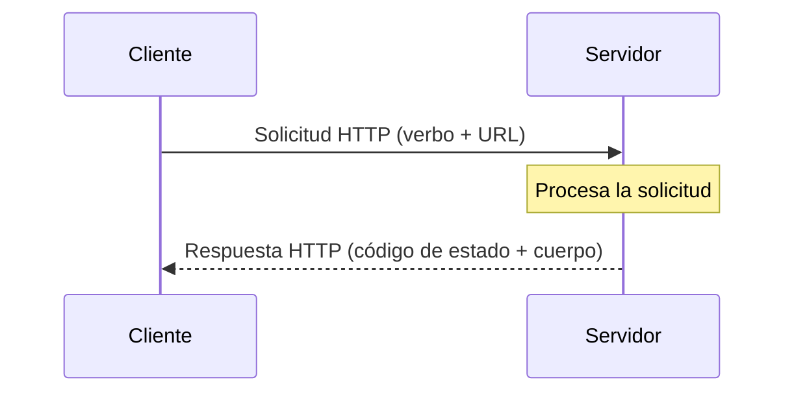

# 💡 Ejemplo 01 — ¿Qué es una API y cómo funciona HTTP?

## 🌍 Contexto

Hasta ahora, toda la aplicación de MediSalud y Biblioteca Universitaria
vivía dentro de un único proceso Java: `Main` guardaba y leía datos
directamente contra H2, sin que nadie más pudiera acceder a esa
información desde afuera. Una API es justamente lo que resuelve esa
limitación.

**Qué busca demostrar este ejemplo**: qué es una API, qué la distingue de
una API remota/web, y cómo funciona el protocolo HTTP (ciclo
solicitud-respuesta, verbos, códigos de estado) que casi todas las APIs
web usan para comunicarse.

## 🧠 ¿Qué es una API?

Una API (*Application Programming Interface*) es un conjunto de reglas que
permite que dos componentes de software se comuniquen entre sí, sin que
cada uno necesite conocer los detalles internos del otro.

- Una **API local** vive dentro del mismo proceso (por ejemplo, los
  métodos públicos de `RepositorioLibros` son la API que `ServicioLibros`
  usa para hablar con la base de datos, dentro del mismo programa Java).
- Una **API remota/web** opera sobre una red: el cliente y el servidor son
  procesos distintos, generalmente en máquinas distintas, y se comunican a
  través de un protocolo estándar — casi siempre HTTP.

Este módulo se enfoca en el segundo caso: exponer MediSalud/Biblioteca
Universitaria como una API web, alcanzable desde fuera del propio proceso
Java.

## 🧠 El ciclo solicitud-respuesta de HTTP

HTTP funciona con un patrón simple: un **cliente** (un navegador, una app
móvil, o una herramienta como Insomnia) envía una **solicitud** a un
**servidor**, y el servidor responde con una **respuesta**.

```text
Cliente                                Servidor
   |──── Solicitud HTTP (GET /libros) ────>|
   |                                        | (procesa la solicitud)
   |<──── Respuesta HTTP (200 + JSON) ──────|
```

## 🗺️ Diagrama: el ciclo solicitud-respuesta



Toda solicitud HTTP tiene, como mínimo, un **verbo** (qué se quiere hacer)
y una **URL** (sobre qué recurso). Toda respuesta tiene un **código de
estado** (qué pasó) y, generalmente, un **cuerpo** (los datos, casi
siempre en JSON en una API REST).

## 🧠 Los verbos HTTP

| Verbo | Para qué se usa | Ejemplo sobre `Libro` |
|---|---|---|
| `GET` | Solicitar/leer un recurso, sin modificarlo | `GET /libros` (listar todos), `GET /libros/3` (uno solo) |
| `POST` | Crear un recurso nuevo | `POST /libros` con el JSON del libro nuevo en el cuerpo |
| `PUT` | Reemplazar/actualizar un recurso existente por completo | `PUT /libros/3` con el JSON actualizado completo |
| `DELETE` | Eliminar un recurso existente | `DELETE /libros/3` |
| `PATCH` | Modificar parcialmente un recurso existente | `PATCH /libros/3` con solo el campo `titulo` en el cuerpo |

**La diferencia clave entre `PUT` y `PATCH`**: `PUT` reemplaza el recurso
completo (hay que enviar todos sus campos); `PATCH` modifica solo lo que
se envía, dejando el resto sin cambios.

## 🧠 Los códigos de estado HTTP

Cada respuesta HTTP incluye un código de tres dígitos, agrupado en cinco
rangos:

| Rango | Significado | Ejemplo |
|---|---|---|
| `1xx` | Informativo: la solicitud se está procesando | `100 Continue` |
| `2xx` | Éxito: la solicitud se completó correctamente | `200 OK`, `201 Created` |
| `3xx` | Redirección: el recurso está en otro lado | `302 Found` |
| `4xx` | Error del cliente: la solicitud tiene un problema | `404 Not Found` |
| `5xx` | Error del servidor: algo falló al procesar la solicitud | `500 Internal Server Error` |

Sobre una API de `Libro`:

```text
Método: GET
URL: http://localhost:8080/libros/99
Respuesta: 404 Not Found
{
  "error": "No existe un libro con id 99"
}
```

## 🧭 Explicación paso a paso

1. Una API es un contrato de comunicación entre dos componentes; una API
   web/remota usa ese contrato sobre una red, generalmente con HTTP.
2. Toda solicitud HTTP combina un verbo (qué operación) y una URL (sobre
   qué recurso); toda respuesta combina un código de estado (qué pasó) y,
   normalmente, un cuerpo con los datos.
3. Elegir el verbo correcto no es una convención decorativa: `GET` nunca
   debería modificar datos (por eso los navegadores pueden repetirlo sin
   preguntar), mientras que `POST`/`PUT`/`PATCH`/`DELETE` sí modifican el
   estado del servidor.
4. El código de estado le dice al cliente, sin que tenga que leer el
   cuerpo de la respuesta, si la operación tuvo éxito (`2xx`), si el
   propio cliente cometió un error (`4xx`) o si el problema fue del
   servidor (`5xx`).

## ❓ Preguntas de repaso

**1. [Selección]** ¿Qué verbo HTTP se usa para reemplazar por completo un
recurso existente?

- **A.** `GET`.
- **B.** `POST`.
- **C.** `PUT`.
- **D.** `PATCH`.

<details>
<summary>🔑 Ver respuesta</summary>

**Respuesta correcta: C**. `PUT` reemplaza el recurso completo; `PATCH`
modifica solo una parte.

</details>

**2. [Selección múltiple]** Seleccioná **todas** las afirmaciones
correctas sobre los códigos de estado HTTP.

- **A.** Un código `2xx` indica que la solicitud se completó con éxito.
- **B.** Un código `404` indica un error del servidor.
- **C.** Un código `4xx` indica un error causado por el cliente.
- **D.** Un código `500` indica un error del servidor.

<details>
<summary>🔑 Ver respuesta</summary>

**Respuestas correctas: A, C, D**. La B es falsa: `404` es un error del
**cliente** (`4xx`, recurso no encontrado), no del servidor.

</details>

**3. [Abierta]** Un compañero te dice: "no entiendo por qué necesitamos
tantos verbos HTTP distintos si `POST` podría servir para todo (crear,
actualizar, eliminar), solo cambiando lo que mandamos en el cuerpo".

**Pregunta**: ¿Qué le responderías?

<details>
<summary>🔑 Ver respuesta modelo</summary>

**Respuesta modelo**: Técnicamente es cierto que un servidor podría
aceptar todo por `POST` e interpretar la intención según el cuerpo, pero
eso rompe la idea de una **interfaz uniforme** (uno de los principios
REST): cualquier cliente, herramienta o intermediario (un proxy, un
firewall, un navegador) puede razonar sobre una solicitud con solo mirar
su verbo, sin tener que inspeccionar el cuerpo. `GET` es seguro de repetir
o cachear porque nunca modifica nada; `PUT` es idempotente (repetirlo da
el mismo resultado); `DELETE` es explícito sobre la intención. Usar solo
`POST` para todo elimina esas garantías y obliga a todos a leer la
documentación en vez de poder inferir el comportamiento del verbo mismo.

</details>
