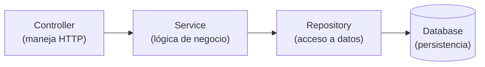

# 💡 Ejemplo 03 — MVC y la arquitectura en capas de Spring

## 🌍 Contexto

Antes de escribir la primera línea de código de este módulo, conviene
tener claro **dónde** va cada línea nueva. Spring Boot organiza una
aplicación web siguiendo el patrón Modelo Vista Controlador (MVC), pero lo
traduce a su propia arquitectura en capas.

**Qué busca demostrar este ejemplo**: qué es MVC en general, cómo se
traduce a la arquitectura en capas de Spring (`Controller` → `Service` →
`Repository` → `Database`), y qué responsabilidad tiene cada capa.

## 🧠 El patrón Modelo Vista Controlador (MVC)

MVC divide una aplicación en tres partes:

- **Modelo**: los datos y las reglas de negocio.
- **Vista**: lo que el usuario ve (una página HTML, una pantalla).
- **Controlador**: recibe la interacción del usuario y coordina entre el
  Modelo y la Vista.

En una aplicación web tradicional (que renderiza HTML), la Vista es una
página completa. En una **API REST**, no hay una Vista en ese sentido: el
"controlador" responde directamente con datos (JSON), y el cliente (una
app, un frontend separado) decide cómo mostrarlos. El cuerpo JSON de la
respuesta cumple, en la práctica, el rol que la Vista cumplía antes.

## 🧠 La arquitectura en capas de Spring

Spring Boot traduce MVC a cuatro capas con responsabilidades bien
definidas:

| Capa | Responsabilidad | Anotación típica |
|---|---|---|
| `Controller` | Recibir la solicitud HTTP, delegar en el `Service`, devolver la respuesta con su código de estado | `@RestController` |
| `Service` | Lógica de negocio: qué hacer con los datos, en qué orden, con qué validaciones | `@Service` |
| `Repository` | Acceso a datos: leer/escribir en la base de datos | `interface ... extends JpaRepository` |
| `Database` | Persistencia real de los datos | H2 en memoria |

**Regla clave**: cada capa solo se comunica con la de abajo. El
`Controller` nunca accede directamente al `Repository`, saltándose el
`Service` — aunque "funcione" en un caso simple, rompe la separación de
responsabilidades: cualquier regla de negocio que se necesite agregar
después (validaciones, cálculos, combinación de varias fuentes de datos)
no tendría un lugar claro donde vivir.

## 🧭 Explicación paso a paso

1. MVC es un patrón general, no exclusivo de Spring ni de las APIs REST;
   existe desde mucho antes de que existieran las APIs web.
2. En una API REST, no hay Vista tradicional: el JSON de la respuesta es
   lo que el cliente consume, y quién decide cómo mostrarlo es el cliente,
   no el servidor.
3. Spring Boot no obliga a usar `Service` — técnicamente se podría inyectar
   el `Repository` directo en el `Controller` — pero la convención
   establecida (y la que sigue este módulo) es mantener esa capa
   intermedia, porque es donde va a vivir toda la lógica de negocio futura.
4. El orden de las flechas en el diagrama importa: una solicitud siempre
   entra por `Controller` y baja; la respuesta sube por el mismo camino en
   sentido inverso.

## ❓ Preguntas de repaso

**1. [Selección]** En una API REST, ¿qué reemplaza a la "Vista" del
patrón MVC tradicional?

- **A.** Una página HTML renderizada por el servidor.
- **B.** El cuerpo JSON de la respuesta, que el cliente decide cómo mostrar.
- **C.** La base de datos.
- **D.** Nada; las APIs REST no tienen equivalente de Vista.

🔑 Ver respuesta

**Respuesta correcta: B**. El JSON de la respuesta cumple, en la
práctica, el rol de la Vista: es lo que el cliente recibe y decide cómo
presentar.

**2. [Selección múltiple]** Seleccioná **todas** las afirmaciones
correctas sobre la arquitectura en capas de Spring.

- **A.** El `Controller` es responsable de manejar la solicitud y respuesta HTTP.
- **B.** El `Service` es responsable de acceder directamente a la base de datos.
- **C.** El `Repository` es responsable del acceso a datos.
- **D.** Cada capa solo debería comunicarse con la capa inmediatamente inferior.

🔑 Ver respuesta

**Respuestas correctas: A, C, D**. La B es falsa: el `Service` contiene
lógica de negocio y delega el acceso a datos en el `Repository`, no accede
a la base de datos directamente.

**3. [Abierta]** Un compañero te muestra un `@RestController` que inyecta
`RepositorioLibros` directamente (sin ningún `@Service` intermedio), y te
dice: "funciona igual, y me ahorré escribir una clase de más".

**Pregunta**: ¿Qué le responderías sobre por qué esa capa importa, aunque
hoy "funcione igual"?

🔑 Ver respuesta modelo

**Respuesta modelo**: Es cierto que, para un caso tan simple como un CRUD
directo, el resultado inmediato es el mismo. El problema aparece en
cuanto se necesita agregar cualquier lógica de negocio (validar datos
antes de guardar, combinar información de varios repositorios, calcular
algo antes de responder): sin una capa `Service`, esa lógica termina
mezclada dentro del `Controller`, que debería limitarse a manejar HTTP.
Mantener la capa desde el principio evita tener que reorganizar todo el
código más adelante, cuando el controlador ya esté sobrecargado de
responsabilidades que no son suyas.

