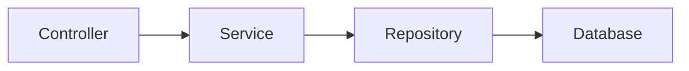

# 🖥️ Presentación — Módulo 5: Diseño API REST en Spring Boot

## Slide 1 — Título

**Módulo 5 — Diseño API REST en Spring Boot**
Curso Spring Boot para Aplicaciones Empresariales

## Slide 2 — Objetivos del módulo

Al finalizar, vas a poder diseñar e implementar una API REST completa en
Spring Boot, agregando las capas `Service` y `Controller` sobre la
persistencia ya construida.

## Slide 3 — Ruta de la sesión

2 bloques: ¿Qué es una API? → Implementación de un RESTful API en Spring
Boot.

## Slide 4 — De la consola a la web

En los Módulos 3-4, la aplicación vivía en un único proceso Java. Este
módulo la expone al mundo exterior con HTTP.

## Slide 5 — ¿Qué es una API?

Un conjunto de reglas que permite que dos componentes de software se
comuniquen; una API remota/web opera sobre una red, casi siempre con HTTP.

## Slide 6 — El ciclo solicitud-respuesta de HTTP

```text
Cliente ── Solicitud (verbo + URL) ──> Servidor
Cliente <── Respuesta (código + cuerpo) ── Servidor
```

## Slide 7 — Los verbos HTTP

`GET` (leer) · `POST` (crear) · `PUT` (reemplazar) · `PATCH` (modificar
parcialmente) · `DELETE` (eliminar).

## Slide 8 — Los códigos de estado HTTP

`1xx` informativo · `2xx` éxito · `3xx` redirección · `4xx` error del
cliente · `5xx` error del servidor.

## Slide 9 — Actividad práctica: Ejemplo 01 y Básico 01/02

Elegir el verbo HTTP correcto y el código de estado correcto para
distintos escenarios.

## Slide 10 — Los principios de una API REST

Sin estado · cliente-servidor · interfaz uniforme · basada en recursos ·
sistema en capas · cacheable (+ código bajo demanda, opcional).

## Slide 11 — Sin estado: por qué importa

Cada solicitud trae toda la información necesaria; el servidor no
recuerda solicitudes anteriores — clave para escalar a muchos servidores.

## Slide 12 — Basada en recursos

Las URIs se nombran como sustantivos (`/libros`, `/libros/3`), nunca como
verbos (`/obtenerLibro`).

## Slide 13 — El patrón Modelo Vista Controlador (MVC)

Modelo (datos y reglas) · Vista (lo que ve el usuario) · Controlador
(coordina entre ambos).

## Slide 14 — MVC en una API REST

No hay Vista tradicional: el cuerpo JSON de la respuesta cumple ese rol.

## Slide 15 — La arquitectura en capas de Spring



## Slide 16 — Responsabilidad de cada capa

`Controller` maneja HTTP · `Service` tiene la lógica de negocio ·
`Repository` accede a datos · `Database` persiste.

## Slide 17 — Regla clave: cada capa habla con la de abajo

El `Controller` nunca inyecta el `Repository` directamente, aunque
"funcione" en un caso simple.

## Slide 18 — Actividad práctica: Ejemplo 03 y Básico 03

Relacionar MVC con las capas de Spring; identificar la responsabilidad de
un fragmento de código dado.

## Slide 19 — Recapitulando: el proyecto ya existe

Los Módulos 3-4 ya crearon el proyecto y la conexión a H2. Este módulo
solo agrega `spring-boot-starter-web`.

## Slide 20 — La única dependencia nueva

`spring-boot-starter-web` habilita Spring MVC: `@RestController` y las
anotaciones de mapeo HTTP.

## Slide 21 — Creación de la clase servicio

`@Service` inyecta el repositorio ya existente y expone métodos de
negocio: `listarTodos`, `buscarPorId`, `crear`, `actualizar`, `eliminar`.

## Slide 22 — Por qué `Optional`/`boolean`, no excepciones

El `Service` no conoce HTTP; deja en manos del `Controller` decidir el
código de estado según el resultado.

## Slide 23 — Actividad práctica: Ejemplo 05 e Intermedio 01

Crear una clase de servicio para una entidad y repositorio dados.

## Slide 24 — El controlador REST

`@RestController` + `@RequestMapping` definen la ruta base; el
controlador delega en el `Service`, nunca en el `Repository`.

## Slide 25 — Anotaciones del controlador

`@GetMapping` · `@PostMapping` · `@PutMapping` · `@DeleteMapping` ·
`@PathVariable` · `@RequestParam` · `@RequestBody`.

## Slide 26 — Códigos de estado en el controlador

`200` éxito con cuerpo · `201` recurso creado · `404` recurso no
encontrado.

## Slide 27 — `ResponseEntity`: elegir el código explícitamente

```java
return servicio.buscarPorId(id)
    .map(ResponseEntity::ok)
    .orElseGet(() -> ResponseEntity.notFound().build());
```

## Slide 28 — Actividad práctica: Ejemplos 06-07 e Intermedio 02/03

Construir los cinco endpoints CRUD de un controlador REST.

## Slide 29 — Probar con Insomnia

Documentar, para cada endpoint: método, URL, cuerpo, código de estado y
respuesta — incluyendo casos de error.

## Slide 30 — El caso `DELETE` + `GET`

Un `DELETE` exitoso no prueba nada por sí solo: el `GET` posterior con
`404` confirma que el recurso desapareció.

## Slide 31 — El problema de la recursión infinita

`Cita` → `paciente` → `citas` → `Cita` → ... cuando una relación
bidireccional se serializa a JSON sin manejarla.

## Slide 32 — La solución: `@JsonIgnore`

Se agrega en el lado que causa el ciclo, sin afectar el mapeo JPA de la
relación.

## Slide 33 — Actividad práctica: Taller 01 y Desafío 01

Taller: API REST completa de `Paciente`. Desafío: API REST completa de
`Cita`, resolviendo la recursión infinita.

## Slide 34 — Resumen del módulo

HTTP y REST (concepto) → MVC y arquitectura en capas → `Service` →
`Controller` → pruebas con Insomnia → caso integrado.

## Slide 35 — Evaluación y próximo módulo

Quiz de 17 ítems + 9 ejercicios (incluido 1 Desafío) + 1 Taller,
cubriendo los 11 resultados de aprendizaje. Recursos adicionales:
documentación oficial de Spring Web y de Insomnia. El curso continúa con
seguridad de APIs en un módulo posterior.
