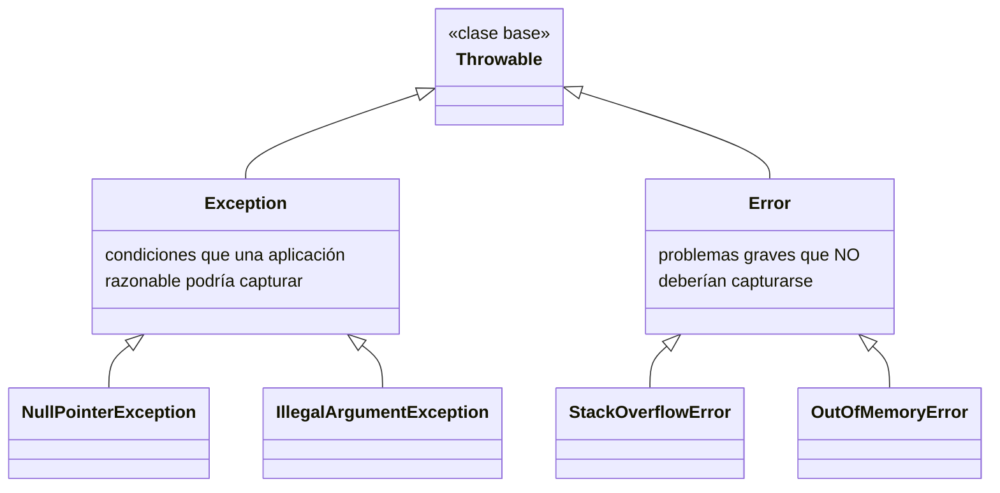

# 💡 Ejemplo 01 — ¿Qué es una excepción?

## 🌍 Contexto

En el Módulo 5, cuando `ServicioLibros.buscarPorId(...)` no encontraba un
libro, devolvía `Optional.empty()` y el controlador construía manualmente
un `404`. Ese patrón funciona, pero no escala: cada método nuevo repite la
misma lógica. Antes de reemplazarlo, conviene entender qué es realmente
una excepción.

**Qué busca demostrar este ejemplo**: qué es una excepción, la jerarquía
`Throwable` → `Exception`/`Error`, la distinción oficial entre ambas
ramas, y las causas típicas que originan excepciones en Java.

## 🧠 ¿Qué es una excepción?

Una excepción es un evento o condición anormal que surge durante la
ejecución de un programa y que interrumpe el flujo normal de las
instrucciones. Cuando ocurre, el programa transfiere el control a un
bloque especial (el "manejador de excepciones"), en vez de terminar
abruptamente — permitiendo imprimir un mensaje, registrar información,
notificar al usuario o tomar una medida correctiva.

## 🧠 La jerarquía `Throwable`

Todas las excepciones y errores de Java son subclases de `Throwable`, la
clase base de la jerarquía:

| Rama | Significado | Ejemplo |
|---|---|---|
| `Error` | Indica un problema grave que una aplicación razonable **no debería** intentar capturar. | `StackOverflowError` |
| `Exception` | Indica condiciones que una aplicación razonable **podría** intentar capturar. | `NullPointerException` |

**Nota**: oficialmente se distingue entre excepciones y errores por esta
razón (los errores son problemas más graves), pero en la práctica, la
mayoría de los desarrolladores considera a los errores simplemente como
un subconjunto de las excepciones.

## 🧠 Causas típicas de excepciones

- Pérdida de conectividad de red.
- Datos de entrada inválidos.
- Solicitudes de archivos ausentes o inexistentes.
- Superar los límites de memoria de la Máquina Virtual de Java (JVM).
- Errores de código.

## 🧭 Explicación paso a paso

1. `Throwable` es la raíz de toda la jerarquía; nunca se usa directamente
   en el código de una aplicación, solo sus dos ramas.
2. La rama `Exception` es la que un programa de usuario debería capturar
   y manejar — es el foco de este módulo completo.
3. La rama `Error` la usa la propia JVM para señalar problemas del
   entorno de ejecución (por ejemplo, quedarse sin memoria); intentar
   "manejar" un `Error` normalmente no resuelve el problema real.
4. De las cinco causas típicas, este módulo se enfoca en las que ocurren
   dentro de una API REST controlada por el propio código (datos
   inválidos, reglas de negocio) más que en las externas al programa
   (conectividad, archivos ausentes).

## ❓ Preguntas de repaso

**1. [Selección]** ¿Cuál es la clase base de toda la jerarquía de
excepciones y errores en Java?

- **A.** `Exception`.
- **B.** `Error`.
- **C.** `Throwable`.
- **D.** `RuntimeException`.

🔑 Ver respuesta

**Respuesta correcta: C**. `Throwable` es la clase base; `Exception` y
`Error` son sus dos ramas principales.

**2. [Selección múltiple]** Seleccioná **todas** las afirmaciones
correctas sobre la distinción entre `Exception` y `Error`.

- **A.** Un `Error` indica un problema grave que una aplicación razonable no debería intentar capturar.
- **B.** `NullPointerException` es un ejemplo de la rama `Error`.
- **C.** `StackOverflowError` es un ejemplo de la rama `Error`.
- **D.** Una `Exception` indica condiciones que una aplicación razonable podría intentar capturar.

🔑 Ver respuesta

**Respuestas correctas: A, C, D**. La B es falsa: `NullPointerException`
pertenece a la rama `Exception`, no `Error`.

**3. [Abierta]** Un compañero te dice: "en la práctica, no veo la
diferencia entre manejar una `Exception` o un `Error`, ¿por qué la
distinción oficial insiste en que los `Error` no deberían capturarse?".

**Pregunta**: ¿Qué le responderías?

🔑 Ver respuesta modelo

**Respuesta modelo**: Un `Error` (como `StackOverflowError` u
`OutOfMemoryError`) generalmente indica que el entorno de ejecución (la
JVM) ya está en un estado comprometido — capturarlo con un `try/catch` no
resuelve la causa real (por ejemplo, memoria insuficiente), y el programa
probablemente no pueda seguir funcionando de forma confiable de todos
modos. Una `Exception`, en cambio, suele representar una condición
esperable dentro del propio dominio del programa (un dato inválido, un
recurso no encontrado) que sí tiene una acción correctiva razonable —
como se verá en el resto de este módulo.

