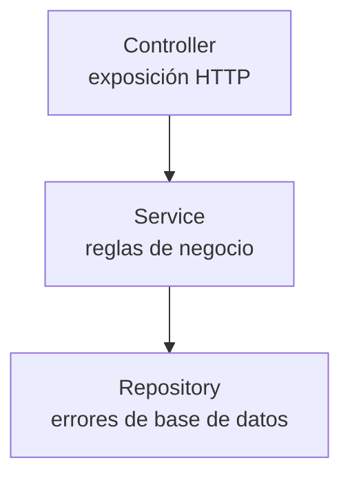

# 💡 Ejemplo 02 — Excepciones en una API REST

## 🌍 Contexto

Ya sabés qué es una excepción (Ejemplo 01). Ahora falta entender por qué
esto importa específicamente en una API REST como las que construiste en
el Módulo 5, y en qué parte del código conviene lanzar y manejar cada
una.

**Qué busca demostrar este ejemplo**: por qué manejar excepciones es
importante en una API REST, y en qué capa de la arquitectura (`Controller`/
`Service`/`Repository`) se origina cada tipo de error.

## 🧠 Por qué importa manejar excepciones en una API REST

En una API REST, los errores no son fallos inesperados: son situaciones
normales del flujo de la aplicación. Por ejemplo:

- Un recurso no existe.
- Se intenta crear un registro duplicado.
- Los datos enviados son inválidos.
- No se cumplen reglas de negocio.

Si estos casos no se gestionan correctamente:

- La API responde con errores genéricos (`500`).
- El cliente no entiende qué ocurrió.
- El código se llena de bloques `try/catch` innecesarios.

El manejo de excepciones permite transformar errores internos en
respuestas HTTP claras, controladas y consistentes — exactamente lo que
falta en `ControladorLibros` del Módulo 5, que todavía construye sus
respuestas de error a mano.

## 🧠 Dónde se producen las excepciones en una arquitectura en capas

| Capa | Tipo de error que origina |
|---|---|
| `Repository` | Errores de base de datos (conexión, restricciones violadas). |
| `Service` | Reglas de negocio (recurso no encontrado, duplicado, validaciones). |
| `Controller` | Exposición HTTP (no debería originar errores de negocio, solo traducirlos). |

**Buena práctica**: las excepciones se lanzan desde el `Service` (donde
vive la regla de negocio) y se manejan a nivel del `Controller` o,
preferentemente, de forma global — nunca al revés.

## 🧭 Explicación paso a paso

1. Los cuatro ejemplos de error (recurso inexistente, duplicado, datos
   inválidos, regla de negocio incumplida) tienen algo en común: todos
   son parte esperable del negocio, no errores de programación.
2. Sin manejo adecuado, cualquiera de estos casos termina en una
   excepción no capturada, que Spring Boot traduce en un `500 Internal
   Server Error` — el mismo código para cualquier problema, sin importar
   la causa real.
3. La arquitectura en capas del Módulo 5 (Ejemplo 03) ya definía la
   responsabilidad de cada capa; el manejo de excepciones sigue esa misma
   separación: el `Service` sabe **por qué** falló algo (conoce la regla
   de negocio), el `Controller` sabe **cómo** comunicarlo por HTTP.
4. Este módulo va a mostrar tres formas de lograr esa traducción
   (`@ResponseStatus`, `@ExceptionHandler`, `@ControllerAdvice`), todas
   respetando esta misma regla: la excepción se lanza en el `Service`.

## ❓ Preguntas de repaso

**1. [Selección]** En una API REST, un cliente intenta crear un libro con
un isbn que ya existe. ¿Cómo se clasifica esta situación?

- **A.** Un fallo inesperado del servidor.
- **B.** Una situación normal del flujo de la aplicación.
- **C.** Un error de la JVM.
- **D.** Un problema de conectividad de red.

🔑 Ver respuesta

**Respuesta correcta: B**. Los recursos duplicados, igual que los
recursos inexistentes o los datos inválidos, son parte normal del flujo
de una API REST, no fallos inesperados.

**2. [Selección múltiple]** Seleccioná **todas** las afirmaciones
correctas sobre dónde se originan los errores en una arquitectura en
capas.

- **A.** Los errores de conexión a la base de datos se originan en el `Repository`.
- **B.** Las reglas de negocio (por ejemplo, rechazar un duplicado) se validan en el `Controller`.
- **C.** La buena práctica es lanzar la excepción desde el `Service`.
- **D.** El `Controller` es responsable de exponer HTTP, no de contener reglas de negocio.

🔑 Ver respuesta

**Respuestas correctas: A, C, D**. La B es falsa: las reglas de negocio
se validan en el `Service`, no en el `Controller`.

**3. [Abierta]** Un compañero escribe la validación de "isbn duplicado"
directamente dentro del método del `Controller`, antes de llamar al
`Service`.

**Pregunta**: ¿Por qué eso no sigue la buena práctica de este módulo, y
qué problema podría causar a futuro?

🔑 Ver respuesta modelo

**Respuesta modelo**: Mezcla la responsabilidad de exposición HTTP
(`Controller`) con una regla de negocio (validar duplicados), que
debería vivir en el `Service`. El problema concreto a futuro: si mañana
se necesita la misma validación desde otro punto de entrada (por
ejemplo, un proceso batch que también crea libros, sin pasar por el
`Controller`), la regla de negocio no estaría disponible ahí — habría que
duplicarla. Si la regla vive en el `Service`, cualquier consumidor del
`Service` la respeta automáticamente.

