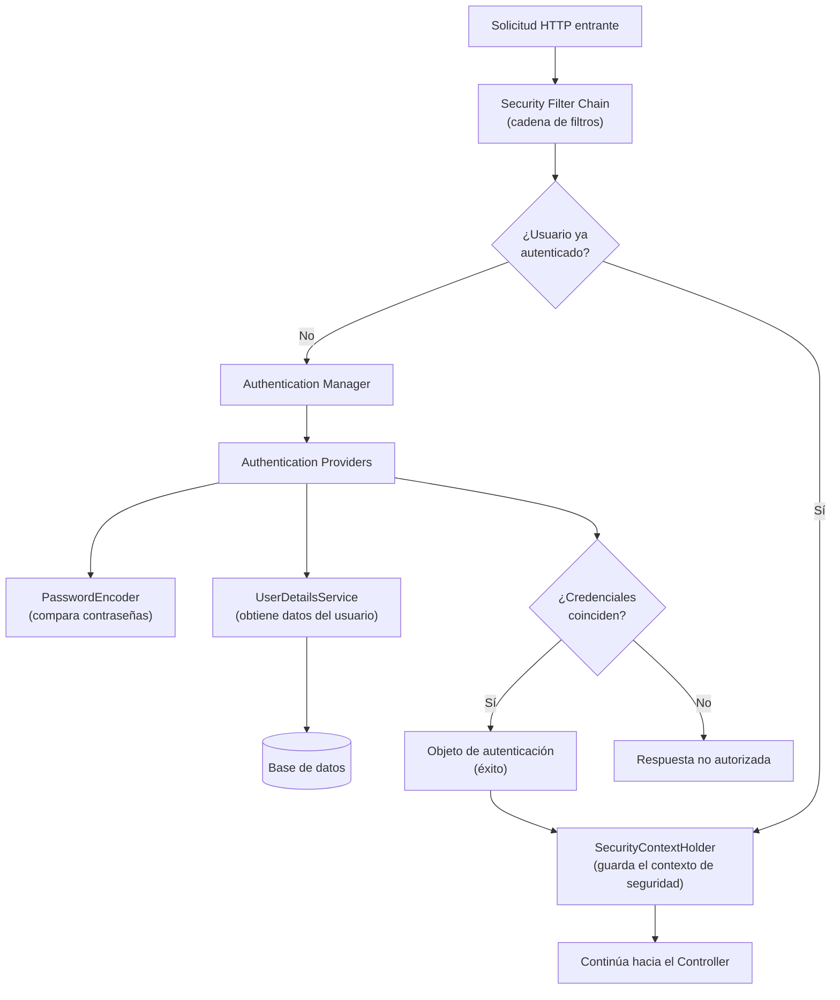

# 💡 Ejemplo 02 — Arquitectura de Spring Boot Security

## 🌍 Contexto

El Ejemplo 01 presentó los conceptos clave de Spring Security de forma
aislada. Este ejemplo los conecta en una arquitectura concreta: qué
componente participa en cada paso, desde que una solicitud HTTP llega
al servidor hasta que el sistema decide si el usuario está autenticado.

**Qué busca demostrar este ejemplo**: que la autenticación no es "una
caja negra", sino una secuencia de pasos bien definidos entre
componentes con responsabilidades específicas — y que, una vez
entendidos, esos mismos componentes reaparecen sin cambios en la
implementación de Basic Auth (Ejemplo 05) y de JWT (Ejemplo 08).

## 🗺️ Diagrama

## 🧭 Explicación paso a paso

1. Toda solicitud HTTP es interceptada primero por la **Security Filter
   Chain**, compuesta por una serie de filtros, cada uno con una tarea
   específica relacionada con la seguridad.
2. Si el usuario aún no está autenticado, los filtros de autenticación
   activan el **Authentication Manager**.
3. El **Authentication Manager** delega en los **Authentication
   Providers** configurados para verificar las credenciales del usuario.
4. Los **Authentication Providers** usan el **PasswordEncoder** para
   comparar la contraseña recibida contra la almacenada (codificada), y
   pueden usar el **UserDetailsService** para obtener los detalles del
   usuario, que a su vez los obtiene de la base de datos.
5. Si las credenciales coinciden, el Authentication Manager genera un
   **objeto de autenticación** que indica éxito; si no, el estado de la
   autenticación se envía al usuario como una respuesta no autorizada.
6. El objeto de autenticación exitoso se almacena en el
   **SecurityContextHolder**, que representa desde ese momento al usuario
   autenticado durante el resto del procesamiento de la solicitud.

## ❓ Preguntas de repaso

**1. [Selección]** Según el diagrama, ¿qué componente activa el
`Authentication Manager`?

- **A.** El `SecurityContextHolder`.
- **B.** Los filtros de autenticación de la Security Filter Chain, cuando el usuario aún no está autenticado.
- **C.** El `UserDetailsService`.
- **D.** La base de datos directamente.

🔑 Ver respuesta

**B.** La Security Filter Chain intercepta la solicitud y, si el usuario
no está autenticado, sus filtros de autenticación activan el
Authentication Manager.

**2. [Selección múltiple]** ¿Cuáles de los siguientes componentes
participan directamente en verificar si una contraseña es correcta?

- **A.** `PasswordEncoder`.
- **B.** `Authentication Providers`.
- **C.** `SecurityContextHolder`.
- **D.** `UserDetailsService`.

🔑 Ver respuesta

**A, B y D.** Los `Authentication Providers` verifican las credenciales
usando el `PasswordEncoder` para comparar contraseñas y el
`UserDetailsService` para obtener los datos del usuario a comparar. El
`SecurityContextHolder` (C) actúa después: solo almacena el resultado ya
verificado, no participa en la verificación en sí.

**3. [Abierta]** Explicá, con tus palabras, dónde queda representado un
usuario ya autenticado una vez que el proceso de la Security Filter
Chain termina, y por qué eso le permite al resto de la aplicación saber
"quién está haciendo esta solicitud" sin repetir la verificación.

🔑 Ver respuesta modelo

Queda representado en el `SecurityContextHolder`, que almacena el objeto
de autenticación generado por el Authentication Manager. Como ese
contexto de seguridad vive durante el procesamiento de la solicitud, el
resto de la aplicación (por ejemplo, el Controller) puede consultarlo sin
volver a pedir credenciales ni repetir la verificación.

