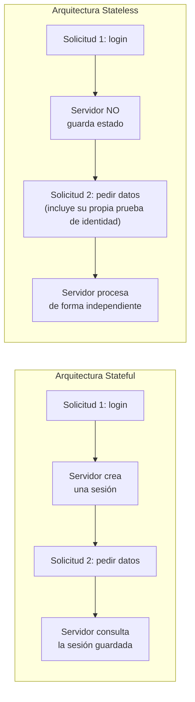

# 💡 Ejemplo 03 — Arquitecturas RESTful: stateful vs. stateless

## 🌍 Contexto

Antes de implementar autenticación con JWT (Ejemplo 08), es necesario
entender por qué se diseña como **stateless**. Este ejemplo compara los
dos tipos de arquitectura RESTful y muestra en qué escenarios reales se
usa cada una.

**Qué busca demostrar este ejemplo**: que "stateless" no significa "sin
autenticación", sino "sin que el servidor almacene el estado de la
sesión entre solicitudes" — la distinción exacta que hace posible que
JWT funcione sin sesiones.

## 🗺️ Diagrama

## 🧭 Explicación paso a paso

1. Una arquitectura **stateful** almacena información sobre el estado
   actual del sistema o las interacciones pasadas del usuario (por
   ejemplo, una sesión HTTP tradicional): cada solicitud depende de lo
   que el servidor recuerde de solicitudes anteriores.
2. Una arquitectura **stateless** procesa cada solicitud de forma
   independiente, sin referencia a eventos anteriores; cada solicitud
   debe incluir toda la información necesaria para entenderla y
   procesarla (por ejemplo, un token).
3. Esto tiene ventajas de escalabilidad y simplicidad: una solicitud
   stateless puede ser atendida por cualquier servidor de un clúster, sin
   necesidad de que ese servidor "recuerde" nada del usuario.
4. El material fuente enumera 7 aplicaciones típicas de arquitecturas
   stateless: servicios web RESTful, servidores de archivos estáticos,
   aplicaciones serverless, balanceadores de carga, aplicaciones de
   búsqueda, autenticación con JWT, y arquitecturas de microservicios.
5. Nótese que "autenticación con JWT" ya aparece en esta lista: es la
   pieza que conecta este ejemplo con el resto del módulo (Ejemplos 06-08).

## ❓ Preguntas de repaso

**1. [Selección]** ¿Cuál de las siguientes es la característica central
de una arquitectura stateless?

- **A.** No usa base de datos.
- **B.** Cada solicitud se procesa de forma independiente, sin que el servidor almacene el estado entre solicitudes.
- **C.** No permite autenticación.
- **D.** Solo funciona con un único servidor.

🔑 Ver respuesta

**B.** El resto de las opciones son ideas erróneas: una arquitectura
stateless sí puede usar base de datos, sí permite autenticación (con
JWT, por ejemplo) y de hecho escala mejor entre varios servidores
precisamente porque no depende de un estado compartido.

**2. [Abierta]** Nombrá dos de las siete aplicaciones típicas de
arquitecturas stateless mencionadas en este ejemplo, y explicá
brevemente por qué encajan en esa categoría.

🔑 Ver respuesta modelo

Por ejemplo: los balanceadores de carga (distribuyen solicitudes entre
varios servidores sin necesidad de recordar el estado de sesión de cada
una) y la autenticación JWT (el token contiene toda la información
necesaria para autenticar al usuario, eliminando la necesidad de una
sesión en el servidor). Cualquier par de las siete aplicaciones listadas
es válido si la justificación es correcta.

**3. [Selección múltiple]** ¿Cuáles de las siguientes son ventajas
típicas de una arquitectura stateless frente a una stateful?

- **A.** Mayor escalabilidad, porque cualquier servidor del clúster puede atender cualquier solicitud.
- **B.** Simplicidad, porque no hay que sincronizar estado de sesión entre servidores.
- **C.** Menor consumo de ancho de banda en cada solicitud.
- **D.** No requiere ningún mecanismo de autenticación.

🔑 Ver respuesta

**A y B.** C es falsa (una solicitud stateless suele incluir más
información, no menos, porque no puede depender de una sesión previa); D
también es falsa, como muestra el propio caso de JWT.

