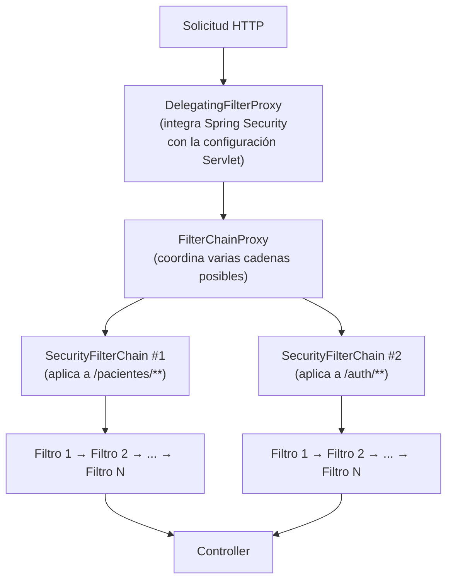

# 💡 Ejemplo 04 — `FilterChainProxy`, `DelegatingFilterProxy` y `SecurityFilterChain`

## 🌍 Contexto

El Ejemplo 02 mostró la "Security Filter Chain" como una caja única en el
diagrama de arquitectura. En realidad, esa cadena de filtros está
implementada por tres clases concretas de Spring Security, cada una con
una responsabilidad distinta. Entenderlas es lo que permite, más
adelante (Ejemplo 08), registrar un filtro propio (`FiltroAutenticacionJwt`)
en el lugar correcto de la cadena.

**Qué busca demostrar este ejemplo**: que la "cadena de filtros" no es
una sola clase, sino una colaboración entre tres componentes con roles
distintos y complementarios.

## 🗺️ Diagrama

## 🧭 Explicación paso a paso

1. **`DelegatingFilterProxy`**: es una clase de Spring Framework que actúa
   como delegado de un filtro definido en el contexto de la aplicación.
   Es el punto donde Spring Security se integra con la configuración de
   filtros de una aplicación web basada en Servlet.
2. **`FilterChainProxy`**: es un filtro especial que gestiona y coordina
   otros filtros dentro de la aplicación. Administra una cadena de
   filtros que se aplican secuencialmente a las solicitudes entrantes
   antes de llegar a la lógica de la aplicación, según el orden
   configurado.
3. **`SecurityFilterChain`**: es una interfaz que define una cadena de
   filtros de seguridad específica para aplicar a las solicitudes
   entrantes. Una aplicación puede tener más de una `SecurityFilterChain`,
   cada una asociada a un patrón de URL particular, lo que permite reglas
   de seguridad distintas para distintas partes de la aplicación.
4. En resumen: `DelegatingFilterProxy` conecta Spring Security con el
   contenedor Servlet; `FilterChainProxy` decide qué `SecurityFilterChain`
   aplica a una solicitud dada, y coordina la ejecución ordenada de sus
   filtros.

## ❓ Preguntas de repaso

**1. [Selección]** ¿Qué componente decide cuál `SecurityFilterChain`
aplicar a una solicitud entrante?

- **A.** `PasswordEncoder`.
- **B.** `FilterChainProxy`.
- **C.** `UserDetailsService`.
- **D.** `SecurityContextHolder`.

🔑 Ver respuesta

**B.** `FilterChainProxy` gestiona y coordina las cadenas de filtros
disponibles, decidiendo cuál aplica a cada solicitud.

**2. [Selección múltiple]** ¿Cuáles de las siguientes afirmaciones son
correctas?

- **A.** `DelegatingFilterProxy` integra Spring Security con la configuración de filtros de Servlet.
- **B.** Una aplicación solo puede tener una `SecurityFilterChain`.
- **C.** Una `SecurityFilterChain` puede asociarse a un patrón de URL particular.
- **D.** `FilterChainProxy` administra una cadena de filtros aplicada secuencialmente.

🔑 Ver respuesta

**A, C y D.** B es falsa: una aplicación puede tener varias
`SecurityFilterChain`, cada una asociada a distintos patrones de URL.

**3. [Abierta]** Explicá con tus propias palabras la diferencia entre
`FilterChainProxy` y `SecurityFilterChain`.

🔑 Ver respuesta modelo

`SecurityFilterChain` es una cadena de filtros específica, asociable a un
patrón de URL concreto. `FilterChainProxy` es el componente que coordina
varias `SecurityFilterChain` posibles y decide cuál aplicar a cada
solicitud entrante — no es una cadena en sí, sino el coordinador de
cadenas.

