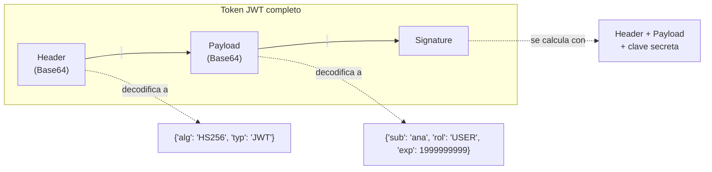

# 💡 Ejemplo 06 — Estructura de un JWT

## 🌍 Contexto

El Ejemplo 05 protegió un endpoint con Basic Auth, pero ese mecanismo
exige enviar usuario y contraseña en **cada** solicitud. JWT (JSON Web
Token) resuelve esto de otra forma: el cliente se autentica una sola vez
(en el login) y recibe un token que "demuestra" su identidad en las
solicitudes siguientes, sin repetir la contraseña. Antes de implementarlo
(Ejemplo 08), hay que entender de qué está hecho un JWT.

**Qué busca demostrar este ejemplo**: que un JWT no es un texto opaco,
sino tres partes con un propósito específico cada una, y que se puede
decodificar (aunque no falsificar sin la clave secreta) por cualquiera.

## 🧠 ¿Qué es JWT?

JWT son las siglas de **JSON Web Token**. Es un estándar abierto (**RFC
7519**) que define una forma compacta y autónoma de representar
información entre dos partes, de manera segura y verificable. Esa
información es confiable porque está **firmada digitalmente**. Los JWT
se usan comúnmente para autenticación y autorización en aplicaciones web
y servicios.

En la práctica, un JWT es una cadena de texto con tres partes codificadas
en **Base64**, cada una separada por un punto:

```text
eyJhbGciOiJIUzI1NiJ9.eyJzdWIiOiJhbmEiLCJyb2wiOiJVU0VSIn0.4f2a8c...
└──────── header ────────┘ └──────────── payload ────────────┘ └─ signature ─┘
```

## 🗺️ Diagrama



## 🧭 Explicación paso a paso

1. **Header (encabezado)**: contiene información sobre cómo debe
   procesarse el JWT, como el tipo de token (`"typ": "JWT"`) y el
   algoritmo de firma usado (por ejemplo, `"alg": "HS256"`).
2. **Payload (cuerpo)**: contiene la información que se transmite —
   *claims* (declaraciones) sobre el usuario y datos adicionales, como
   pares clave-valor (`id` del usuario, tiempo de expiración, rol, etc.).
3. **Signature (firma)**: se usa para verificar que el remitente es quien
   dice ser y que el contenido no fue alterado en el camino. Se calcula
   tomando el header codificado, el payload codificado, y una clave
   secreta, aplicando un algoritmo de firma (por ejemplo, HMAC-SHA256).
4. Header y payload están codificados en Base64, **no encriptados**:
   cualquiera puede decodificarlos y leer su contenido (por eso el
   payload nunca debe contener información sensible, como una contraseña
   en texto plano). Lo que impide manipularlos sin ser detectado es la
   firma, no la codificación.

## ❓ Preguntas de repaso

**1. [Selección]** ¿Qué representa la tercera parte de un JWT
(`signature`)?

- **A.** El nombre de usuario en texto plano.
- **B.** Una firma calculada a partir del header, el payload y una clave secreta, usada para detectar manipulación.
- **C.** La contraseña del usuario, encriptada.
- **D.** La fecha de creación del token, sin ningún otro propósito.

<details><summary>🔑 Ver respuesta</summary>

**B.** La firma permite verificar que el contenido no fue alterado desde
que el servidor emitió el token.

</details>

**2. [Selección múltiple]** ¿Cuáles de las siguientes afirmaciones sobre
un JWT son correctas?

- **A.** El header y el payload están codificados en Base64, no encriptados.
- **B.** Cualquiera puede decodificar y leer el contenido del header y el payload.
- **C.** La firma garantiza que el contenido nunca puede leerse.
- **D.** Las tres partes están separadas por puntos.

<details><summary>🔑 Ver respuesta</summary>

**A, B y D.** C es falsa: la firma detecta manipulación, no oculta el
contenido — eso es justamente lo que hace que un JWT no deba contener
información sensible en texto plano.

</details>

**3. [Abierta]** ¿Por qué el payload de un JWT nunca debería incluir la
contraseña del usuario en texto plano, aunque el token esté firmado?

<details><summary>🔑 Ver respuesta modelo</summary>

Porque el header y el payload solo están codificados en Base64, no
encriptados: cualquiera que intercepte el token puede decodificarlos y
leer su contenido directamente. La firma protege contra la
**manipulación** del contenido, no contra su **lectura**.

</details>
