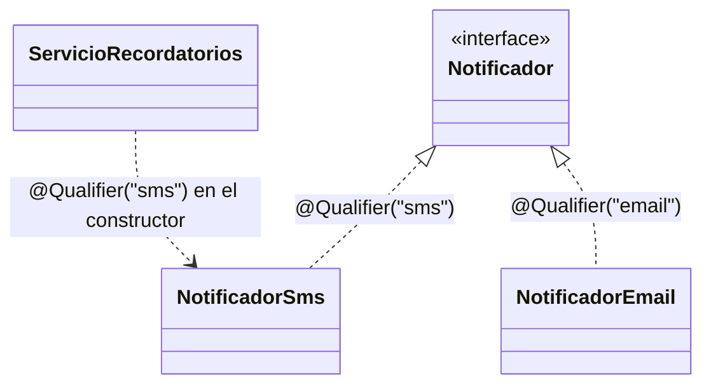

# 💡 Ejemplo 04 — Implementación y resolución de una dependencia general

## 🌍 Contexto

Hasta ahora, cada interfaz de este curso tuvo una sola implementación
candidata, así que Spring siempre supo qué inyectar. Pero en el Ejercicio
Avanzado 01 del Módulo 1 ya construiste una interfaz `Notificador` con **dos**
implementaciones (`NotificadorSms` y `NotificadorEmail`), ensambladas a mano
con `new`. Si esas mismas clases se administraran con Spring, el contenedor no
podría decidir por sí solo cuál inyectar: necesita ayuda para **resolver la
ambigüedad**.

**Qué busca demostrar este ejemplo**: primero, que con una sola implementación
Spring resuelve automáticamente, sin ambigüedad; después, que agregar una
segunda implementación de la misma interfaz rompe esa resolución automática
—mostrando el error real que produce Spring—; y por último, que `@Qualifier`
resuelve esa ambigüedad indicando explícitamente qué bean usar en cada punto
de inyección.

## 🏥 Caso de estudio

MediSalud/Biblioteca Universitaria: `Notificador`, `NotificadorSms` y
`NotificadorEmail`, ya construidos en el Módulo 1 (Ejercicio Avanzado 01),
ahora administrados por el contenedor IoC.

## 💻 Código — Paso 1: una sola implementación, sin ambigüedad

```java
public interface Notificador {
    void enviar(String destinatario, String mensaje);
}

@Component
public class NotificadorSms implements Notificador {
    @Override
    public void enviar(String destinatario, String mensaje) {
        System.out.println("SMS a " + destinatario + ": " + mensaje);
    }
}

@Service
public class ServicioRecordatorios {

    private final Notificador notificador;

    public ServicioRecordatorios(Notificador notificador) {
        this.notificador = notificador;
    }

    public void enviarRecordatorio(String destinatario, String mensaje) {
        notificador.enviar(destinatario, mensaje);
    }
}
```

Con **una sola** clase anotada `@Component` que implementa `Notificador`,
Spring no tiene dudas: al arrancar, resuelve `ServicioRecordatorios` sin
ningún error.

## 🚧 Código — Paso 2: agregar una segunda implementación rompe la resolución automática

```java
@Component
public class NotificadorEmail implements Notificador {
    @Override
    public void enviar(String destinatario, String mensaje) {
        System.out.println("Email a " + destinatario + ": " + mensaje);
    }
}
```

Apenas `NotificadorEmail` también queda anotado `@Component`, arrancar la
aplicación produce un error real (no un error inventado para el ejemplo):

```text
Error creating bean with name 'servicioRecordatorios': Unsatisfied dependency
expressed through constructor parameter 0: No qualifying bean of type
'Notificador' available: expected single matching bean but found 2:
notificadorSms, notificadorEmail
```

## 💻 Código — Paso 3: resolver la ambigüedad con `@Qualifier`

```java
@Component
@Qualifier("sms")
public class NotificadorSms implements Notificador {
    @Override
    public void enviar(String destinatario, String mensaje) {
        System.out.println("SMS a " + destinatario + ": " + mensaje);
    }
}

@Component
@Qualifier("email")
public class NotificadorEmail implements Notificador {
    @Override
    public void enviar(String destinatario, String mensaje) {
        System.out.println("Email a " + destinatario + ": " + mensaje);
    }
}

@Service
public class ServicioRecordatorios {

    private final Notificador notificador;

    public ServicioRecordatorios(@Qualifier("sms") Notificador notificador) {
        this.notificador = notificador;
    }

    public void enviarRecordatorio(String destinatario, String mensaje) {
        notificador.enviar(destinatario, mensaje);
    }
}
```

## 🗺️ Diagrama: dos implementaciones, una resolución explícita



Sin la etiqueta `@Qualifier("sms")` en el constructor de
`ServicioRecordatorios`, la flecha de abajo tendría dos destinos posibles
—exactamente la ambigüedad del Paso 2—; con la etiqueta, el destino queda
resuelto sin dudas.

## 🧭 Explicación paso a paso

1. Con una sola implementación de `Notificador`, Spring resuelve
   `ServicioRecordatorios` sin ambigüedad: no hace falta ninguna anotación
   extra.
2. Al agregar `NotificadorEmail` como segundo `@Component` de la misma
   interfaz, Spring ya no puede decidir cuál de los dos beans corresponde al
   parámetro `Notificador notificador` del constructor: el arranque falla con
   `No qualifying bean of type 'Notificador'... but found 2`.
3. `@Qualifier("sms")` sobre `NotificadorSms` y `@Qualifier("email")` sobre
   `NotificadorEmail` les da un nombre explícito a cada bean.
4. `@Qualifier("sms")` sobre el **parámetro** del constructor de
   `ServicioRecordatorios` le dice a Spring, sin ambigüedad, cuál de los dos
   beans usar en ese punto de inyección.
5. Esto es la **implementación y resolución de una dependencia general**: la
   dependencia (`Notificador`) tiene más de una implementación candidata, y
   `@Qualifier` es la herramienta que resuelve cuál usar en cada caso, sin
   tener que elegir una sola implementación para todo el proyecto.

## ✅ Resultado esperado

Sin `@Qualifier` (Paso 2), la aplicación **no arranca** y muestra el error de
ambigüedad de arriba. Con `@Qualifier` (Paso 3), arranca sin errores y:

```text
ServicioRecordatorios.enviarRecordatorio("+54 11 5555-0100", "Su cita es mañana.")
→ SMS a +54 11 5555-0100: Su cita es mañana.
```

## ❓ Preguntas de repaso

**1. [Selección]** Con una única clase `@Component` implementando
`Notificador`, ¿qué hace Spring al inyectarla en `ServicioRecordatorios`?

- **A.** Falla, porque siempre hace falta `@Qualifier`.
- **B.** La resuelve automáticamente, sin ambigüedad.
- **C.** Pide que se le indique el nombre del bean por consola al arrancar.
- **D.** Ignora la dependencia y deja el campo en `null`.

<details>
<summary>🔑 Ver respuesta</summary>

**Respuesta correcta: B**. Con una sola implementación candidata no hay
ambigüedad que resolver.

</details>

**2. [Selección múltiple]** Al agregar `NotificadorEmail` como segundo
`@Component` de `Notificador` (sin usar `@Qualifier`), seleccioná **todas**
las afirmaciones correctas.

- **A.** La aplicación arranca igual, Spring elige uno al azar.
- **B.** La aplicación falla al arrancar con un error de "no qualifying bean".
- **C.** El error indica cuántos beans candidatos encontró Spring.
- **D.** Agregar `@Qualifier` en ambas implementaciones y en el punto de
  inyección resuelve el error.

<details>
<summary>🔑 Ver respuesta</summary>

**Respuestas correctas: B, C, D**. La A es falsa: Spring nunca "elige al
azar"; si no puede decidir de forma inequívoca, falla explícitamente en el
arranque.

</details>

**3. [Abierta]** ¿Por qué falla la aplicación al arrancar en vez de que Spring
elija cualquiera de las dos implementaciones y siga funcionando?

<details>
<summary>🔑 Ver respuesta modelo</summary>

**Respuesta modelo**: Porque elegir "cualquiera" sería un comportamiento
impredecible: la aplicación podría enviar un SMS en un arranque y un email en
otro, sin que el código lo controle. Spring prefiere fallar rápido y de forma
explícita al arrancar (en vez de comportarse de forma ambigua en producción),
para que el desarrollador decida explícitamente, con `@Qualifier`, qué
implementación corresponde a cada punto de inyección.

</details>
