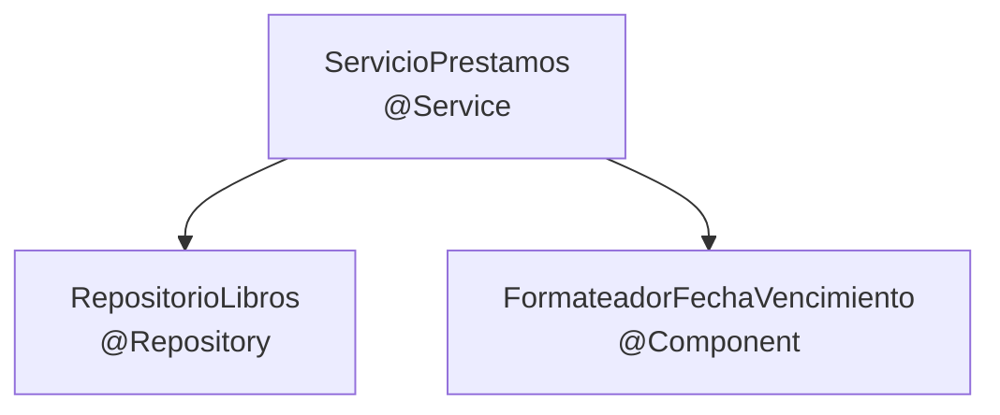

# 💡 Ejemplo 07 — Uso de `@Component`

## 🌍 Contexto

`@Component` es la anotación **base** de Spring para registrar un bean en el
contenedor, sin ningún efecto adicional. Ya usaste sus especializaciones
semánticas en el Módulo 1 (`@Service` para lógica de negocio, `@Repository`
para acceso a datos, `@RestController` para exponer una API), pero nunca se
explicó `@Component` en sí misma, aislada de esas especializaciones.

**Qué busca demostrar este ejemplo**: que `@Component` alcanza, por sí sola,
para que Spring registre y administre una clase como bean —sin
configuración adicional—, y que sus especializaciones (`@Service`,
`@Repository`, `@Controller`) no agregan ningún comportamiento técnico
extra: solo comunican una intención más específica sobre la responsabilidad
de la clase.

## 🏥📚 Caso de estudio

Biblioteca Universitaria: una utilidad de formateo de fechas de vencimiento,
que no encaja claramente en ninguna capa (no es lógica de negocio, ni acceso a
datos, ni un controlador web).

## 🌳 Árbol de archivos (como se vería en VS Code)

```text
📁 ejemplo-07-uso-de-component
└── 📁 src
    ├── 📄 RepositorioLibros.java           (interfaz — del Módulo 1, Ejemplo 11)
    ├── 📄 RepositorioLibrosEnMemoria.java  (del Módulo 1, con @Repository agregado)
    ├── 📄 FormateadorFechaVencimiento.java (nuevo — @Component)
    ├── 📄 ServicioPrestamos.java           (nuevo — @Service)
    ├── 📄 ConfiguracionApp.java
    └── 📄 Main.java                        (▶️ clase con el main que se ejecuta)
```

## 💻 Archivo: `FormateadorFechaVencimiento.java`

```java
@Component // registra el bean en el contenedor, sin ningún efecto adicional
public class FormateadorFechaVencimiento {

    public String formatear(LocalDate fecha) {
        return fecha.format(DateTimeFormatter.ofPattern("dd/MM/yyyy"));
    }
}
```

## 💻 Archivo: `ServicioPrestamos.java`

```java
@Service // especialización semántica de @Component: "esto es lógica de negocio"
public class ServicioPrestamos {

    private final RepositorioLibros repositorioLibros;
    private final FormateadorFechaVencimiento formateadorFechaVencimiento;

    public ServicioPrestamos(RepositorioLibros repositorioLibros,
                              FormateadorFechaVencimiento formateadorFechaVencimiento) {
        this.repositorioLibros = repositorioLibros;
        this.formateadorFechaVencimiento = formateadorFechaVencimiento;
    }

    public String prestarConFechaVencimiento(String isbn, LocalDate fechaVencimiento) {
        repositorioLibros.buscarPorIsbn(isbn).orElseThrow();
        return "Vence el " + formateadorFechaVencimiento.formatear(fechaVencimiento);
    }
}
```

## 💻 Archivo: `RepositorioLibrosEnMemoria.java` (con `@Repository` agregado para este ejemplo)

```java
@Repository
public class RepositorioLibrosEnMemoria implements RepositorioLibros {
    @Override
    public Optional<Libro> buscarPorIsbn(String isbn) {
        return Optional.of(new Libro(isbn, "Libro de ejemplo"));
    }
}
```

## 💻 Archivo: `ConfiguracionApp.java`

```java
@Configuration
@ComponentScan(basePackages = "com.biblioteca")
public class ConfiguracionApp {
}
```

## 💻 Archivo: `Main.java` (▶️ clic derecho → "Run Java" en VS Code)

```java
public class Main {
    public static void main(String[] args) {
        ConfigurableApplicationContext contexto =
                new AnnotationConfigApplicationContext(ConfiguracionApp.class);

        ServicioPrestamos servicioPrestamos = contexto.getBean(ServicioPrestamos.class);
        System.out.println(servicioPrestamos.prestarConFechaVencimiento(
                "978-3-16-148410-0", LocalDate.of(2026, 10, 1)));

        contexto.close();
    }
}
```

## 🗺️ Diagrama: `@Component` conectado igual que cualquier otro bean



Las dos flechas que salen de `ServicioPrestamos` se dibujan exactamente
igual: para Spring, inyectar un `@Repository` o un `@Component` es el mismo
mecanismo técnico. Lo único que distingue a los tres recuadros es la etiqueta
que cada uno eligió para comunicar su responsabilidad.

## 🧭 Explicación paso a paso

1. `FormateadorFechaVencimiento` no tiene ninguna razón de negocio, de acceso
   a datos ni de exposición web: es una utilidad genérica. `@Component` es la
   anotación correcta cuando una clase necesita ser un bean pero no encaja en
   ninguna de las capas con anotación especializada.
2. `@Component` sola alcanza para que Spring la detecte al escanear el
   paquete y la registre como bean, sin ningún archivo de configuración
   adicional.
3. `ServicioPrestamos` recibe `FormateadorFechaVencimiento` inyectado por
   constructor, exactamente igual que recibiría cualquier otro bean —da
   igual si su anotación es `@Component`, `@Service` o `@Repository`, Spring
   los trata técnicamente del mismo modo.
4. La diferencia entre `@Component` y sus especializaciones
   (`@Service`, `@Repository`, `@Controller`) es puramente **semántica**: le
   dice a quien lea el código (y a algunas herramientas de análisis) qué tipo
   de responsabilidad tiene la clase, pero el mecanismo de registro como bean
   es idéntico para las cuatro.

## ✅ Resultado esperado

Al ejecutar `Main.java`:

```text
Vence el 01/10/2026
```

## ❓ Preguntas de repaso

**1. [Selección]** ¿Qué logra anotar una clase con `@Component`?

- **A.** Nada, hasta que además se agregue `@Service`.
- **B.** Registrarla como bean en el contenedor de Spring, sin configuración adicional.
- **C.** Convertirla automáticamente en un controlador web.
- **D.** Hacerla serializable.

<details>
<summary>🔑 Ver respuesta</summary>

**Respuesta correcta: B**. `@Component` por sí sola ya registra el bean; no
hace falta ninguna otra anotación para eso.

</details>

**2. [Selección múltiple]** Sobre `@Component`, `@Service` y `@Repository`,
seleccioná **todas** las afirmaciones correctas.

- **A.** Las tres registran la clase como bean de la misma forma técnica.
- **B.** `@Service` y `@Repository` agregan un comportamiento técnico distinto al de `@Component`.
- **C.** La diferencia entre ellas es principalmente semántica (qué responsabilidad comunican).
- **D.** Una clase sin responsabilidad clara de negocio, datos o web puede anotarse simplemente `@Component`.

<details>
<summary>🔑 Ver respuesta</summary>

**Respuestas correctas: A, C, D**. La B es falsa: como se explicó también en
el Módulo 1, técnicamente hacen lo mismo (salvo matices menores de algunas
especializaciones, como la traducción de excepciones en `@Repository`, no
cubierta en este módulo).

</details>

**3. [Abierta]** ¿Por qué se prefiere anotar `ServicioPrestamos` con
`@Service` en vez de simplemente `@Component`, si ambas registran el bean de
la misma forma?

<details>
<summary>🔑 Ver respuesta modelo</summary>

**Respuesta modelo**: Porque aunque el registro técnico como bean es
idéntico, `@Service` comunica explícitamente que la clase contiene lógica de
negocio, lo cual ayuda a cualquiera que lea el código (o a un docente
revisando el proyecto) a entender la arquitectura por capas de un vistazo,
sin tener que leer el cuerpo de la clase. Usar `@Component` en todos lados
funcionaría igual de bien técnicamente, pero perdería esa claridad
semántica.

</details>
