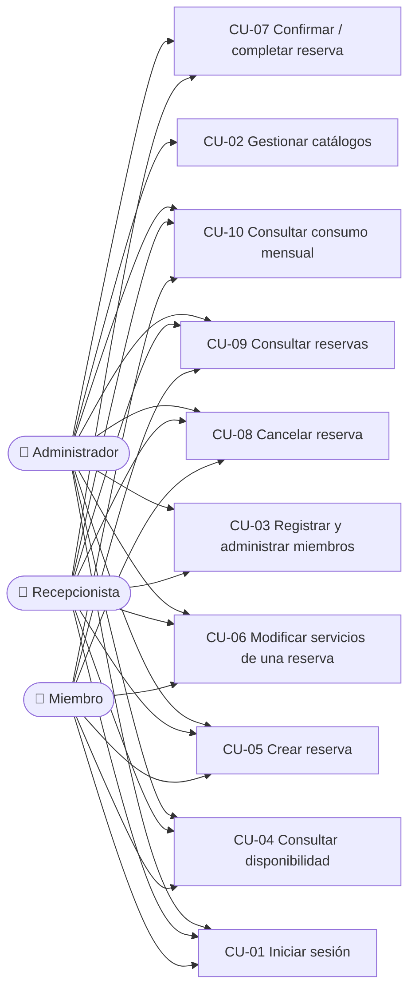
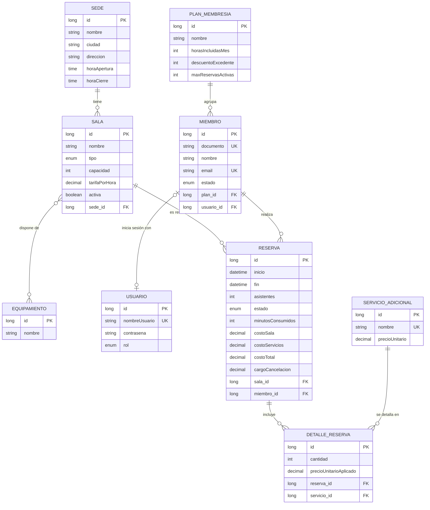

# 📝 Fase 0 — Documento de análisis (entregable 1)

> Este es el análisis de la solución de referencia. **Antes de leerlo, hacé el tuyo**:
> lo que más se aprende es enfrentarse a las ambigüedades del enunciado y decidir.
> Después comparalo con este para ver qué decisiones tomaste distinto.

**Navegación**: [Índice](README.md) · Siguiente → [Fase 1 — Proyecto base](01-fase-1-proyecto-base.md)

## 🎯 Qué vas a hacer en esta fase

Producir, **sin escribir código**, el documento que te permita implementar el sistema
sin volver a preguntar nada. Las seis secciones que pide el enunciado están abajo.

## 1. Actores y casos de uso

| Actor | Quién es | Qué puede hacer |
|---|---|---|
| **Administrador** (`ADMIN`) | Gestiona la operación de CoWorkHub | Todo lo de recepción + gestionar catálogos (sedes, salas, equipamiento, servicios adicionales, planes) |
| **Recepcionista** (`RECEPCION`) | Atiende en la sede | Registrar y administrar miembros; crear, confirmar, cancelar y completar reservas de cualquier miembro; consultar consumo |
| **Miembro** (`MIEMBRO`) | Cliente con un plan | Consultar disponibilidad y catálogos; reservar a su nombre; ver, modificar y cancelar **solo sus** reservas; ver su consumo |

| Caso de uso | Descripción breve | Reglas involucradas |
|---|---|---|
| CU-01 Iniciar sesión | El usuario envía usuario y contraseña y recibe un JWT con su rol | RN-13 |
| CU-02 Gestionar catálogos | Alta, consulta, modificación y baja de sedes, salas (con equipamiento), equipamiento, servicios adicionales y planes | RN-11, RN-12, RN-13 |
| CU-03 Registrar y administrar miembros | Alta del miembro junto con su usuario; actualización; suspensión y reactivación; baja | RN-11, RN-12 |
| CU-04 Consultar disponibilidad | Salas libres de una sede en una fecha y rango horario, filtrando por capacidad y equipamiento | RN-01, RN-03, RN-04 |
| CU-05 Crear reserva | Reserva una sala con servicios opcionales; el sistema calcula el costo | RN-01 … RN-07 |
| CU-06 Modificar servicios | Agregar o quitar servicios mientras la reserva está `PENDIENTE`; se recalcula el costo | RN-07, RN-10 |
| CU-07 Confirmar / completar | Recepción avanza el estado de la reserva | RN-09 |
| CU-08 Cancelar reserva | Cancela aplicando la política de anticipación y devuelve el cargo | RN-08, RN-09 |
| CU-09 Consultar reservas | Por id, por miembro, por sala y fecha, o por estado | RN-13 |
| CU-10 Consultar consumo mensual | Horas incluidas, usadas, restantes y excedentes del mes | RN-07, RN-08 |

## 2. Glosario del dominio

| Término | Definición |
|---|---|
| **Reserva** | Uso de una sala por un miembro, entre un `inicio` y un `fin` del mismo día. Tiene un estado (`PENDIENTE`, `CONFIRMADA`, `COMPLETADA`, `CANCELADA`) y un costo. |
| **Plan de membresía** | Contrato del miembro. Define cuántas horas se incluyen al mes, qué descuento tienen las horas que se pasan del cupo y cuántas reservas activas puede tener a la vez. |
| **Horas incluidas** | Cupo mensual de horas de sala que el plan cubre sin cobro (`horasIncluidasMes`). Se cuenta por mes calendario, según el mes de `inicio` de cada reserva. |
| **Horas excedentes** | Horas usadas en el mes por encima del cupo. Se cobran a `tarifaPorHora × (1 − descuentoExcedente)`. |
| **Solapamiento** | Dos reservas activas de la misma sala cuyo tiempo se superpone: `inicioNuevo < finExistente` **y** `finNuevo > inicioExistente`. Si una termina justo cuando empieza la otra, no se solapan. |
| **Cargo por cancelación** | Monto que se cobra al cancelar tarde (entre 24 h y 2 h antes del inicio): el 50 % del costo de la sala. Con 24 h o más es cero. |
| **Reserva activa** | Reserva en estado `PENDIENTE` o `CONFIRMADA`: ocupa la sala y cuenta para el límite del plan. |
| **Detalle de reserva** | Línea de una reserva que registra un servicio adicional, su cantidad y el precio vigente al momento de reservar. |

## 3. Modelo de dominio

> `SALA_EQUIPAMIENTO` (tabla intermedia de la relación N↔N) no aparece en el diagrama:
> JPA la crea a partir de `@JoinTable`.

### Justificación de cada relación

| Relación | Lado dueño (tiene la clave foránea) | `fetch` | `cascade` | Por qué |
|---|---|---|---|---|
| `Sala` → `Sede` (N→1) | `Sala` (`sede_id`) | `EAGER` (por defecto en `@ManyToOne`) | ninguno | Toda respuesta de una sala muestra su sede. La sede vive por sí sola: no se crea desde la sala. |
| `Sede` → `Sala` (1→N) | — (lado inverso, `mappedBy = "sede"`) | `LAZY` | ninguno | Solo existe para poder consultar las salas de una sede. Se excluye del JSON (`@JsonIgnore`) para evitar recursión. |
| `Sala` ↔ `Equipamiento` (N↔N) | `Sala` (`@JoinTable sala_equipamiento`) | `LAZY` | ninguno | Se elige `Sala` como dueña porque el equipamiento se asigna *a una sala*. El equipamiento existe aunque ninguna sala lo use. Los listados de salas lo cargan con `@EntityGraph`. |
| `Miembro` → `PlanMembresia` (N→1) | `Miembro` (`plan_id`) | `EAGER` | ninguno | El plan siempre se necesita junto al miembro (cálculo de costos, límites). |
| `Miembro` ↔ `Usuario` (1↔1) | `Miembro` (`usuario_id`) | `LAZY` | `ALL` + `orphanRemoval` | El `Usuario` no tiene sentido sin su `Miembro`: al eliminar al miembro se elimina su usuario. Nunca se muestra en el JSON (tiene la contraseña codificada). |
| `Reserva` → `Sala`, `Reserva` → `Miembro` (N→1) | `Reserva` | `EAGER` | ninguno | Una reserva siempre se muestra con su sala y su miembro. Ni la sala ni el miembro se crean desde la reserva. |
| `Reserva` → `DetalleReserva` (1→N) | `DetalleReserva` (`reserva_id`); `Reserva` es el lado inverso | `LAZY` | `ALL` + `orphanRemoval` | Los detalles no existen sin la reserva: se guardan con ella y, al quitarlos de la lista, se eliminan de la base. |
| `DetalleReserva` → `ServicioAdicional` (N→1) | `DetalleReserva` (`servicio_id`) | `EAGER` | ninguno | Es una **entidad intermedia**: además de unir, guarda `cantidad` y `precioUnitarioAplicado`. El precio se copia al reservar, así que cambiar el precio del servicio no altera reservas existentes. |

**Sobre RNF-08 (N+1)**: como los `@ManyToOne` son `EAGER`, un listado ingenuo lanzaría
una consulta extra por fila. Por eso los repositorios que devuelven listas (`findAll`
de salas y miembros, y todas las búsquedas de reservas) usan `@EntityGraph`, que trae
las asociaciones necesarias en **una sola consulta**.

## 4. Matriz de trazabilidad

| RF | Reglas | Endpoints | Clases principales |
|---|---|---|---|
| RF-01 Catálogos | RN-11, RN-12, RN-13 | `/api/sedes`, `/api/salas`, `/api/equipamientos`, `/api/servicios-adicionales`, `/api/planes` (GET, POST, PUT, DELETE) | `Controlador*` + `Servicio*` de cada catálogo |
| RF-02 Miembros | RN-11, RN-12, RN-13 | `POST/GET/PUT/DELETE /api/miembros`, `PATCH /api/miembros/{id}/suspender`, `PATCH /api/miembros/{id}/activar` | `ControladorMiembros`, `ServicioMiembros` |
| RF-03 Disponibilidad | RN-01, RN-03, RN-04 | `GET /api/disponibilidad` | `ControladorDisponibilidad`, `ServicioDisponibilidad`, `RepositorioSalas` |
| RF-04 Crear reserva | RN-01 … RN-07 | `POST /api/reservas` | `ServicioReservas.crear`, `CalculadoraCostoReserva` |
| RF-05 Consultar reservas | RN-13 | `GET /api/reservas/{id}`, `GET /api/reservas?miembroId=` / `?salaId=&fecha=` / `?estado=` | `ServicioReservas.buscarPorId`, `buscar` |
| RF-06 Servicios de la reserva | RN-07, RN-10, RN-13 | `POST /api/reservas/{id}/servicios`, `DELETE /api/reservas/{id}/servicios/{servicioId}` | `ServicioReservas.agregarServicio`, `quitarServicio` |
| RF-07 Confirmar | RN-09, RN-13 | `POST /api/reservas/{id}/confirmar` | `ServicioReservas.confirmar` |
| RF-08 Cancelar | RN-08, RN-09, RN-13 | `POST /api/reservas/{id}/cancelar` | `ServicioReservas.cancelar` |
| RF-09 Completar | RN-09, RN-13 | `POST /api/reservas/{id}/completar` | `ServicioReservas.completar` |
| RF-10 Consumo mensual | RN-07, RN-08, RN-13 | `GET /api/miembros/{id}/consumo?mes=yyyy-MM` | `ServicioConsumo` |
| RF-11 Login | RN-13 | `POST /auth/login` | `ControladorAutenticacion`, `UtilJwt` |
| RF-12 Autorización | RN-13 | Todos, salvo login y Swagger | `ConfiguracionSeguridad`, `FiltroAutenticacionJwt`, `@PreAuthorize` |
| RF-13 Documentación | — | `/doc/swagger-ui.html`, `/v3/api-docs` | `ConfiguracionOpenApi`, anotaciones `@Tag`, `@Operation`, `@Schema` |

### Quién puede hacer qué (RN-13)

| Operación | `ADMIN` | `RECEPCION` | `MIEMBRO` |
|---|---|---|---|
| Leer catálogos y consultar disponibilidad | ✅ | ✅ | ✅ |
| Crear, modificar o eliminar catálogos | ✅ | ❌ `403` | ❌ `403` |
| Listar miembros; registrar, actualizar, suspender o eliminar miembros | ✅ | ✅ | ❌ `403` |
| Ver la ficha o el consumo de un miembro | ✅ | ✅ | Solo el suyo |
| Crear una reserva | ✅ | ✅ | Solo a su nombre |
| Ver, listar por miembro, modificar servicios o cancelar una reserva | ✅ | ✅ | Solo las suyas |
| Listar reservas por sala/fecha o por estado; confirmar; completar | ✅ | ✅ | ❌ `403` |

## 5. Supuestos y decisiones

El enunciado deja varios puntos abiertos. Estos son los que resolvió esta solución:

| # | Ambigüedad | Decisión |
|---|---|---|
| S-01 | Las reglas RN-03 y RN-08 dependen de "ahora", y los escenarios 5, 6 y 7 piden anticipaciones exactas | El "ahora" viene de un bean `Clock` inyectable. La propiedad opcional `coworkhub.reloj.fijo` congela la hora para poder repetir las pruebas. Vacía, se usa la hora real. |
| S-02 | ¿Qué mes cuenta para el consumo de una reserva? | El **mes calendario del `inicio`**. Cada reserva guarda `minutosConsumidos` para poder devolver las horas al cancelar (RN-08). |
| S-03 | "Devolver las horas" y "50 % del costo de la sala" al cancelar | Con 24 h o más: `minutosConsumidos = 0` y cargo 0. Entre 24 h y 2 h: el cargo es el 50 % de `costoSala` (que ya excluye las horas cubiertas por el plan) y las horas **no** se devuelven. Al cancelar, `costoTotal` pasa a valer el cargo. |
| S-04 | Casos límite | Exactamente 24 h → sin cargo. Exactamente 2 h → se puede cancelar, con cargo. Menos de 2 h, o ya iniciada → `409`. |
| S-05 | "Reservas activas futuras" (RN-06) | `PENDIENTE` o `CONFIRMADA` con `inicio` posterior a "ahora". |
| S-06 | Qué significa "eliminar" con reservas asociadas (RN-12) | Sala con reservas activas → `409`. Sala con solo historial → también `409` (por integridad de datos) sugiriendo desactivarla. Plan con miembros, sede con salas, servicio usado en reservas, equipamiento en uso y miembro con reservas → `409`. |
| S-07 | Agregar un servicio que la reserva ya tiene | Suma la cantidad y conserva el precio con que se agregó por primera vez. |
| S-08 | Cambiar el precio de un servicio | No afecta reservas existentes (`precioUnitarioAplicado`). |
| S-09 | Confirmar y completar | No revalidan horarios; completar no exige que la reserva haya terminado. |
| S-10 | Alta de personal | Los usuarios `ADMIN` y `RECEPCION` vienen de los datos semilla. Gestionarlos por API queda fuera de alcance. |
| S-11 | ¿Exponer entidades o DTOs? | Las respuestas de lectura devuelven las entidades (como en el Módulo 5), con `@JsonIgnore` en los lados inversos y en `Miembro.usuario`. Las **solicitudes** y el resumen de consumo usan `record`s en el paquete transversal `dto`, para que el cliente no pueda enviar campos como `id`, `estado` o costos. |
| S-12 | Formato de fechas | ISO-8601 sin zona (`2030-06-04T16:00:00`), en la zona horaria del servidor. |
| S-13 | Dos solicitudes simultáneas (RN-01) | Al crear una reserva se **bloquea la fila de la sala** (`PESSIMISTIC_WRITE`) hasta terminar la transacción. |
| S-14 | Datos mal formados vs. reglas violadas | Falta un campo o tiene un formato inválido → `400`. Se viola una regla de negocio o hay un duplicado → `409`. |
| S-15 | Sala desactivada | Deja de aparecer en la disponibilidad y no se puede reservar. Sus reservas existentes no se tocan. |
| S-16 | Miembro suspendido | Conserva sus reservas; no puede crear nuevas (RN-05). |
| S-17 | Contraseñas | Mínimo 6 caracteres, guardadas con BCrypt. |
| S-18 | Código de respuesta de `DELETE` | `200` sin cuerpo (RNF-06 solo prevé `200` y `201` para éxito). |
| S-19 | Horario de la sede | Se compara la hora del día: `inicio ≥ horaApertura` y `fin ≤ horaCierre`. |
| S-20 | Persistencia | H2 en memoria: al reiniciar se pierde todo y los datos semilla se recargan. |

## 6. Fuera de alcance

- Pagos en línea y facturación fiscal (el sistema solo calcula montos).
- Notificaciones por correo.
- Interfaz gráfica.
- Gestión de usuarios de personal por API (S-10).
- Recuperación de contraseña y renovación de tokens (*refresh tokens*).

## 7. Decisiones técnicas relevantes

| Tema | Decisión | Motivo |
|---|---|---|
| Capas | `controllers` → `services` → `persistences` | RNF-02: cada capa solo conoce a la de abajo |
| Errores | Excepciones propias (`RecursoNoEncontradoException`, `ReglaNegocioException`, `SolicitudInvalidaException`) + un `@ControllerAdvice` | Los servicios no conocen HTTP; el manejador es el único que traduce a códigos |
| Costos | Bean `CalculadoraCostoReserva` | RNF-03: las fórmulas viven en un solo lugar y no tocan la base de datos |
| Datos semilla | Dos `CommandLineRunner` ordenados (`@Order`): catálogos, y luego reservas | Las reservas del pasado no pueden pasar por `ServicioReservas` (RN-03) |
| Autorización | URL para catálogos + `@PreAuthorize` con expresiones para dueño/rol | Lo que depende de *quién es el dueño del recurso* no se puede decidir solo por URL |
| N+1 | `@EntityGraph` en las consultas que devuelven listas | RNF-08 |

**Siguiente →** [Fase 1 — Proyecto base](01-fase-1-proyecto-base.md)
