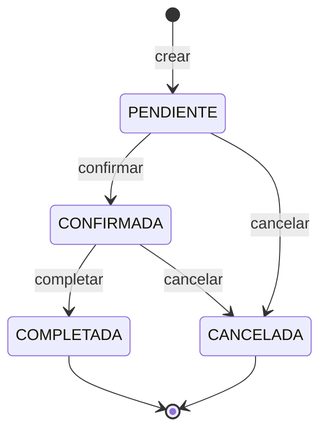

# 📅 Fase 3c — Reservas: calculadora de costos, reglas de negocio y datos de ejemplo

**Navegación**: [Índice](README.md) · ← [Fase 3b — Miembros](03b-fase-3-miembros.md) · Siguiente → [Fase 4 — Excepciones](04-fase-4-excepciones.md)

## 🎯 Qué vas a lograr

Implementar el corazón del sistema: **crear, consultar, modificar y cancelar reservas**
aplicando las reglas RN-01 a RN-10, con costos calculados por un bean propio, y cargar 15
reservas de ejemplo. Es la parte más larga del proyecto: avanzá de a un paso.

## 🪜 Paso a paso

### Paso 3.13 — `CalculadoraCostoReserva` (RN-07 y RN-08)

Un `@Component` que concentra **todas las fórmulas de dinero**. No accede a la base de
datos: recibe lo que necesita y devuelve un resultado. Eso la hace fácil de entender y de
probar, y cumple RNF-03.

Tres operaciones:

| Método | Regla | Cálculo |
|---|---|---|
| `calcularCostoSala` | RN-07 | Los minutos que aún caben en las horas incluidas del plan **no se cobran**. Los excedentes cuestan `tarifa × horasExcedentes × (100 − descuento) / 100` |
| `calcularCostoServicios` | RN-07 | Suma `cantidad × precioUnitarioAplicado` de cada detalle |
| `calcularCargoCancelacionTardia` | RN-08 | 50 % del `costoSala` |

**Ejemplos** (para que puedas verificar tu cálculo a mano):

| Caso | Datos | Resultado |
|---|---|---|
| Todo cubierto por el plan | Ana (Profesional, 40 h/mes) reserva 1,5 h y aún no consumió nada | `costoSala = 0` |
| Sin horas incluidas | Marta (Flex, 0 h) reserva 1,5 h en `Sala Andes` (30/h) | 1,5 × 30 = **45,00** |
| Excedente con descuento | Plan de 2 h y 10 % de descuento; ya consumió 2 h; reserva 1 h en una sala de 20/h | 20 × 1 × 0,90 = **18,00** |
| Parcialmente cubierta | Plan de 2 h; ya consumió 1 h; reserva 2 h en una sala de 20/h → 1 h cubierta y 1 h excedente | 20 × 1 × 0,90 = **18,00** |

**Sobre `BigDecimal`**: el dinero no se calcula con `double`. `multiply`, `divide` y
`setScale` devuelven **objetos nuevos** (no modifican el original). `divide(..., 10,
RoundingMode.HALF_UP)` exige indicar cuántos decimales conservar y cómo redondear, porque
dividir por 60 puede dar infinitos decimales; recién al final se redondea a 2 con
`setScale(2, HALF_UP)`.

**📄 `src/main/java/com/coworkhub/services/CalculadoraCostoReserva.java`**

```java
package com.coworkhub.services;

import java.math.BigDecimal;
import java.math.RoundingMode;
import java.util.List;

import org.springframework.stereotype.Component;

import com.coworkhub.persistences.entities.DetalleReserva;
import com.coworkhub.persistences.entities.PlanMembresia;
import com.coworkhub.persistences.entities.Sala;

// Bean que concentra las fórmulas de costo (RN-07 y RN-08). No accede a la base de datos:
// recibe los datos que necesita y devuelve resultados, por eso es fácil de probar.
@Component
public class CalculadoraCostoReserva {

    public record CostoSala(int minutosConsumidos, BigDecimal costoSala) {
    }

    // RN-07: los minutos cubiertos por las horas incluidas del plan no se cobran;
    // los excedentes se cobran a tarifa × (1 − descuento del plan).
    public CostoSala calcularCostoSala(Sala sala, PlanMembresia plan, long minutosReserva,
                                       long minutosYaConsumidosEnElMes) {
        long minutosIncluidos = plan.getHorasIncluidasMes() * 60L;
        long minutosDisponibles = Math.max(0, minutosIncluidos - minutosYaConsumidosEnElMes);
        long minutosCubiertos = Math.min(minutosReserva, minutosDisponibles);
        long minutosExcedentes = minutosReserva - minutosCubiertos;

        BigDecimal factorDescuento = BigDecimal.valueOf(100 - plan.getDescuentoExcedente())
                .divide(BigDecimal.valueOf(100));
        BigDecimal costo = sala.getTarifaPorHora()
                .multiply(BigDecimal.valueOf(minutosExcedentes))
                .divide(BigDecimal.valueOf(60), 10, RoundingMode.HALF_UP)
                .multiply(factorDescuento)
                .setScale(2, RoundingMode.HALF_UP);

        return new CostoSala((int) minutosReserva, costo);
    }

    // RN-07: suma cantidad × precio vigente al momento de reservar.
    public BigDecimal calcularCostoServicios(List<DetalleReserva> detalles) {
        return detalles.stream()
                .map(DetalleReserva::getSubtotal)
                .reduce(BigDecimal.ZERO, BigDecimal::add)
                .setScale(2, RoundingMode.HALF_UP);
    }

    // RN-08: entre 24 h y 2 h antes del inicio se cobra el 50 % del costo de la sala.
    public BigDecimal calcularCargoCancelacionTardia(BigDecimal costoSala) {
        return costoSala.multiply(new BigDecimal("0.50")).setScale(2, RoundingMode.HALF_UP);
    }
}
```

### Paso 3.14 — `ServicioReservas`

Es la clase más importante. Copiala completa y después leé la guía de abajo.

**📄 `src/main/java/com/coworkhub/services/ServicioReservas.java`**

```java
package com.coworkhub.services;

import static com.coworkhub.services.Validaciones.enteroPositivo;
import static com.coworkhub.services.Validaciones.requerido;

import java.math.BigDecimal;
import java.time.Clock;
import java.time.Duration;
import java.time.LocalDate;
import java.time.LocalDateTime;
import java.time.LocalTime;
import java.time.YearMonth;
import java.util.List;

import org.springframework.stereotype.Service;
import org.springframework.transaction.annotation.Transactional;

import com.coworkhub.dto.ItemServicio;
import com.coworkhub.dto.SolicitudReserva;
import com.coworkhub.exception.ReglaNegocioException;
import com.coworkhub.exception.RecursoNoEncontradoException;
import com.coworkhub.exception.SolicitudInvalidaException;
import com.coworkhub.persistences.entities.DetalleReserva;
import com.coworkhub.persistences.entities.EstadoMiembro;
import com.coworkhub.persistences.entities.EstadoReserva;
import com.coworkhub.persistences.entities.Miembro;
import com.coworkhub.persistences.entities.Reserva;
import com.coworkhub.persistences.entities.Sala;
import com.coworkhub.persistences.entities.Sede;
import com.coworkhub.persistences.entities.ServicioAdicional;
import com.coworkhub.persistences.repositories.RepositorioMiembros;
import com.coworkhub.persistences.repositories.RepositorioReservas;
import com.coworkhub.persistences.repositories.RepositorioSalas;
import com.coworkhub.persistences.repositories.RepositorioServiciosAdicionales;

@Service
@Transactional(readOnly = true)
public class ServicioReservas {

    private static final long DURACION_MINIMA_SEGUNDOS = 30 * 60;
    private static final long DURACION_MAXIMA_SEGUNDOS = 8 * 60 * 60;
    private static final long ANTICIPACION_MINIMA_MINUTOS = 60;
    private static final Duration ANTICIPACION_CANCELACION_SIN_CARGO = Duration.ofHours(24);
    private static final Duration ANTICIPACION_CANCELACION_MINIMA = Duration.ofHours(2);

    private final RepositorioReservas repositorioReservas;
    private final RepositorioSalas repositorioSalas;
    private final RepositorioMiembros repositorioMiembros;
    private final RepositorioServiciosAdicionales repositorioServicios;
    private final CalculadoraCostoReserva calculadora;
    private final Clock reloj;

    public ServicioReservas(RepositorioReservas repositorioReservas, RepositorioSalas repositorioSalas,
                            RepositorioMiembros repositorioMiembros,
                            RepositorioServiciosAdicionales repositorioServicios,
                            CalculadoraCostoReserva calculadora, Clock reloj) {
        this.repositorioReservas = repositorioReservas;
        this.repositorioSalas = repositorioSalas;
        this.repositorioMiembros = repositorioMiembros;
        this.repositorioServicios = repositorioServicios;
        this.calculadora = calculadora;
        this.reloj = reloj;
    }

    // ---------------------------------------------------------------- consultas (RF-05)

    public Reserva buscarPorId(Long id) {
        return repositorioReservas.findById(id)
                .orElseThrow(() -> new RecursoNoEncontradoException("Reserva", id));
    }

    // Se filtra por miembro, o por sala + fecha, o por estado (en ese orden de prioridad).
    public List<Reserva> buscar(Long miembroId, Long salaId, LocalDate fecha, EstadoReserva estado) {
        if (miembroId != null) {
            if (!repositorioMiembros.existsById(miembroId)) {
                throw new RecursoNoEncontradoException("Miembro", miembroId);
            }
            return repositorioReservas.findByMiembroIdOrderByInicioDesc(miembroId);
        }
        if (salaId != null) {
            requerido(fecha, "fecha");
            if (!repositorioSalas.existsById(salaId)) {
                throw new RecursoNoEncontradoException("Sala", salaId);
            }
            return repositorioReservas.findBySalaIdAndInicioBetweenOrderByInicio(
                    salaId, fecha.atStartOfDay(), fecha.atTime(LocalTime.MAX));
        }
        if (estado != null) {
            return repositorioReservas.findByEstadoOrderByInicio(estado);
        }
        throw new SolicitudInvalidaException("Indicá miembroId, o salaId junto con fecha, o estado");
    }

    // ---------------------------------------------------------------- crear (RF-04)

    @Transactional
    public Reserva crear(SolicitudReserva solicitud) {
        requerido(solicitud, "cuerpo de la solicitud");
        Long miembroId = requerido(solicitud.miembroId(), "miembroId");
        Long salaId = requerido(solicitud.salaId(), "salaId");
        LocalDateTime inicio = requerido(solicitud.inicio(), "inicio");
        LocalDateTime fin = requerido(solicitud.fin(), "fin");
        int asistentes = enteroPositivo(solicitud.asistentes(), "asistentes");

        Miembro miembro = repositorioMiembros.findById(miembroId)
                .orElseThrow(() -> new RecursoNoEncontradoException("Miembro", miembroId));
        // La sala se bloquea hasta terminar la transacción: así, dos solicitudes simultáneas
        // para la misma sala no pueden pasar a la vez la verificación de solapamiento.
        Sala sala = repositorioSalas.buscarParaReservar(salaId)
                .orElseThrow(() -> new RecursoNoEncontradoException("Sala", salaId));

        validarMiembroActivo(miembro);
        validarSala(sala, asistentes);
        long segundos = validarDuracion(inicio, fin);
        LocalDateTime ahora = LocalDateTime.now(reloj);
        validarHorario(sala.getSede(), inicio, fin, ahora);
        validarSinSolapamiento(sala, inicio, fin);
        validarLimiteDeReservas(miembro, ahora);

        Reserva reserva = new Reserva(sala, miembro, inicio, fin, asistentes);
        if (solicitud.servicios() != null) {
            for (ItemServicio item : solicitud.servicios()) {
                agregarOSumarDetalle(reserva, item);
            }
        }

        long minutos = segundos / 60;
        YearMonth mes = YearMonth.from(inicio);
        long minutosYaConsumidos = repositorioReservas.sumarMinutosConsumidos(miembroId,
                mes.atDay(1).atStartOfDay(), mes.plusMonths(1).atDay(1).atStartOfDay());
        CalculadoraCostoReserva.CostoSala costoSala =
                calculadora.calcularCostoSala(sala, miembro.getPlan(), minutos, minutosYaConsumidos);

        reserva.setMinutosConsumidos(costoSala.minutosConsumidos());
        reserva.setCostoSala(costoSala.costoSala());
        recalcularCostos(reserva);
        return repositorioReservas.save(reserva);
    }

    // ---------------------------------------------------------------- servicios adicionales (RF-06)

    @Transactional
    public Reserva agregarServicio(Long reservaId, ItemServicio item) {
        Reserva reserva = buscarPorId(reservaId);
        exigirPendienteParaServicios(reserva);
        agregarOSumarDetalle(reserva, requerido(item, "cuerpo de la solicitud"));
        recalcularCostos(reserva);
        return reserva;
    }

    @Transactional
    public Reserva quitarServicio(Long reservaId, Long servicioId) {
        Reserva reserva = buscarPorId(reservaId);
        exigirPendienteParaServicios(reserva);
        DetalleReserva detalle = reserva.getDetalles().stream()
                .filter(d -> d.getServicio().getId().equals(servicioId))
                .findFirst()
                .orElseThrow(() -> new RecursoNoEncontradoException("Servicio en la reserva", servicioId));
        reserva.quitarDetalle(detalle); // orphanRemoval elimina el detalle de la base de datos
        recalcularCostos(reserva);
        return reserva;
    }

    // ---------------------------------------------------------------- cambios de estado (RF-07, RF-08, RF-09)

    @Transactional
    public Reserva confirmar(Long id) {
        Reserva reserva = buscarPorId(id);
        exigirEstado(reserva, EstadoReserva.PENDIENTE, "confirmar");
        reserva.setEstado(EstadoReserva.CONFIRMADA);
        return reserva;
    }

    @Transactional
    public Reserva completar(Long id) {
        Reserva reserva = buscarPorId(id);
        exigirEstado(reserva, EstadoReserva.CONFIRMADA, "completar");
        reserva.setEstado(EstadoReserva.COMPLETADA);
        return reserva;
    }

    // RN-08: la política de cancelación depende de cuánto falta para el inicio.
    @Transactional
    public Reserva cancelar(Long id) {
        Reserva reserva = buscarPorId(id);
        if (!EstadoReserva.ACTIVOS.contains(reserva.getEstado())) {
            throw new ReglaNegocioException("RN-09",
                    "Solo se pueden cancelar reservas PENDIENTE o CONFIRMADA (estado actual: " + reserva.getEstado() + ")");
        }
        LocalDateTime ahora = LocalDateTime.now(reloj);
        if (!ahora.isBefore(reserva.getInicio())) {
            throw new ReglaNegocioException("RN-08", "La reserva ya comenzó y no se puede cancelar");
        }
        Duration anticipacion = Duration.between(ahora, reserva.getInicio());
        if (anticipacion.compareTo(ANTICIPACION_CANCELACION_MINIMA) < 0) {
            throw new ReglaNegocioException("RN-08",
                    "No se puede cancelar con menos de 2 horas de anticipación");
        }

        BigDecimal cargo = BigDecimal.ZERO;
        if (anticipacion.compareTo(ANTICIPACION_CANCELACION_SIN_CARGO) >= 0) {
            reserva.setMinutosConsumidos(0); // 24 h o más: sin cargo y se devuelven las horas del plan
        } else {
            cargo = calculadora.calcularCargoCancelacionTardia(reserva.getCostoSala());
        }
        reserva.setEstado(EstadoReserva.CANCELADA);
        reserva.setCargoCancelacion(cargo);
        reserva.setCostoTotal(cargo); // lo único que se cobra por una reserva cancelada es el cargo
        return reserva;
    }

    // ---------------------------------------------------------------- reglas de negocio (métodos privados)

    // RN-05
    private void validarMiembroActivo(Miembro miembro) {
        if (miembro.getEstado() != EstadoMiembro.ACTIVO) {
            throw new ReglaNegocioException("RN-05", "Solo un miembro ACTIVO puede reservar");
        }
    }

    // RN-04
    private void validarSala(Sala sala, int asistentes) {
        if (!sala.isActiva()) {
            throw new ReglaNegocioException("RN-04", "La sala '" + sala.getNombre() + "' está inactiva");
        }
        if (asistentes > sala.getCapacidad()) {
            throw new ReglaNegocioException("RN-04",
                    "Los asistentes (" + asistentes + ") superan la capacidad de la sala (" + sala.getCapacidad() + ")");
        }
    }

    // RN-02: devuelve la duración en segundos
    private long validarDuracion(LocalDateTime inicio, LocalDateTime fin) {
        if (!inicio.toLocalDate().equals(fin.toLocalDate())) {
            throw new ReglaNegocioException("RN-02", "La reserva debe empezar y terminar el mismo día");
        }
        long segundos = Duration.between(inicio, fin).getSeconds();
        if (segundos < DURACION_MINIMA_SEGUNDOS || segundos > DURACION_MAXIMA_SEGUNDOS
                || segundos % DURACION_MINIMA_SEGUNDOS != 0) {
            throw new ReglaNegocioException("RN-02",
                    "La duración debe ser de entre 30 minutos y 8 horas, en múltiplos de 30 minutos");
        }
        return segundos;
    }

    // RN-03
    private void validarHorario(Sede sede, LocalDateTime inicio, LocalDateTime fin, LocalDateTime ahora) {
        if (inicio.toLocalTime().isBefore(sede.getHoraApertura()) || fin.toLocalTime().isAfter(sede.getHoraCierre())) {
            throw new ReglaNegocioException("RN-03", "La reserva debe estar dentro del horario de la sede ("
                    + sede.getHoraApertura() + " a " + sede.getHoraCierre() + ")");
        }
        if (inicio.isBefore(ahora.plusMinutes(ANTICIPACION_MINIMA_MINUTOS))) {
            throw new ReglaNegocioException("RN-03", "La reserva debe hacerse con al menos 1 hora de anticipación");
        }
    }

    // RN-01
    private void validarSinSolapamiento(Sala sala, LocalDateTime inicio, LocalDateTime fin) {
        if (repositorioReservas.haySolapamiento(sala.getId(), inicio, fin, EstadoReserva.ACTIVOS)) {
            throw new ReglaNegocioException("RN-01", "La sala ya está reservada en ese horario");
        }
    }

    // RN-06
    private void validarLimiteDeReservas(Miembro miembro, LocalDateTime ahora) {
        long activas = repositorioReservas.countByMiembroIdAndEstadoInAndInicioAfter(
                miembro.getId(), EstadoReserva.ACTIVOS, ahora);
        int maximo = miembro.getPlan().getMaxReservasActivas();
        if (activas >= maximo) {
            throw new ReglaNegocioException("RN-06", "El plan " + miembro.getPlan().getNombre()
                    + " permite como máximo " + maximo + " reservas activas");
        }
    }

    // RN-10
    private void exigirPendienteParaServicios(Reserva reserva) {
        if (reserva.getEstado() != EstadoReserva.PENDIENTE) {
            throw new ReglaNegocioException("RN-10",
                    "Los servicios solo se pueden modificar mientras la reserva esté PENDIENTE");
        }
    }

    // RN-09
    private void exigirEstado(Reserva reserva, EstadoReserva requerido, String accion) {
        if (reserva.getEstado() != requerido) {
            throw new ReglaNegocioException("RN-09", "No se puede " + accion + " una reserva en estado "
                    + reserva.getEstado() + " (debe estar " + requerido + ")");
        }
    }

    // Si el servicio ya está en la reserva, suma la cantidad; si no, crea un detalle nuevo
    // con el precio vigente en este momento (RN-07).
    private void agregarOSumarDetalle(Reserva reserva, ItemServicio item) {
        Long servicioId = requerido(requerido(item, "servicios").servicioId(), "servicioId");
        int cantidad = enteroPositivo(item.cantidad(), "cantidad");
        ServicioAdicional servicio = repositorioServicios.findById(servicioId)
                .orElseThrow(() -> new RecursoNoEncontradoException("Servicio adicional", servicioId));
        reserva.getDetalles().stream()
                .filter(d -> d.getServicio().getId().equals(servicioId))
                .findFirst()
                .ifPresentOrElse(
                        existente -> existente.setCantidad(existente.getCantidad() + cantidad),
                        () -> reserva.agregarDetalle(new DetalleReserva(reserva, servicio, cantidad)));
    }

    // El costo de la sala no cambia al modificar servicios: solo se recalculan servicios y total.
    private void recalcularCostos(Reserva reserva) {
        reserva.setCostoServicios(calculadora.calcularCostoServicios(reserva.getDetalles()));
        reserva.setCostoTotal(reserva.getCostoSala().add(reserva.getCostoServicios()));
    }
}
```

#### Guía de lectura

**1. El orden de validación en `crear`.** Sigue una lógica: primero lo barato y lo que
casi seguro falla, y al final lo que consulta la base de datos.

**📄 `src/main/java/com/coworkhub/services/ServicioReservas.java`** (fragmento)

```java
        validarMiembroActivo(miembro);
        validarSala(sala, asistentes);
        long segundos = validarDuracion(inicio, fin);
        LocalDateTime ahora = LocalDateTime.now(reloj);
        validarHorario(sala.getSede(), inicio, fin, ahora);
        validarSinSolapamiento(sala, inicio, fin);
        validarLimiteDeReservas(miembro, ahora);
```

| Validación | Regla | Código si falla |
|---|---|---|
| `validarMiembroActivo` | RN-05 | `409` `RN-05` |
| `validarSala` | RN-04 (sala inactiva, capacidad) | `409` `RN-04` |
| `validarDuracion` | RN-02 (mismo día; 30 min a 8 h; múltiplos de 30 min) | `409` `RN-02` |
| `validarHorario` | RN-03 (horario de la sede, futura, 1 h de anticipación) | `409` `RN-03` |
| `validarSinSolapamiento` | RN-01 | `409` `RN-01` |
| `validarLimiteDeReservas` | RN-06 | `409` `RN-06` |

Fijate que `ahora` sale del `Clock` inyectado: `LocalDateTime.now(reloj)`.

**2. Por qué se bloquea la sala.** Imaginá que dos personas envían al mismo tiempo una
reserva para la misma sala y hora. Sin protección, **ambas** pasan la verificación de
solapamiento (ninguna ve a la otra todavía) y **ambas** se guardan: justo el problema
que la empresa quiere resolver.

**📄 `src/main/java/com/coworkhub/services/ServicioReservas.java`** (fragmento)

```java
        // La sala se bloquea hasta terminar la transacción: así, dos solicitudes simultáneas
        // para la misma sala no pueden pasar a la vez la verificación de solapamiento.
        Sala sala = repositorioSalas.buscarParaReservar(salaId)
                .orElseThrow(() -> new RecursoNoEncontradoException("Sala", salaId));
```

`buscarParaReservar` usa un **bloqueo pesimista** (`SELECT ... FOR UPDATE`): la segunda
transacción **espera** a que termine la primera. Cuando por fin obtiene la sala, la
verificación de solapamiento ya "ve" la reserva de la primera y responde `409`. El
resultado: entre solicitudes simultáneas para el mismo horario, **solo una gana**.

**3. RN-02 en detalle.** Todo se mide en segundos para evitar errores de redondeo:

**📄 `src/main/java/com/coworkhub/services/ServicioReservas.java`** (fragmento)

```java
        long segundos = Duration.between(inicio, fin).getSeconds();
        if (segundos < DURACION_MINIMA_SEGUNDOS || segundos > DURACION_MAXIMA_SEGUNDOS
                || segundos % DURACION_MINIMA_SEGUNDOS != 0) {
```

`DURACION_MINIMA_SEGUNDOS` vale 30 min (1800 s). Que `segundos % 1800 != 0` sea falso
significa que la duración es **múltiplo de 30 minutos**. Una reserva de 45 min (2700 s)
da resto 900 y se rechaza.

**4. El costo se calcula al final**, con el consumo del mes ya acumulado por ese miembro:

**📄 `src/main/java/com/coworkhub/services/ServicioReservas.java`** (fragmento)

```java
        long minutos = segundos / 60;
        YearMonth mes = YearMonth.from(inicio);
        long minutosYaConsumidos = repositorioReservas.sumarMinutosConsumidos(miembroId,
                mes.atDay(1).atStartOfDay(), mes.plusMonths(1).atDay(1).atStartOfDay());
```

**5. Servicios adicionales.** `agregarOSumarDetalle` busca si la reserva ya tiene ese
servicio: si es así **suma** la cantidad (y conserva el precio original); si no, crea un
`DetalleReserva` que **copia el precio vigente** del servicio. Como `Reserva.detalles` tiene
`cascade`, los detalles se guardan al guardar la reserva. `quitarServicio` hace
`reserva.quitarDetalle(detalle)` y `orphanRemoval` borra el detalle de la base.
`recalcularCostos` actualiza `costoServicios` y `costoTotal`, **sin tocar** `costoSala`.

**6. La máquina de estados (RN-09).**



`exigirEstado(reserva, PENDIENTE, "confirmar")` rechaza con `409` `RN-09` cualquier otra
transición.

**7. Cancelación (RN-08).** Se calcula cuánto falta para el inicio (`anticipacion`):

| Anticipación | Resultado |
|---|---|
| Ya empezó (`ahora ≥ inicio`) | `409` `RN-08` |
| Menos de 2 h | `409` `RN-08` |
| De 2 h (inclusive) a menos de 24 h | Se cancela con **cargo = 50 % de `costoSala`**. Las horas del plan **no** se devuelven |
| 24 h o más (inclusive) | Se cancela **sin cargo** y `minutosConsumidos = 0`: las horas vuelven al cupo del mes |

Al cancelar, `costoTotal` pasa a valer el cargo (lo único que se cobra por una reserva
cancelada). Esta decisión y los límites exactos están en el
[análisis](00-analisis.md#5-supuestos-y-decisiones) (S-03 y S-04).

**8. Transacciones.** `crear`, `cancelar`, etc. son `@Transactional` (los de escritura) y la
clase es `readOnly` por defecto. Si algo falla **después** de haber armado parte de la
reserva (por ejemplo, un servicio inexistente), la excepción deshace todo: no queda una
reserva a medias (RNF-04). Lo comprobarás en el checkpoint.

### Paso 3.15 — `ControladorReservas`

| Método HTTP y ruta | Acción | Estado de éxito |
|---|---|---|
| `POST /api/reservas` | Crear | `201` |
| `GET /api/reservas/{id}` | Consultar | `200` |
| `GET /api/reservas?miembroId=` · `?salaId=&fecha=` · `?estado=` | Listar con filtro | `200` |
| `POST /api/reservas/{id}/servicios` | Agregar servicio | `200` |
| `DELETE /api/reservas/{id}/servicios/{servicioId}` | Quitar servicio | `200` |
| `POST /api/reservas/{id}/confirmar` · `/cancelar` · `/completar` | Cambiar estado | `200` |

Las acciones (`confirmar`, `cancelar`, `completar`) son `POST` sobre un sub-recurso porque
**no son un simple cambio de datos**: ejecutan lógica de negocio. Devuelven la reserva
actualizada, por eso en `cancelar` ves el `cargoCancelacion` en la respuesta (RF-08).

**📄 `src/main/java/com/coworkhub/controllers/ControladorReservas.java`**

```java
package com.coworkhub.controllers;

import java.time.LocalDate;
import java.util.List;

import org.springframework.http.HttpStatus;
import org.springframework.web.bind.annotation.DeleteMapping;
import org.springframework.web.bind.annotation.GetMapping;
import org.springframework.web.bind.annotation.PathVariable;
import org.springframework.web.bind.annotation.PostMapping;
import org.springframework.web.bind.annotation.RequestBody;
import org.springframework.web.bind.annotation.RequestMapping;
import org.springframework.web.bind.annotation.RequestParam;
import org.springframework.web.bind.annotation.ResponseStatus;
import org.springframework.web.bind.annotation.RestController;

import com.coworkhub.dto.ItemServicio;
import com.coworkhub.dto.SolicitudReserva;
import com.coworkhub.persistences.entities.EstadoReserva;
import com.coworkhub.persistences.entities.Reserva;
import com.coworkhub.services.ServicioReservas;

@RestController
@RequestMapping("/api/reservas")
public class ControladorReservas {

    private final ServicioReservas servicioReservas;

    public ControladorReservas(ServicioReservas servicioReservas) {
        this.servicioReservas = servicioReservas;
    }

    @PostMapping
    @ResponseStatus(HttpStatus.CREATED)
    public Reserva crear(@RequestBody SolicitudReserva solicitud) {
        return servicioReservas.crear(solicitud);
    }

    @GetMapping("/{id}")
    public Reserva buscarPorId(@PathVariable Long id) {
        return servicioReservas.buscarPorId(id);
    }

    // GET /api/reservas?miembroId=1
    // GET /api/reservas?salaId=1&fecha=2030-06-04
    // GET /api/reservas?estado=PENDIENTE
    @GetMapping
    public List<Reserva> listar(@RequestParam(required = false) Long miembroId,
                                @RequestParam(required = false) Long salaId,
                                @RequestParam(required = false) LocalDate fecha,
                                @RequestParam(required = false) EstadoReserva estado) {
        return servicioReservas.buscar(miembroId, salaId, fecha, estado);
    }

    @PostMapping("/{id}/servicios")
    public Reserva agregarServicio(@PathVariable Long id, @RequestBody ItemServicio item) {
        return servicioReservas.agregarServicio(id, item);
    }

    @DeleteMapping("/{id}/servicios/{servicioId}")
    public Reserva quitarServicio(@PathVariable Long id, @PathVariable Long servicioId) {
        return servicioReservas.quitarServicio(id, servicioId);
    }

    @PostMapping("/{id}/confirmar")
    public Reserva confirmar(@PathVariable Long id) {
        return servicioReservas.confirmar(id);
    }

    @PostMapping("/{id}/cancelar")
    public Reserva cancelar(@PathVariable Long id) {
        return servicioReservas.cancelar(id);
    }

    @PostMapping("/{id}/completar")
    public Reserva completar(@PathVariable Long id) {
        return servicioReservas.completar(id);
    }
}
```

### Paso 3.16 — Reservas de ejemplo (`CargadorReservasDemo`)

Carga 15 reservas en distintos estados (RNF-09). **No usa `ServicioReservas`**: las
reservas `COMPLETADA` están en el pasado y el servicio las rechazaría por RN-03. Las
guarda directamente con los repositorios, pero calcula sus costos con la **misma**
`CalculadoraCostoReserva`, así los números son consistentes. Corre después de
`CargadorCatalogos` (`@Order(2)`).

Las fechas son relativas a "hoy" (`LocalDate.now(reloj)`); "hoy" es la fecha del `Clock`.
Los identificadores que se generan son estos (los usarás en las pruebas):

| Id | Sala | Miembro | Día | Horario | Estado | Notas |
|---|---|---|---|---|---|---|
| 1 | Sala Andes | Ana | hoy − 14 | 09:00–11:00 | `COMPLETADA` | Catering × 1 |
| 2 | Sala Andes | Luis | hoy − 7 | 14:00–15:30 | `COMPLETADA` | |
| 3 | Sala Caribe | Marta | hoy − 5 | 10:00–11:00 | `COMPLETADA` | |
| 4 | Oficina 101 | Carlos | hoy − 3 | 08:00–12:00 | `COMPLETADA` | |
| 5 | Sala Caribe | Sofía | hoy − 20 | 10:00–11:00 | `COMPLETADA` | |
| 6 | Sala Pacífico | Ana | hoy − 2 | 09:00–10:00 | `CANCELADA` | Sin cargo |
| 7 | Sala Andes | Ana | hoy + 1 | 10:00–12:00 | `CONFIRMADA` | Catering × 2 |
| 8 | Sala Andes | Luis | hoy + 1 | 14:00–15:00 | `PENDIENTE` | |
| 9 | Sala Caribe | Marta | hoy + 2 | 09:00–10:30 | `PENDIENTE` | |
| 10 | Oficina 101 | Carlos | hoy + 2 | 08:00–10:00 | `CONFIRMADA` | |
| 11 | Sala Pacífico | Carlos | hoy + 3 | 09:00–13:00 | `CONFIRMADA` | Soporte técnico × 1 |
| 12 | Sala Pacífico | Ana | hoy + 3 | 15:00–16:00 | `PENDIENTE` | |
| 13 | Escritorio A1 | Luis | hoy + 4 | 09:00–17:00 | `PENDIENTE` | |
| 14 | Oficina 201 | Marta | hoy + 5 | 10:00–12:00 | `CANCELADA` | Cargo tardío (50 %) |
| 15 | Sala Andes | Carlos | hoy + 5 | 09:00–10:00 | `PENDIENTE` | |

**📄 `src/main/java/com/coworkhub/config/CargadorReservasDemo.java`**

```java
package com.coworkhub.config;

import java.time.Clock;
import java.time.Duration;
import java.time.LocalDate;
import java.time.LocalTime;
import java.time.YearMonth;

import org.slf4j.Logger;
import org.slf4j.LoggerFactory;
import org.springframework.boot.CommandLineRunner;
import org.springframework.core.annotation.Order;
import org.springframework.stereotype.Component;
import org.springframework.transaction.annotation.Transactional;

import com.coworkhub.persistences.entities.DetalleReserva;
import com.coworkhub.persistences.entities.EstadoReserva;
import com.coworkhub.persistences.entities.Miembro;
import com.coworkhub.persistences.entities.Reserva;
import com.coworkhub.persistences.entities.Sala;
import com.coworkhub.persistences.entities.ServicioAdicional;
import com.coworkhub.persistences.repositories.RepositorioMiembros;
import com.coworkhub.persistences.repositories.RepositorioReservas;
import com.coworkhub.persistences.repositories.RepositorioSalas;
import com.coworkhub.persistences.repositories.RepositorioServiciosAdicionales;
import com.coworkhub.services.CalculadoraCostoReserva;

// Reservas de ejemplo en distintos estados (RNF-09). Se guardan directamente con los repositorios
// —sin pasar por ServicioReservas— porque algunas están en el pasado, y el servicio lo rechazaría (RN-03).
@Component
@Order(2)
public class CargadorReservasDemo implements CommandLineRunner {

    private static final Logger log = LoggerFactory.getLogger(CargadorReservasDemo.class);

    private final RepositorioReservas repositorioReservas;
    private final RepositorioSalas repositorioSalas;
    private final RepositorioMiembros repositorioMiembros;
    private final RepositorioServiciosAdicionales repositorioServicios;
    private final CalculadoraCostoReserva calculadora;
    private final Clock reloj;

    public CargadorReservasDemo(RepositorioReservas repositorioReservas, RepositorioSalas repositorioSalas,
                                RepositorioMiembros repositorioMiembros,
                                RepositorioServiciosAdicionales repositorioServicios,
                                CalculadoraCostoReserva calculadora, Clock reloj) {
        this.repositorioReservas = repositorioReservas;
        this.repositorioSalas = repositorioSalas;
        this.repositorioMiembros = repositorioMiembros;
        this.repositorioServicios = repositorioServicios;
        this.calculadora = calculadora;
        this.reloj = reloj;
    }

    @Override
    @Transactional
    public void run(String... args) {
        if (repositorioReservas.count() > 0) {
            return;
        }
        LocalDate hoy = LocalDate.now(reloj);

        // Pasadas
        reservar("Sala Andes", "1010101", hoy.minusDays(14), "09:00", "11:00", 4, EstadoReserva.COMPLETADA, "Catering", 1);
        reservar("Sala Andes", "2020202", hoy.minusDays(7), "14:00", "15:30", 3, EstadoReserva.COMPLETADA, null, 0);
        reservar("Sala Caribe", "3030303", hoy.minusDays(5), "10:00", "11:00", 2, EstadoReserva.COMPLETADA, null, 0);
        reservar("Oficina 101", "4040404", hoy.minusDays(3), "08:00", "12:00", 2, EstadoReserva.COMPLETADA, null, 0);
        reservar("Sala Caribe", "5050505", hoy.minusDays(20), "10:00", "11:00", 2, EstadoReserva.COMPLETADA, null, 0);
        cancelar(reservar("Sala Pacífico", "1010101", hoy.minusDays(2), "09:00", "10:00", 6,
                EstadoReserva.CANCELADA, null, 0), false);

        // Futuras
        reservar("Sala Andes", "1010101", hoy.plusDays(1), "10:00", "12:00", 5, EstadoReserva.CONFIRMADA, "Catering", 2);
        reservar("Sala Andes", "2020202", hoy.plusDays(1), "14:00", "15:00", 3, EstadoReserva.PENDIENTE, null, 0);
        reservar("Sala Caribe", "3030303", hoy.plusDays(2), "09:00", "10:30", 3, EstadoReserva.PENDIENTE, null, 0);
        reservar("Oficina 101", "4040404", hoy.plusDays(2), "08:00", "10:00", 2, EstadoReserva.CONFIRMADA, null, 0);
        reservar("Sala Pacífico", "4040404", hoy.plusDays(3), "09:00", "13:00", 10, EstadoReserva.CONFIRMADA, "Soporte técnico", 1);
        reservar("Sala Pacífico", "1010101", hoy.plusDays(3), "15:00", "16:00", 6, EstadoReserva.PENDIENTE, null, 0);
        reservar("Escritorio A1", "2020202", hoy.plusDays(4), "09:00", "17:00", 1, EstadoReserva.PENDIENTE, null, 0);
        cancelar(reservar("Oficina 201", "3030303", hoy.plusDays(5), "10:00", "12:00", 3,
                EstadoReserva.CANCELADA, null, 0), true);
        reservar("Sala Andes", "4040404", hoy.plusDays(5), "09:00", "10:00", 4, EstadoReserva.PENDIENTE, null, 0);

        log.info("Reservas de ejemplo cargadas: {}", repositorioReservas.count());
    }

    private Reserva reservar(String nombreSala, String documento, LocalDate dia, String horaInicio, String horaFin,
                             int asistentes, EstadoReserva estado, String nombreServicio, int cantidad) {
        Sala sala = repositorioSalas.findAll().stream()
                .filter(s -> s.getNombre().equals(nombreSala)).findFirst().orElseThrow();
        Miembro miembro = repositorioMiembros.findAll().stream()
                .filter(m -> m.getDocumento().equals(documento)).findFirst().orElseThrow();

        Reserva reserva = new Reserva(sala, miembro, dia.atTime(LocalTime.parse(horaInicio)),
                dia.atTime(LocalTime.parse(horaFin)), asistentes);
        reserva.setEstado(estado);

        if (nombreServicio != null) {
            ServicioAdicional servicio = repositorioServicios.findAll().stream()
                    .filter(s -> s.getNombre().equals(nombreServicio)).findFirst().orElseThrow();
            reserva.agregarDetalle(new DetalleReserva(reserva, servicio, cantidad));
        }

        long minutos = Duration.between(reserva.getInicio(), reserva.getFin()).toMinutes();
        YearMonth mes = YearMonth.from(reserva.getInicio());
        long yaConsumidos = repositorioReservas.sumarMinutosConsumidos(miembro.getId(),
                mes.atDay(1).atStartOfDay(), mes.plusMonths(1).atDay(1).atStartOfDay());
        CalculadoraCostoReserva.CostoSala costoSala =
                calculadora.calcularCostoSala(sala, miembro.getPlan(), minutos, yaConsumidos);

        reserva.setMinutosConsumidos(costoSala.minutosConsumidos());
        reserva.setCostoSala(costoSala.costoSala());
        reserva.setCostoServicios(calculadora.calcularCostoServicios(reserva.getDetalles()));
        reserva.setCostoTotal(reserva.getCostoSala().add(reserva.getCostoServicios()));
        return repositorioReservas.save(reserva);
    }

    // Aplica a una reserva de ejemplo el resultado de una cancelación (RN-08).
    private void cancelar(Reserva reserva, boolean tardia) {
        if (tardia) {
            reserva.setCargoCancelacion(calculadora.calcularCargoCancelacionTardia(reserva.getCostoSala()));
        } else {
            reserva.setMinutosConsumidos(0);
        }
        reserva.setCostoTotal(reserva.getCargoCancelacion());
        repositorioReservas.save(reserva);
    }
}
```

## ✅ Checkpoint 3c — reservas funcionando

### Congelar el "ahora" para que tus pruebas coincidan con las de esta guía

Agregá (o completá) esta línea en `application.properties`:

```properties
coworkhub.reloj.fijo=2030-06-03T08:00:00
```

Con eso, "hoy" es el lunes **2030-06-03 a las 08:00** y todas las fechas de abajo son
reales. (Dejala así durante el desarrollo; para usar la hora real, vaciala.) Reiniciá.

**a) Crear una reserva con dos servicios** — Ana reserva `Sala Caribe` de 16:00 a 17:30:

```bash
curl -s -X POST http://localhost:8080/api/reservas -H 'Content-Type: application/json' \
  -d '{"miembroId":1,"salaId":2,"inicio":"2030-06-04T16:00:00","fin":"2030-06-04T17:30:00","asistentes":3,"servicios":[{"servicioId":1,"cantidad":2},{"servicioId":2,"cantidad":10}]}'
```

`201` con la reserva completa. Los campos clave (el resto es la sala, la sede y el miembro):

```json
{
  "id": 16,
  "inicio": "2030-06-04T16:00:00",
  "fin": "2030-06-04T17:30:00",
  "asistentes": 3,
  "estado": "PENDIENTE",
  "minutosConsumidos": 90,
  "costoSala": 0.0,
  "costoServicios": 100.0,
  "costoTotal": 100.0,
  "cargoCancelacion": 0,
  "detalles": [
    { "servicio": { "nombre": "Catering" },  "cantidad": 2,  "precioUnitarioAplicado": 25.0, "subtotal": 50.0 },
    { "servicio": { "nombre": "Impresión" }, "cantidad": 10, "precioUnitarioAplicado": 5.0,  "subtotal": 50.0 }
  ]
}
```

`costoSala` es 0 porque las 1,5 h caben en las 40 h incluidas del plan Profesional.
`costoServicios` = 2 × 25 + 10 × 5 = 100.

**b) Agregar y quitar servicios (recalculan el costo):**

```bash
curl -s -X POST http://localhost:8080/api/reservas/16/servicios -H 'Content-Type: application/json' -d '{"servicioId":3,"cantidad":1}'
# → costoServicios: 140.0 (agregó Soporte técnico × 1 = 40) y 3 detalles

curl -s -X DELETE http://localhost:8080/api/reservas/16/servicios/2
# → costoServicios: 90.0 (quitó las 10 impresiones = 50) y 2 detalles
```

**c) Confirmar:**

```bash
curl -s -X POST http://localhost:8080/api/reservas/16/confirmar     # → "estado": "CONFIRMADA"
```

**d) Una reserva que sí se cobra.** Marta (plan Flex: 0 horas incluidas) reserva 1,5 h en
`Sala Andes` (30 por hora):

```bash
curl -s -X POST http://localhost:8080/api/reservas -H 'Content-Type: application/json' \
  -d '{"miembroId":3,"salaId":1,"inicio":"2030-06-10T10:00:00","fin":"2030-06-10T11:30:00","asistentes":3}'
```

→ `"id": 17`, `"minutosConsumidos": 90`, `"costoSala": 45.0`, `"costoTotal": 45.0` (1,5 × 30).

**e) Consultas:**

```bash
curl -s "http://localhost:8080/api/reservas?salaId=1&fecha=2030-06-04"   # Sala Andes ese día: reservas 7 y 8
curl -s "http://localhost:8080/api/reservas?estado=CONFIRMADA"           # 7, 16, 10 y 11
curl -s "http://localhost:8080/api/reservas/7"                           # una reserva completa
curl -s "http://localhost:8080/api/miembros/1/consumo?mes=2030-06"       # ahora sí hay horas usadas
```

**f) Un caso de error (todavía sin traducir).** Solapamiento con la reserva 7
(`Sala Andes`, 10:00–12:00):

```bash
curl -s -w "\nHTTP %{http_code}\n" -X POST http://localhost:8080/api/reservas -H 'Content-Type: application/json' \
  -d '{"miembroId":2,"salaId":1,"inicio":"2030-06-04T11:00:00","fin":"2030-06-04T12:00:00","asistentes":2}'
```

Responde `500`. La regla **sí** se aplicó (no se guardó nada), pero la excepción
`ReglaNegocioException` aún no se traduce a `409`. La [Fase 4](04-fase-4-excepciones.md)
lo corrige.

**g) Comprobá la transacción (RNF-04).** Pedí una reserva con un servicio inexistente:

```bash
curl -s -X POST http://localhost:8080/api/reservas -H 'Content-Type: application/json' \
  -d '{"miembroId":4,"salaId":1,"inicio":"2030-06-09T10:00:00","fin":"2030-06-09T11:00:00","asistentes":2,"servicios":[{"servicioId":999,"cantidad":1}]}'
curl -s "http://localhost:8080/api/reservas?salaId=1&fecha=2030-06-09"
```

La primera falla; la segunda debe devolver `[]`: la reserva **no** quedó a medias.

**h) Comprobá el problema N+1 (RNF-08).** Agregá temporalmente
`spring.jpa.show-sql=true` a `application.properties`, reiniciá, llamá a cada endpoint y
contá cuántas líneas `Hibernate: select ...` aparecen **por llamada**:

| Llamada | Consultas esperadas |
|---|---|
| `GET /api/reservas?estado=PENDIENTE` (varias reservas) | **1** |
| `GET /api/salas` | **1** |
| `GET /api/miembros` | **1** |
| `GET /api/reservas/7` | 2 (la reserva con sus asociaciones, y una segunda para sus detalles) |

Si ves decenas de `select`, falta un `@EntityGraph` en el repositorio correspondiente.
Quitá `show-sql` al terminar.

### Paso 3.17 — Commit

```bash
git add .
git commit -m "fase 3c: reservas, calculadora de costos y datos de ejemplo"
```

**Siguiente →** [Fase 4 — Manejo de excepciones](04-fase-4-excepciones.md)
