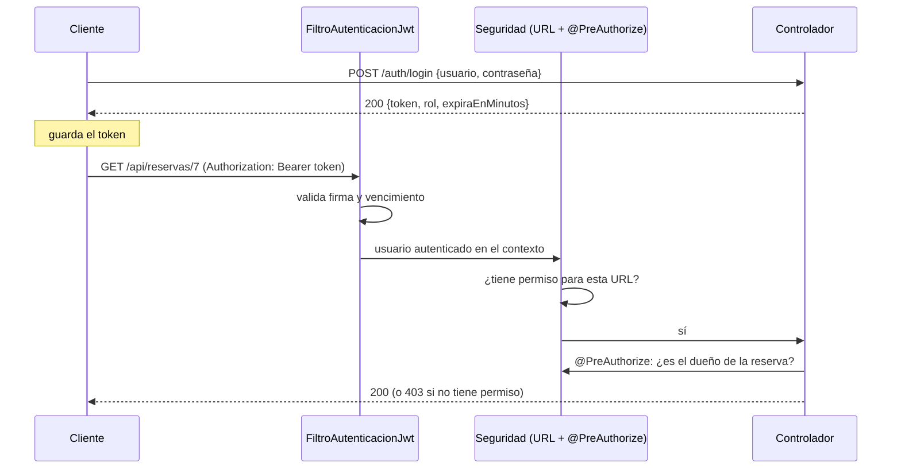

# 🔐 Fase 6 — Spring Security con JWT y roles

**Navegación**: [Índice](README.md) · ← [Fase 5 — Swagger](05-fase-5-swagger.md) · Siguiente → [Fase 7 — Pruebas de aceptación y README](07-pruebas-de-aceptacion-y-readme.md)

## 🎯 Qué vas a lograr

Proteger toda la API (RF-11 y RF-12): un endpoint de **login** que entrega un **JWT**, un
filtro que lo valida en cada solicitud, y reglas de **autorización** por rol y por dueño
del recurso (RN-13). Al terminar, sin token la API responde `401`; con token pero sin
permiso, `403`.

**Módulo que se aplica**: 08 (Spring Boot Security con JWT).

## 🧠 Cómo encaja todo

**Autenticación** = *¿quién sos?* (login, token). **Autorización** = *¿qué podés hacer?*
(roles, dueño del recurso). Con JWT la autenticación es **stateless**: el servidor no
guarda sesiones; el cliente manda el token en cada solicitud.



Un **JWT** (*JSON Web Token*) son tres partes en Base64 separadas por puntos:
`encabezado.contenido.firma`. El contenido (*claims*) de nuestro token incluye:

```json
{ "sub": "ana", "rol": "ROLE_MIEMBRO", "iat": 1789922950, "exp": 1789926550 }
```

`sub` es el usuario, `iat` cuándo se emitió y `exp` cuándo vence. La **firma** se calcula
con una clave secreta que solo conoce el servidor: si alguien altera el contenido (por
ejemplo, cambiar `ROLE_MIEMBRO` por `ROLE_ADMIN`), la firma deja de coincidir y el token se
rechaza. **El contenido no está cifrado**, solo firmado: nunca pongas datos sensibles.

## 🌳 Archivos de esta fase

```text
📁 coworkhub
├── 📄 .gitignore
├── 📄 docker-compose.yml
├── 📄 pom.xml                                                 ◀ ✏️ se modifica
├── 📁 docs  (documentación del proyecto)
│   └── 📄 analisis.md
├── 📁 src/main/java/com/coworkhub
│   ├── 📄 Main.java
│   ├── 📁 config  (beans, datos de ejemplo y OpenAPI)
│   │   ├── 📄 CargadorReservasDemo.java
│   │   ├── 📄 ConfiguracionBeans.java
│   │   └── 📄 ConfiguracionOpenApi.java
│   ├── 📁 controllers  (capa Controller, HTTP)
│   │   ├── 📄 ControladorDisponibilidad.java
│   │   ├── 📄 ControladorEquipamientos.java
│   │   ├── 📄 ControladorMiembros.java                        ◀ ✏️ se modifica
│   │   ├── 📄 ControladorPlanes.java
│   │   ├── 📄 ControladorReservas.java                        ◀ ✏️ se modifica
│   │   ├── 📄 ControladorSalas.java
│   │   ├── 📄 ControladorSedes.java
│   │   └── 📄 ControladorServiciosAdicionales.java
│   ├── 📁 dto  (solicitudes y respuestas, en records)
│   │   ├── 📄 ItemServicio.java
│   │   ├── 📄 RespuestaLogin.java                             ◀ 🆕 nuevo
│   │   ├── 📄 ResumenConsumo.java
│   │   ├── 📄 SolicitudActualizarMiembro.java
│   │   ├── 📄 SolicitudEquipamiento.java
│   │   ├── 📄 SolicitudLogin.java                             ◀ 🆕 nuevo
│   │   ├── 📄 SolicitudMiembro.java
│   │   ├── 📄 SolicitudPlan.java
│   │   ├── 📄 SolicitudReserva.java
│   │   ├── 📄 SolicitudSala.java
│   │   ├── 📄 SolicitudSede.java
│   │   └── 📄 SolicitudServicioAdicional.java
│   ├── 📁 exception  (excepciones y manejador global)
│   │   ├── 📄 ManejadorGlobalDeExcepciones.java               ◀ ✏️ se modifica
│   │   ├── 📄 RecursoNoEncontradoException.java
│   │   ├── 📄 ReglaNegocioException.java
│   │   ├── 📄 RespuestaError.java
│   │   └── 📄 SolicitudInvalidaException.java
│   ├── 📁 persistences  (capa Persistence)
│   │   ├── 📁 entities  (clases @Entity)
│   │   │   ├── 📄 DetalleReserva.java
│   │   │   ├── 📄 Equipamiento.java
│   │   │   ├── 📄 EstadoMiembro.java
│   │   │   ├── 📄 EstadoReserva.java
│   │   │   ├── 📄 Miembro.java
│   │   │   ├── 📄 PlanMembresia.java
│   │   │   ├── 📄 Reserva.java
│   │   │   ├── 📄 Sala.java
│   │   │   ├── 📄 Sede.java
│   │   │   ├── 📄 ServicioAdicional.java
│   │   │   └── 📄 TipoSala.java
│   │   └── 📁 repositories  (interfaces JpaRepository)
│   │       ├── 📄 RepositorioEquipamientos.java
│   │       ├── 📄 RepositorioMiembros.java                    ◀ ✏️ se modifica
│   │       ├── 📄 RepositorioPlanes.java
│   │       ├── 📄 RepositorioReservas.java                    ◀ ✏️ se modifica
│   │       ├── 📄 RepositorioSalas.java
│   │       ├── 📄 RepositorioSedes.java
│   │       └── 📄 RepositorioServiciosAdicionales.java
│   ├── 📁 security  (autenticación y autorización)
│   │   ├── 📁 config  (reglas de seguridad)
│   │   │   ├── 📄 ConfiguracionSeguridad.java                 ◀ 🆕 nuevo
│   │   │   ├── 📄 ManejadorAccesoDenegado.java                ◀ 🆕 nuevo
│   │   │   ├── 📄 Permisos.java                               ◀ 🆕 nuevo
│   │   │   └── 📄 PuntoEntradaJwt.java                        ◀ 🆕 nuevo
│   │   ├── 📁 controllers  (login)
│   │   │   └── 📄 ControladorAutenticacion.java               ◀ 🆕 nuevo
│   │   ├── 📁 jwt  (tokens y filtro)
│   │   │   ├── 📄 FiltroAutenticacionJwt.java                 ◀ 🆕 nuevo
│   │   │   └── 📄 UtilJwt.java                                ◀ 🆕 nuevo
│   │   ├── 📁 persistences  (capa Persistence de seguridad)
│   │   │   ├── 📁 entities  (Usuario y Rol)
│   │   │   │   ├── 📄 Rol.java
│   │   │   │   └── 📄 Usuario.java
│   │   │   └── 📁 repositories  (RepositorioUsuarios)
│   │   │       └── 📄 RepositorioUsuarios.java
│   │   └── 📁 services  (usuarios y permisos)
│   │       ├── 📄 ServicioAutorizacion.java                   ◀ 🆕 nuevo
│   │       └── 📄 ServicioDetallesUsuario.java                ◀ 🆕 nuevo
│   └── 📁 services  (capa Service, reglas de negocio)
│       ├── 📄 CalculadoraCostoReserva.java
│       ├── 📄 ServicioConsumo.java
│       ├── 📄 ServicioDisponibilidad.java
│       ├── 📄 ServicioEquipamientos.java
│       ├── 📄 ServicioMiembros.java
│       ├── 📄 ServicioPlanes.java
│       ├── 📄 ServicioReservas.java
│       ├── 📄 ServicioSalas.java
│       ├── 📄 ServicioSedes.java
│       ├── 📄 ServicioServiciosAdicionales.java
│       └── 📄 Validaciones.java
└── 📁 src/main/resources
    ├── 📄 application-h2.properties
    ├── 📄 application-mysql.properties
    ├── 📄 application-postgres.properties
    ├── 📄 application.properties                              ◀ ✏️ se modifica
    └── 📄 data.sql
```

🆕 archivo nuevo en esta fase · ✏️ archivo que ya existía y se modifica en esta fase · sin marca: ya existe de fases anteriores.

**En esta fase**: 11 archivos nuevos y 7 archivos modificados.

## 🪜 Paso a paso

### Paso 6.1 — Dependencias

En el `pom.xml`, **reemplazá** la dependencia `spring-security-crypto` (con su comentario)
por estas cuatro:

**📄 `pom.xml`** (fragmento)

```xml
        <dependency>
            <groupId>org.springframework.boot</groupId>
            <artifactId>spring-boot-starter-security</artifactId>
        </dependency>
        <dependency>
            <groupId>io.jsonwebtoken</groupId>
            <artifactId>jjwt-api</artifactId>
            <version>0.12.6</version>
        </dependency>
        <dependency>
            <groupId>io.jsonwebtoken</groupId>
            <artifactId>jjwt-impl</artifactId>
            <version>0.12.6</version>
            <scope>runtime</scope>
        </dependency>
        <dependency>
            <groupId>io.jsonwebtoken</groupId>
            <artifactId>jjwt-jackson</artifactId>
            <version>0.12.6</version>
            <scope>runtime</scope>
        </dependency>
```

| Dependencia | Para qué |
|---|---|
| `spring-boot-starter-security` | Spring Security completo (incluye el codificador BCrypt que ya usabas). **En cuanto la agregás, todos los endpoints exigen autenticación** |
| `jjwt-api` | La API para crear y leer JWT |
| `jjwt-impl`, `jjwt-jackson` | La implementación y el soporte JSON (solo en tiempo de ejecución) |

> ⚠️ Antes de seguir, si habías agregado `spring.h2.console.enabled=true` en la Fase 2,
> **quitalo** de `application.properties`.

### Paso 6.2 — Propiedades del JWT

Agregá al final de `application.properties`:

**📄 `src/main/resources/application.properties`** (fragmento)

```properties
# JWT
# ⚠️ Solo para fines educativos: en producción la clave debe venir de una variable de entorno
# o de un gestor de secretos, nunca del código ni del repositorio. Mínimo 32 caracteres.
coworkhub.seguridad.jwt.clave=esta-clave-es-solo-para-fines-educativos-del-proyecto-coworkhub-0987654321
coworkhub.seguridad.jwt.expiracion-minutos=60
```

La clave se lee de la configuración (RNF-07), no está escrita dentro de una clase.
Necesita **al menos 32 caracteres** para el algoritmo HMAC. Y aunque acá está en el archivo
—porque es un proyecto educativo—, **en un proyecto real jamás se sube al repositorio**.

### Paso 6.3 — DTOs de login

**📄 `src/main/java/com/coworkhub/dto/SolicitudLogin.java`**

```java
package com.coworkhub.dto;

import io.swagger.v3.oas.annotations.media.Schema;

public record SolicitudLogin(
        @Schema(example = "ana") String nombreUsuario,
        @Schema(example = "ana123") String contrasena) {
}
```

**📄 `src/main/java/com/coworkhub/dto/RespuestaLogin.java`**

```java
package com.coworkhub.dto;

public record RespuestaLogin(String token, String rol, long expiraEnMinutos) {
}
```

### Paso 6.4 — `UtilJwt`: crear y validar tokens

- El constructor recibe la clave y la expiración con `@Value` y arma la `SecretKey`.
- `generarToken`: pone `sub` (usuario), `rol`, `iat`, `exp` y **firma** con la clave.
  `jjwt` elige el algoritmo según el largo de la clave (con 74 caracteres usa HS512).
- `validarToken`: intenta leer el token verificando la firma. **Devuelve `false`** si está
  mal formado, si la firma no coincide (fue alterado) o si ya venció. Nunca lanza
  excepciones hacia afuera.
- El token usa la **hora real** del sistema, no el `Clock` de las reservas: el reloj fijo
  de las pruebas afecta solo a las reglas de reservas.

**📄 `src/main/java/com/coworkhub/security/jwt/UtilJwt.java`**

```java
package com.coworkhub.security.jwt;

import java.nio.charset.StandardCharsets;
import java.time.Instant;
import java.time.temporal.ChronoUnit;
import java.util.Date;

import javax.crypto.SecretKey;

import org.springframework.beans.factory.annotation.Value;
import org.springframework.security.core.userdetails.UserDetails;
import org.springframework.stereotype.Component;

import io.jsonwebtoken.JwtException;
import io.jsonwebtoken.Jwts;
import io.jsonwebtoken.security.Keys;

@Component
public class UtilJwt {

    private final SecretKey clave;
    private final long expiracionMinutos;

    public UtilJwt(@Value("${coworkhub.seguridad.jwt.clave}") String clave,
                   @Value("${coworkhub.seguridad.jwt.expiracion-minutos}") long expiracionMinutos) {
        this.clave = Keys.hmacShaKeyFor(clave.getBytes(StandardCharsets.UTF_8));
        this.expiracionMinutos = expiracionMinutos;
    }

    public long getExpiracionMinutos() {
        return expiracionMinutos;
    }

    public String generarToken(UserDetails usuario) {
        Instant ahora = Instant.now();
        return Jwts.builder()
                .subject(usuario.getUsername())
                .claim("rol", usuario.getAuthorities().iterator().next().getAuthority())
                .issuedAt(Date.from(ahora))
                .expiration(Date.from(ahora.plus(expiracionMinutos, ChronoUnit.MINUTES)))
                .signWith(clave)
                .compact();
    }

    // Devuelve false si el token está mal formado, fue alterado (firma inválida) o ya venció.
    public boolean validarToken(String token) {
        try {
            Jwts.parser().verifyWith(clave).build().parseSignedClaims(token);
            return true;
        } catch (JwtException | IllegalArgumentException ex) {
            return false;
        }
    }

    public String extraerNombreUsuario(String token) {
        return Jwts.parser().verifyWith(clave).build()
                .parseSignedClaims(token)
                .getPayload()
                .getSubject();
    }
}
```

### Paso 6.5 — `ServicioDetallesUsuario`

Spring Security necesita saber cómo **buscar un usuario** por nombre. Lo hace mediante un
`UserDetailsService`. Este consulta `RepositorioUsuarios` y arma el `UserDetails`.
`roles("ADMIN")` crea la autoridad **`ROLE_ADMIN`** (Spring antepone `ROLE_`): es la que
después buscan `hasRole('ADMIN')` y `hasAnyRole(...)`.

**📄 `src/main/java/com/coworkhub/security/services/ServicioDetallesUsuario.java`**

```java
package com.coworkhub.security.services;

import org.springframework.security.core.userdetails.User;
import org.springframework.security.core.userdetails.UserDetails;
import org.springframework.security.core.userdetails.UserDetailsService;
import org.springframework.security.core.userdetails.UsernameNotFoundException;
import org.springframework.stereotype.Service;

import com.coworkhub.security.persistences.entities.Usuario;
import com.coworkhub.security.persistences.repositories.RepositorioUsuarios;

@Service
public class ServicioDetallesUsuario implements UserDetailsService {

    private final RepositorioUsuarios repositorioUsuarios;

    public ServicioDetallesUsuario(RepositorioUsuarios repositorioUsuarios) {
        this.repositorioUsuarios = repositorioUsuarios;
    }

    @Override
    public UserDetails loadUserByUsername(String nombreUsuario) throws UsernameNotFoundException {
        Usuario usuario = repositorioUsuarios.findByNombreUsuario(nombreUsuario)
                .orElseThrow(() -> new UsernameNotFoundException("No existe el usuario " + nombreUsuario));
        // roles("ADMIN") crea la autoridad "ROLE_ADMIN", que es la que buscan hasRole(...) y hasAnyRole(...)
        return User.withUsername(usuario.getNombreUsuario())
                .password(usuario.getContrasena())
                .roles(usuario.getRol().name())
                .build();
    }
}
```

### Paso 6.6 — Consultas de pertenencia (RN-13)

Para saber si una reserva o un miembro "es del usuario que está haciendo la solicitud"
agregamos dos métodos derivados. Ambos recorren la relación hasta el nombre de usuario:

- `Miembro` → `usuario` → `nombreUsuario`
- `Reserva` → `miembro` → `usuario` → `nombreUsuario`

En `RepositorioMiembros`, junto a `findByUsuarioNombreUsuario`:

**📄 `src/main/java/com/coworkhub/persistences/repositories/RepositorioMiembros.java`** (fragmento)

```java
    // ¿El miembro con este id es el dueño del usuario con este nombre? (RN-13)
    boolean existsByIdAndUsuarioNombreUsuario(Long id, String nombreUsuario);
```

En `RepositorioReservas`, antes de `existsByDetallesServicioId`:

**📄 `src/main/java/com/coworkhub/persistences/repositories/RepositorioReservas.java`** (fragmento)

```java
    // ¿La reserva pertenece a un miembro cuyo usuario tiene este nombre? (RN-13)
    boolean existsByIdAndMiembroUsuarioNombreUsuario(Long id, String nombreUsuario);
```

### Paso 6.7 — `ServicioAutorizacion`

Un servicio (capa `services` de seguridad) que responde dos preguntas a partir de esas
consultas. Tiene un **nombre de bean explícito**, `@Service("autorizacion")`, porque las
expresiones de autorización lo invocarán como `@autorizacion.esElMiembro(...)`.

**📄 `src/main/java/com/coworkhub/security/services/ServicioAutorizacion.java`**

```java
package com.coworkhub.security.services;

import org.springframework.security.core.Authentication;
import org.springframework.stereotype.Service;

import com.coworkhub.persistences.repositories.RepositorioMiembros;
import com.coworkhub.persistences.repositories.RepositorioReservas;

// RN-13: decide si el usuario autenticado es dueño de un miembro o de una reserva.
// Se usa desde las expresiones de @PreAuthorize como @autorizacion.esElMiembro(...).
@Service("autorizacion")
public class ServicioAutorizacion {

    private final RepositorioMiembros repositorioMiembros;
    private final RepositorioReservas repositorioReservas;

    public ServicioAutorizacion(RepositorioMiembros repositorioMiembros, RepositorioReservas repositorioReservas) {
        this.repositorioMiembros = repositorioMiembros;
        this.repositorioReservas = repositorioReservas;
    }

    // ¿El usuario autenticado es el usuario del miembro con ese id?
    public boolean esElMiembro(Authentication autenticacion, Long miembroId) {
        return miembroId != null
                && repositorioMiembros.existsByIdAndUsuarioNombreUsuario(miembroId, autenticacion.getName());
    }

    // ¿La reserva pertenece a un miembro cuyo usuario es el usuario autenticado?
    public boolean esDuenoDeLaReserva(Authentication autenticacion, Long reservaId) {
        return reservaId != null
                && repositorioReservas.existsByIdAndMiembroUsuarioNombreUsuario(reservaId, autenticacion.getName());
    }
}
```

### Paso 6.8 — `FiltroAutenticacionJwt`

Un **filtro** es código que se ejecuta **antes** de llegar a los controladores. Este
corre una vez por solicitud (`OncePerRequestFilter`) y:

1. Lee el encabezado `Authorization`. Si empieza con `Bearer `, toma el token.
2. Si `UtilJwt.validarToken` lo acepta, carga el usuario y lo deja **autenticado** en el
   `SecurityContextHolder` (la "memoria" de Spring Security durante esa solicitud).
3. Continúa la cadena (`filterChain.doFilter`).

Punto clave: **si no hay token, o es inválido, el filtro no responde ningún error**: solo
deja la solicitud como *anónima*. Es la configuración de seguridad (paso 6.11) la que
decide rechazarla con `401` en los endpoints protegidos. Si el token es válido pero
pertenece a un usuario que ya fue eliminado, se captura `UsernameNotFoundException` y
también se la trata como anónima (sin esto, respondería `500`).

**📄 `src/main/java/com/coworkhub/security/jwt/FiltroAutenticacionJwt.java`**

```java
package com.coworkhub.security.jwt;

import java.io.IOException;

import org.springframework.security.authentication.UsernamePasswordAuthenticationToken;
import org.springframework.security.core.context.SecurityContextHolder;
import org.springframework.security.core.userdetails.UserDetails;
import org.springframework.security.core.userdetails.UsernameNotFoundException;
import org.springframework.stereotype.Component;
import org.springframework.web.filter.OncePerRequestFilter;

import com.coworkhub.security.services.ServicioDetallesUsuario;

import jakarta.servlet.FilterChain;
import jakarta.servlet.ServletException;
import jakarta.servlet.http.HttpServletRequest;
import jakarta.servlet.http.HttpServletResponse;

// Se ejecuta una vez por solicitud: si trae un JWT válido, autentica al usuario.
// Si no hay token o es inválido, NO responde error: deja la solicitud "anónima" y es la
// configuración de seguridad la que la rechaza con 401 donde haga falta.
@Component
public class FiltroAutenticacionJwt extends OncePerRequestFilter {

    private final UtilJwt utilJwt;
    private final ServicioDetallesUsuario servicioDetallesUsuario;

    public FiltroAutenticacionJwt(UtilJwt utilJwt, ServicioDetallesUsuario servicioDetallesUsuario) {
        this.utilJwt = utilJwt;
        this.servicioDetallesUsuario = servicioDetallesUsuario;
    }

    @Override
    protected void doFilterInternal(HttpServletRequest request, HttpServletResponse response,
                                    FilterChain filterChain) throws ServletException, IOException {
        String encabezado = request.getHeader("Authorization");

        if (encabezado != null && encabezado.startsWith("Bearer ")) {
            String token = encabezado.substring(7);
            if (utilJwt.validarToken(token)) {
                try {
                    UserDetails usuario = servicioDetallesUsuario.loadUserByUsername(utilJwt.extraerNombreUsuario(token));
                    UsernamePasswordAuthenticationToken autenticacion =
                            new UsernamePasswordAuthenticationToken(usuario, null, usuario.getAuthorities());
                    SecurityContextHolder.getContext().setAuthentication(autenticacion);
                } catch (UsernameNotFoundException ex) {
                    // Token válido de un usuario que ya no existe: se trata como solicitud anónima.
                }
            }
        }

        filterChain.doFilter(request, response);
    }
}
```

### Paso 6.9 — Respuestas `401` y `403` con el cuerpo estándar

Los errores de seguridad ocurren **en los filtros, antes de llegar a Spring MVC**, por eso
tu `@ControllerAdvice` no los ve. Hay que darles su propio formato con dos clases:

| Clase | Cuándo actúa | Responde |
|---|---|---|
| `PuntoEntradaJwt` (`AuthenticationEntryPoint`) | Solicitud **sin autenticar** a un endpoint protegido | `401` `NO_AUTENTICADO` |
| `ManejadorAccesoDenegado` (`AccessDeniedHandler`) | Usuario **autenticado** sin permiso para esa URL | `403` `ACCESO_DENEGADO` |

Sin ellas, Spring respondería con su propio cuerpo (y, para solicitudes anónimas, con
`403` en lugar de `401`). Ambas usan el `ObjectMapper` de Spring para escribir el JSON.

**📄 `src/main/java/com/coworkhub/security/config/PuntoEntradaJwt.java`**

```java
package com.coworkhub.security.config;

import java.io.IOException;

import org.springframework.http.HttpStatus;
import org.springframework.http.MediaType;
import org.springframework.security.core.AuthenticationException;
import org.springframework.security.web.AuthenticationEntryPoint;
import org.springframework.stereotype.Component;

import com.coworkhub.exception.RespuestaError;
import com.fasterxml.jackson.databind.ObjectMapper;

import jakarta.servlet.http.HttpServletRequest;
import jakarta.servlet.http.HttpServletResponse;

// Responde 401 con el cuerpo de error estándar cuando una solicitud sin autenticar
// intenta entrar a un endpoint protegido. Este código corre en el filtro de seguridad,
// antes de llegar a Spring MVC, por eso el @ControllerAdvice no lo alcanza.
@Component
public class PuntoEntradaJwt implements AuthenticationEntryPoint {

    private final ObjectMapper objectMapper;

    public PuntoEntradaJwt(ObjectMapper objectMapper) {
        this.objectMapper = objectMapper;
    }

    @Override
    public void commence(HttpServletRequest request, HttpServletResponse response,
                         AuthenticationException ex) throws IOException {
        response.setStatus(HttpStatus.UNAUTHORIZED.value());
        response.setContentType(MediaType.APPLICATION_JSON_VALUE);
        response.setCharacterEncoding("UTF-8");
        objectMapper.writeValue(response.getWriter(),
                RespuestaError.de("NO_AUTENTICADO", "Falta el token de autenticación o no es válido"));
    }
}
```

**📄 `src/main/java/com/coworkhub/security/config/ManejadorAccesoDenegado.java`**

```java
package com.coworkhub.security.config;

import java.io.IOException;

import org.springframework.http.HttpStatus;
import org.springframework.http.MediaType;
import org.springframework.security.access.AccessDeniedException;
import org.springframework.security.web.access.AccessDeniedHandler;
import org.springframework.stereotype.Component;

import com.coworkhub.exception.RespuestaError;
import com.fasterxml.jackson.databind.ObjectMapper;

import jakarta.servlet.http.HttpServletRequest;
import jakarta.servlet.http.HttpServletResponse;

// Responde 403 con el cuerpo de error estándar cuando un usuario autenticado
// no tiene permiso para la URL solicitada (reglas de ConfiguracionSeguridad).
@Component
public class ManejadorAccesoDenegado implements AccessDeniedHandler {

    private final ObjectMapper objectMapper;

    public ManejadorAccesoDenegado(ObjectMapper objectMapper) {
        this.objectMapper = objectMapper;
    }

    @Override
    public void handle(HttpServletRequest request, HttpServletResponse response,
                       AccessDeniedException ex) throws IOException {
        response.setStatus(HttpStatus.FORBIDDEN.value());
        response.setContentType(MediaType.APPLICATION_JSON_VALUE);
        response.setCharacterEncoding("UTF-8");
        objectMapper.writeValue(response.getWriter(),
                RespuestaError.de("ACCESO_DENEGADO", "No tenés permiso para realizar esta operación"));
    }
}
```

### Paso 6.10 — Expresiones de permiso reutilizables

`@PreAuthorize` recibe una expresión (SpEL). Como varias se repiten, las guardamos como
**constantes** (en una anotación solo se admiten constantes). Cómo leerlas:

| Elemento | Significado |
|---|---|
| `hasAnyRole('ADMIN','RECEPCION')` | El usuario tiene alguno de esos roles |
| `authentication` | El usuario autenticado actual |
| `#id`, `#miembroId`, `#solicitud` | El **parámetro del método** con ese nombre |
| `@autorizacion.esElMiembro(...)` | Llama al método del bean `autorizacion` (paso 6.7) |
| `A or B` | Alcanza con que se cumpla una |

**📄 `src/main/java/com/coworkhub/security/config/Permisos.java`**

```java
package com.coworkhub.security.config;

// Expresiones de autorización reutilizadas en @PreAuthorize (RN-13).
// Son constantes para no repetir (ni equivocarse al copiar) la misma expresión en cada método.
public final class Permisos {

    private Permisos() {
    }

    // Personal: ADMIN o RECEPCION
    public static final String STAFF = "hasAnyRole('ADMIN','RECEPCION')";

    // Personal, o el propio miembro cuyo id llega en la URL (#id)
    public static final String STAFF_O_MIEMBRO_DEL_ID =
            STAFF + " or @autorizacion.esElMiembro(authentication, #id)";

    // Personal, o el dueño de la reserva cuyo id llega en la URL (#id)
    public static final String STAFF_O_DUENO_DE_LA_RESERVA =
            STAFF + " or @autorizacion.esDuenoDeLaReserva(authentication, #id)";

    // Personal, o un miembro que reserva a su propio nombre (miembroId del cuerpo de la solicitud)
    public static final String STAFF_O_MIEMBRO_DE_LA_SOLICITUD =
            STAFF + " or @autorizacion.esElMiembro(authentication, #solicitud.miembroId())";

    // Personal, o un miembro que filtra por su propio miembroId (parámetro de la URL)
    public static final String STAFF_O_FILTRO_DE_MIEMBRO =
            STAFF + " or (#miembroId != null and @autorizacion.esElMiembro(authentication, #miembroId))";
}
```

### Paso 6.11 — `ConfiguracionSeguridad`

Es el centro de la seguridad. Decisiones, una por una:

- `@EnableMethodSecurity`: activa `@PreAuthorize` en los controladores.
- `csrf.disable()`: CSRF protege sesiones con *cookies*; con tokens en un encabezado y sin
  sesión no aplica.
- `SessionCreationPolicy.STATELESS`: el servidor **no crea sesiones**.
- `httpBasic` y `formLogin` deshabilitados: solo se autentica con JWT.
- Reglas de URL, **en orden** (la primera que coincide gana):
  1. `permitAll`: `/auth/login` y la documentación (`/doc/**`, `/swagger-ui/**`, `/v3/api-docs/**`).
  2. `GET` a los catálogos: cualquier usuario autenticado.
  3. Cualquier otro método sobre los catálogos: solo `ADMIN`.
  4. Todo lo demás: autenticado; el detalle por rol/dueño lo fija `@PreAuthorize`.
- `exceptionHandling`: conecta las clases del paso 6.9.
- `addFilterBefore(filtroAutenticacionJwt, UsernamePasswordAuthenticationFilter.class)`:
  nuestro filtro corre **antes** del filtro estándar de usuario/contraseña.
- El bean `AuthenticationManager` es el que usará el login para verificar credenciales.
  (El `PasswordEncoder` ya existe desde la Fase 1.)

**📄 `src/main/java/com/coworkhub/security/config/ConfiguracionSeguridad.java`**

```java
package com.coworkhub.security.config;

import org.springframework.context.annotation.Bean;
import org.springframework.context.annotation.Configuration;
import org.springframework.http.HttpMethod;
import org.springframework.security.authentication.AuthenticationManager;
import org.springframework.security.config.annotation.authentication.configuration.AuthenticationConfiguration;
import org.springframework.security.config.annotation.method.configuration.EnableMethodSecurity;
import org.springframework.security.config.annotation.web.builders.HttpSecurity;
import org.springframework.security.config.annotation.web.configuration.EnableWebSecurity;
import org.springframework.security.config.http.SessionCreationPolicy;
import org.springframework.security.web.SecurityFilterChain;
import org.springframework.security.web.authentication.UsernamePasswordAuthenticationFilter;

import com.coworkhub.security.jwt.FiltroAutenticacionJwt;

@Configuration
@EnableWebSecurity
@EnableMethodSecurity // habilita @PreAuthorize en los controladores
public class ConfiguracionSeguridad {

    private static final String[] CATALOGOS = {
            "/api/sedes/**", "/api/salas/**", "/api/equipamientos/**",
            "/api/servicios-adicionales/**", "/api/planes/**"};

    private final FiltroAutenticacionJwt filtroAutenticacionJwt;
    private final PuntoEntradaJwt puntoEntradaJwt;
    private final ManejadorAccesoDenegado manejadorAccesoDenegado;

    public ConfiguracionSeguridad(FiltroAutenticacionJwt filtroAutenticacionJwt, PuntoEntradaJwt puntoEntradaJwt,
                                  ManejadorAccesoDenegado manejadorAccesoDenegado) {
        this.filtroAutenticacionJwt = filtroAutenticacionJwt;
        this.puntoEntradaJwt = puntoEntradaJwt;
        this.manejadorAccesoDenegado = manejadorAccesoDenegado;
    }

    @Bean
    public AuthenticationManager authenticationManager(AuthenticationConfiguration configuracion) throws Exception {
        return configuracion.getAuthenticationManager();
    }

    @Bean
    public SecurityFilterChain securityFilterChain(HttpSecurity http) throws Exception {
        return http
                .csrf(csrf -> csrf.disable())
                .sessionManagement(sesion -> sesion.sessionCreationPolicy(SessionCreationPolicy.STATELESS))
                .authorizeHttpRequests(autorizacion -> autorizacion
                        // Públicos: login y documentación
                        .requestMatchers("/auth/login", "/doc/**", "/swagger-ui/**", "/v3/api-docs/**").permitAll()
                        // Catálogos: cualquier usuario autenticado los lee; solo ADMIN los modifica (RN-13)
                        .requestMatchers(HttpMethod.GET, CATALOGOS).authenticated()
                        .requestMatchers(CATALOGOS).hasRole("ADMIN")
                        // Todo lo demás requiere token; el detalle por rol y por dueño
                        // se decide con @PreAuthorize en cada método de los controladores.
                        .anyRequest().authenticated())
                .httpBasic(basic -> basic.disable())
                .formLogin(formulario -> formulario.disable())
                .exceptionHandling(errores -> errores
                        .authenticationEntryPoint(puntoEntradaJwt)
                        .accessDeniedHandler(manejadorAccesoDenegado))
                .addFilterBefore(filtroAutenticacionJwt, UsernamePasswordAuthenticationFilter.class)
                .build();
    }
}
```

### Paso 6.12 — `ControladorAutenticacion` (login)

- Valida que lleguen usuario y contraseña (si no, `400`).
- Delega en `AuthenticationManager.authenticate(...)`, que **compara la contraseña** con el
  hash BCrypt y lanza `BadCredentialsException` si no coincide (nunca compares contraseñas
  a mano). Esa excepción se traduce a `401` en el paso siguiente.
- Devuelve el token, el rol y cuántos minutos dura.
- `@SecurityRequirements` (vacío) hace que Swagger UI **no** muestre el candado en este
  endpoint: es público.

**📄 `src/main/java/com/coworkhub/security/controllers/ControladorAutenticacion.java`**

```java
package com.coworkhub.security.controllers;

import org.springframework.security.authentication.AuthenticationManager;
import org.springframework.security.authentication.UsernamePasswordAuthenticationToken;
import org.springframework.security.core.userdetails.UserDetails;
import org.springframework.web.bind.annotation.PostMapping;
import org.springframework.web.bind.annotation.RequestBody;
import org.springframework.web.bind.annotation.RequestMapping;
import org.springframework.web.bind.annotation.RestController;

import com.coworkhub.dto.RespuestaLogin;
import com.coworkhub.dto.SolicitudLogin;
import com.coworkhub.exception.SolicitudInvalidaException;
import com.coworkhub.security.jwt.UtilJwt;
import com.coworkhub.security.services.ServicioDetallesUsuario;

import io.swagger.v3.oas.annotations.Operation;
import io.swagger.v3.oas.annotations.security.SecurityRequirements;
import io.swagger.v3.oas.annotations.tags.Tag;

@Tag(name = "Autenticación", description = "Inicio de sesión: devuelve un JWT")
@SecurityRequirements // sin candado en Swagger UI: este endpoint es público
@RestController
@RequestMapping("/auth")
public class ControladorAutenticacion {

    private final AuthenticationManager authenticationManager;
    private final ServicioDetallesUsuario servicioDetallesUsuario;
    private final UtilJwt utilJwt;

    public ControladorAutenticacion(AuthenticationManager authenticationManager,
                                    ServicioDetallesUsuario servicioDetallesUsuario, UtilJwt utilJwt) {
        this.authenticationManager = authenticationManager;
        this.servicioDetallesUsuario = servicioDetallesUsuario;
        this.utilJwt = utilJwt;
    }

    @Operation(summary = "Iniciar sesión",
            description = "Verifica las credenciales y devuelve un JWT para enviar en 'Authorization: Bearer <token>'.")
    @PostMapping("/login")
    public RespuestaLogin login(@RequestBody SolicitudLogin solicitud) {
        if (solicitud == null || solicitud.nombreUsuario() == null || solicitud.nombreUsuario().isBlank()
                || solicitud.contrasena() == null || solicitud.contrasena().isBlank()) {
            throw new SolicitudInvalidaException("nombreUsuario y contrasena son obligatorios");
        }
        // Lanza BadCredentialsException si no coinciden (se traduce a 401 en el manejador global).
        authenticationManager.authenticate(
                new UsernamePasswordAuthenticationToken(solicitud.nombreUsuario(), solicitud.contrasena()));

        UserDetails usuario = servicioDetallesUsuario.loadUserByUsername(solicitud.nombreUsuario());
        String rol = usuario.getAuthorities().iterator().next().getAuthority().replace("ROLE_", "");
        return new RespuestaLogin(utilJwt.generarToken(usuario), rol, utilJwt.getExpiracionMinutos());
    }
}
```

### Paso 6.13 — Traducir los errores de seguridad en el manejador global

Cuando `@PreAuthorize` niega el acceso (o el login falla) la excepción se lanza **dentro**
de Spring MVC, así que sí pasa por tu `@ControllerAdvice`. Sin estos dos métodos caería
en el `@ExceptionHandler(Exception.class)` y respondería `500`. En
`ManejadorGlobalDeExcepciones`, agregá los `import` y los dos métodos:

**📄 `src/main/java/com/coworkhub/exception/ManejadorGlobalDeExcepciones.java`** (fragmento)

```java
import org.springframework.security.access.AccessDeniedException;
import org.springframework.security.core.AuthenticationException;
...
    // Lo lanzan @PreAuthorize (RN-13) y el login: se traducen a 403 y 401 con el cuerpo estándar.
    @ExceptionHandler(AccessDeniedException.class)
    public ResponseEntity<RespuestaError> manejarAccesoDenegado(AccessDeniedException ex) {
        return responder(HttpStatus.FORBIDDEN, "ACCESO_DENEGADO", "No tenés permiso para realizar esta operación");
    }

    @ExceptionHandler(AuthenticationException.class)
    public ResponseEntity<RespuestaError> manejarAutenticacion(AuthenticationException ex) {
        return responder(HttpStatus.UNAUTHORIZED, "NO_AUTENTICADO", "Usuario o contraseña incorrectos");
    }
```

Ubicá los dos métodos justo antes del comentario `// Red de seguridad: una restricción...`.

> 💡 **¿Por qué el mensaje del login no dice si falló el usuario o la contraseña?** Para no
> ayudar a un atacante a averiguar qué usuarios existen.

### Paso 6.14 — `@PreAuthorize` en los controladores de reservas y miembros

Estos dos controladores mezclan operaciones "solo personal" con operaciones "personal o el
dueño", así que cada método lleva su propia anotación. La tabla resume qué constante
lleva cada método:

**`ControladorReservas`**

| Método | Expresión | Quién puede |
|---|---|---|
| `crear` | `STAFF_O_MIEMBRO_DE_LA_SOLICITUD` | Personal, o el miembro que reserva a su nombre |
| `buscarPorId` | `STAFF_O_DUENO_DE_LA_RESERVA` | Personal, o el dueño |
| `listar` | `STAFF_O_FILTRO_DE_MIEMBRO` | Personal, o un miembro filtrando por su propio `miembroId` |
| `agregarServicio`, `quitarServicio`, `cancelar` | `STAFF_O_DUENO_DE_LA_RESERVA` | Personal, o el dueño |
| `confirmar`, `completar` | `STAFF` | Solo personal |

**`ControladorMiembros`**

| Método | Expresión | Quién puede |
|---|---|---|
| `listarTodos`, `crear`, `actualizar`, `suspender`, `activar`, `eliminar` | `STAFF` | Solo personal |
| `buscarPorId`, `consumo` | `STAFF_O_MIEMBRO_DEL_ID` | Personal, o el propio miembro |

Reemplazá el contenido de ambos archivos por estas versiones finales (incluyen las
anotaciones de la Fase 5 y las nuevas de esta fase):

**📄 `src/main/java/com/coworkhub/controllers/ControladorReservas.java`**

```java
package com.coworkhub.controllers;

import io.swagger.v3.oas.annotations.Operation;
import io.swagger.v3.oas.annotations.tags.Tag;

import java.time.LocalDate;
import java.util.List;

import org.springframework.http.HttpStatus;
import org.springframework.security.access.prepost.PreAuthorize;
import org.springframework.web.bind.annotation.DeleteMapping;
import org.springframework.web.bind.annotation.GetMapping;
import org.springframework.web.bind.annotation.PathVariable;
import org.springframework.web.bind.annotation.PostMapping;
import org.springframework.web.bind.annotation.RequestBody;
import org.springframework.web.bind.annotation.RequestMapping;
import org.springframework.web.bind.annotation.RequestParam;
import org.springframework.web.bind.annotation.ResponseStatus;
import org.springframework.web.bind.annotation.RestController;

import com.coworkhub.dto.ItemServicio;
import com.coworkhub.dto.SolicitudReserva;
import com.coworkhub.persistences.entities.EstadoReserva;
import com.coworkhub.persistences.entities.Reserva;
import com.coworkhub.security.config.Permisos;
import com.coworkhub.services.ServicioReservas;

@Tag(name = "Reservas", description = "Crear, consultar, modificar y cancelar reservas")
@RestController
@RequestMapping("/api/reservas")
public class ControladorReservas {

    private final ServicioReservas servicioReservas;

    public ControladorReservas(ServicioReservas servicioReservas) {
        this.servicioReservas = servicioReservas;
    }

    @Operation(summary = "Crear una reserva",
            description = "Valida RN-01 a RN-06 y calcula el costo (RN-07). Responde 201 con el costo calculado.")
    @PostMapping
    @ResponseStatus(HttpStatus.CREATED)
    @PreAuthorize(Permisos.STAFF_O_MIEMBRO_DE_LA_SOLICITUD)
    public Reserva crear(@RequestBody SolicitudReserva solicitud) {
        return servicioReservas.crear(solicitud);
    }

    @Operation(summary = "Consultar una reserva por id")
    @GetMapping("/{id}")
    @PreAuthorize(Permisos.STAFF_O_DUENO_DE_LA_RESERVA)
    public Reserva buscarPorId(@PathVariable Long id) {
        return servicioReservas.buscarPorId(id);
    }

    // GET /api/reservas?miembroId=1
    // GET /api/reservas?salaId=1&fecha=2030-06-04
    // GET /api/reservas?estado=PENDIENTE
    @Operation(summary = "Listar reservas",
            description = "Filtrar por miembroId, o por salaId junto con fecha (yyyy-MM-dd), o por estado.")
    @GetMapping
    @PreAuthorize(Permisos.STAFF_O_FILTRO_DE_MIEMBRO)
    public List<Reserva> listar(@RequestParam(required = false) Long miembroId,
                                @RequestParam(required = false) Long salaId,
                                @RequestParam(required = false) LocalDate fecha,
                                @RequestParam(required = false) EstadoReserva estado) {
        return servicioReservas.buscar(miembroId, salaId, fecha, estado);
    }

    @Operation(summary = "Agregar un servicio adicional",
            description = "Solo con la reserva PENDIENTE (RN-10). Si el servicio ya está, suma la cantidad. Recalcula el costo.")
    @PostMapping("/{id}/servicios")
    @PreAuthorize(Permisos.STAFF_O_DUENO_DE_LA_RESERVA)
    public Reserva agregarServicio(@PathVariable Long id, @RequestBody ItemServicio item) {
        return servicioReservas.agregarServicio(id, item);
    }

    @Operation(summary = "Quitar un servicio adicional",
            description = "Solo con la reserva PENDIENTE (RN-10). Recalcula el costo.")
    @DeleteMapping("/{id}/servicios/{servicioId}")
    @PreAuthorize(Permisos.STAFF_O_DUENO_DE_LA_RESERVA)
    public Reserva quitarServicio(@PathVariable Long id, @PathVariable Long servicioId) {
        return servicioReservas.quitarServicio(id, servicioId);
    }

    @Operation(summary = "Confirmar una reserva", description = "PENDIENTE → CONFIRMADA (RN-09).")
    @PostMapping("/{id}/confirmar")
    @PreAuthorize(Permisos.STAFF)
    public Reserva confirmar(@PathVariable Long id) {
        return servicioReservas.confirmar(id);
    }

    @Operation(summary = "Cancelar una reserva",
            description = "RN-08: 24 h o más sin cargo; entre 24 h y 2 h cargo del 50 %; con menos de 2 h no se puede.")
    @PostMapping("/{id}/cancelar")
    @PreAuthorize(Permisos.STAFF_O_DUENO_DE_LA_RESERVA)
    public Reserva cancelar(@PathVariable Long id) {
        return servicioReservas.cancelar(id);
    }

    @Operation(summary = "Marcar una reserva como completada", description = "CONFIRMADA → COMPLETADA (RN-09).")
    @PostMapping("/{id}/completar")
    @PreAuthorize(Permisos.STAFF)
    public Reserva completar(@PathVariable Long id) {
        return servicioReservas.completar(id);
    }
}
```

**📄 `src/main/java/com/coworkhub/controllers/ControladorMiembros.java`**

```java
package com.coworkhub.controllers;

import io.swagger.v3.oas.annotations.tags.Tag;

import java.time.YearMonth;
import java.util.List;

import org.springframework.http.HttpStatus;
import org.springframework.security.access.prepost.PreAuthorize;
import org.springframework.web.bind.annotation.DeleteMapping;
import org.springframework.web.bind.annotation.GetMapping;
import org.springframework.web.bind.annotation.PatchMapping;
import org.springframework.web.bind.annotation.PathVariable;
import org.springframework.web.bind.annotation.PostMapping;
import org.springframework.web.bind.annotation.PutMapping;
import org.springframework.web.bind.annotation.RequestBody;
import org.springframework.web.bind.annotation.RequestMapping;
import org.springframework.web.bind.annotation.RequestParam;
import org.springframework.web.bind.annotation.ResponseStatus;
import org.springframework.web.bind.annotation.RestController;

import com.coworkhub.dto.ResumenConsumo;
import com.coworkhub.dto.SolicitudActualizarMiembro;
import com.coworkhub.dto.SolicitudMiembro;
import com.coworkhub.persistences.entities.Miembro;
import com.coworkhub.security.config.Permisos;
import com.coworkhub.services.ServicioConsumo;
import com.coworkhub.services.ServicioMiembros;

@Tag(name = "Miembros", description = "Registro de miembros y resumen de consumo mensual")
@RestController
@RequestMapping("/api/miembros")
public class ControladorMiembros {

    private final ServicioMiembros servicioMiembros;
    private final ServicioConsumo servicioConsumo;

    public ControladorMiembros(ServicioMiembros servicioMiembros, ServicioConsumo servicioConsumo) {
        this.servicioMiembros = servicioMiembros;
        this.servicioConsumo = servicioConsumo;
    }

    @GetMapping
    @PreAuthorize(Permisos.STAFF)
    public List<Miembro> listarTodos() {
        return servicioMiembros.listarTodos();
    }

    @GetMapping("/{id}")
    @PreAuthorize(Permisos.STAFF_O_MIEMBRO_DEL_ID)
    public Miembro buscarPorId(@PathVariable Long id) {
        return servicioMiembros.buscarPorId(id);
    }

    @PostMapping
    @ResponseStatus(HttpStatus.CREATED)
    @PreAuthorize(Permisos.STAFF)
    public Miembro crear(@RequestBody SolicitudMiembro solicitud) {
        return servicioMiembros.crear(solicitud);
    }

    @PutMapping("/{id}")
    @PreAuthorize(Permisos.STAFF)
    public Miembro actualizar(@PathVariable Long id, @RequestBody SolicitudActualizarMiembro solicitud) {
        return servicioMiembros.actualizar(id, solicitud);
    }

    @PatchMapping("/{id}/suspender")
    @PreAuthorize(Permisos.STAFF)
    public Miembro suspender(@PathVariable Long id) {
        return servicioMiembros.suspender(id);
    }

    @PatchMapping("/{id}/activar")
    @PreAuthorize(Permisos.STAFF)
    public Miembro activar(@PathVariable Long id) {
        return servicioMiembros.activar(id);
    }

    @DeleteMapping("/{id}")
    @PreAuthorize(Permisos.STAFF)
    public void eliminar(@PathVariable Long id) {
        servicioMiembros.eliminar(id);
    }

    // GET /api/miembros/1/consumo?mes=2030-06   (sin "mes" usa el mes actual)
    @GetMapping("/{id}/consumo")
    @PreAuthorize(Permisos.STAFF_O_MIEMBRO_DEL_ID)
    public ResumenConsumo consumo(@PathVariable Long id, @RequestParam(required = false) YearMonth mes) {
        return servicioConsumo.resumenMensual(id, mes);
    }
}
```

> ⚠️ **Cuidado con el "fallo abierto".** Un método de estos controladores **sin**
> `@PreAuthorize` quedaría accesible para *cualquier usuario autenticado*. Antes de
> terminar, recorré cada método de `ControladorReservas` y `ControladorMiembros` y
> confirmá que tiene su anotación. Los catálogos, en cambio, están protegidos por la regla
> de URL del paso 6.11.

## ✅ Checkpoint 6 — probando la seguridad

Reiniciá (con `coworkhub.reloj.fijo=2030-06-03T08:00:00`).

**1. Sin token → `401`:**

```bash
curl -s -w "\nHTTP %{http_code}\n" http://localhost:8080/api/sedes
```

```json
{"error":"Falta el token de autenticación o no es válido","codigo":"NO_AUTENTICADO","timestamp":"..."}
HTTP 401
```

**2. Login:**

```bash
curl -s -X POST http://localhost:8080/auth/login -H 'Content-Type: application/json' \
  -d '{"nombreUsuario":"ana","contrasena":"ana123"}'
```

```json
{"token":"eyJhbGciOiJIUzUxMiJ9.eyJzdWIiOiJhbmEi...","rol":"MIEMBRO","expiraEnMinutos":60}
```

Pegá el token en <https://jwt.io> (solo con datos de prueba) y verificá que el contenido
tiene `sub`, `rol`, `iat` y `exp` (60 minutos después de `iat`).

**3. Usar el token.** Guardalo en una variable y probá:

```bash
TOKEN_ANA=$(curl -s -X POST http://localhost:8080/auth/login -H 'Content-Type: application/json' \
  -d '{"nombreUsuario":"ana","contrasena":"ana123"}' | sed -E 's/.*"token":"([^"]+)".*/\1/')

curl -s -o /dev/null -w "%{http_code}\n" http://localhost:8080/api/sedes -H "Authorization: Bearer $TOKEN_ANA"
```

Debe imprimir `200`.

**4. Matriz de permisos.** Obtené un token para cada usuario (`admin`/`admin123`,
`recepcion`/`recep123`, `ana`/`ana123`, `luis`/`luis123`) y verificá:

| Usuario | Solicitud | Resultado |
|---|---|---|
| `luis` | `GET /api/reservas/7` (reserva de Ana) | **`403`** `ACCESO_DENEGADO` |
| `luis` | `GET /api/reservas/8` (suya) | `200` |
| `ana` | `GET /api/reservas/7` (suya) | `200` |
| `luis` | `GET /api/reservas?miembroId=1` (de otro) | `403` |
| `luis` | `GET /api/reservas?miembroId=2` (suyas) | `200` |
| `luis` | `GET /api/reservas?estado=PENDIENTE` | `403` |
| `luis` | `POST /api/reservas` con `"miembroId": 1` | `403` |
| `luis` | `POST /api/reservas/8/confirmar` | `403` |
| `luis` | `GET /api/miembros` | `403` |
| `luis` | `GET /api/miembros/2/consumo` (suyo) / `/1/consumo` (ajeno) | `200` / `403` |
| `luis` | `GET /api/sedes` | `200` (leer catálogos está permitido) |
| `recepcion` | `POST /api/sedes` | **`403`** (solo `ADMIN` modifica catálogos) |
| `recepcion` | `POST /api/reservas/8/confirmar` | `200` |
| `admin` | `POST /api/sedes` (con un cuerpo válido) | `201` |
| `admin` | `GET /api/reservas/7` | `200` |

**5. Token alterado → `401`:**

```bash
# Cambiá los últimos 3 caracteres del token
curl -s -w "\nHTTP %{http_code}\n" http://localhost:8080/api/reservas/7 -H "Authorization: Bearer ${TOKEN_ANA%???}AAA"
```

**6. Credenciales inválidas → `401`:**

```bash
curl -s -w "\nHTTP %{http_code}\n" -X POST http://localhost:8080/auth/login \
  -H 'Content-Type: application/json' -d '{"nombreUsuario":"ana","contrasena":"incorrecta"}'
```

```json
{"error":"Usuario o contraseña incorrectos","codigo":"NO_AUTENTICADO","timestamp":"..."}
HTTP 401
```

**7. Swagger UI con seguridad.** Abrí <http://localhost:8080/doc/swagger-ui.html> (sigue
siendo pública). Ejecutá `POST /auth/login` desde ahí, copiá el `token`, tocá el botón
**Authorize** (arriba a la derecha), pegá **solo el token** (sin la palabra `Bearer`) y
confirmá. Ahora los candados quedan cerrados y podés probar el resto de los endpoints.

| Si ves… | Causa probable |
|---|---|
| Todos los endpoints responden `403`, incluso con token válido | El filtro no está registrado en `ConfiguracionSeguridad` (`addFilterBefore`), o el token no lleva el prefijo `Bearer ` |
| Los endpoints sin token responden `403` en vez de `401` | Falta conectar `PuntoEntradaJwt` en `exceptionHandling` |
| `luis` puede ver la reserva de `ana` | A ese método le falta el `@PreAuthorize`, o falta `@EnableMethodSecurity` |
| Un `403` de `@PreAuthorize` sale como `500` | Faltan los dos métodos del paso 6.13 |
| `Illegal key size` / `key length` al arrancar | La clave JWT mide menos de 32 caracteres |
| `EL1008E`/`Property or field 'id' cannot be found` | El nombre en la expresión (`#id`) no coincide con el nombre del parámetro del método |

### Paso 6.15 — Commit

```bash
git add .
git commit -m "fase 6: seguridad con JWT y roles"
```

**Siguiente →** [Fase 7 — Pruebas de aceptación y README](07-pruebas-de-aceptacion-y-readme.md)
