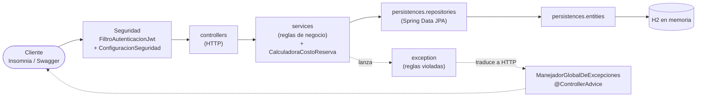

# 🧭 Solución paso a paso — Proyecto 01: CoWorkHub

Esta carpeta contiene la **solución completa del [enunciado](../enunciado.md)**, escrita
para que puedas **transcribirla y construirla vos mismo, fase por fase**, entendiendo qué
hace cada archivo y por qué. Si no lograste resolver el proyecto por tu cuenta, o te
bloqueaste en una parte, está pensada para ayudarte a retomar y mejorar.

> ⚠️ **Usala como ayuda, no como atajo.** El objetivo no es tener el proyecto terminado:
> es que aprendas a construirlo. Antes de abrir una fase, intentá resolverla solo; si te
> trabás, leé **solo esa fase**, cerrala y volvé a tu propio código.

## ✅ Está verificada

Todo el código de estas páginas salió de un proyecto que **compila, arranca y pasa las
pruebas de aceptación** (los 12 escenarios del enunciado, más casos límite, errores de
validación, seguridad por rol y concurrencia) contra **tres bases de datos reales: H2,
MySQL 8.4 y PostgreSQL 16**. Además, se reconstruyó el proyecto
siguiendo estas páginas *en el orden en que aparecen* y el resultado fue idéntico al
proyecto verificado. Si algo no te funciona, la causa está en una transcripción (un
`import`, un nombre, una llave), no en la guía: comparalo carácter por carácter.

## 🗺️ El recorrido

| # | Fase | Qué construís | Módulos | Verificás con |
|---|---|---|---|---|
| 0 | [Análisis](00-analisis.md) | Actores, glosario, diagrama ER, trazabilidad, supuestos | — | Tu documento vs. el de la guía |
| 1 | [Proyecto base](01-fase-1-proyecto-base.md) | Proyecto Maven, paquetes, **elección de la base (H2, MySQL o PostgreSQL)**, `Clock` y `PasswordEncoder` | 01, 02 | La aplicación arranca |
| 2 | [Modelo de datos](02-fase-2-modelo-de-datos.md) | 9 entidades, relaciones, 8 repositorios, datos iniciales en `data.sql` | 03, 04 | Tablas y datos en tu base (consola H2, `mysql` o `psql`) |
| 3a | [Catálogos](03a-fase-3-catalogos.md) | Excepciones, DTOs, servicios y controladores de catálogos | 05 | `curl` a `/api/sedes`, `/api/salas`… |
| 3b | [Miembros y disponibilidad](03b-fase-3-miembros.md) | Miembros con usuario, consumo mensual, disponibilidad | 05 | `curl` a miembros y disponibilidad |
| 3c | [Reservas](03c-fase-3-reservas.md) | Calculadora de costos, reglas RN-01…RN-10, reservas de ejemplo | 05 | Crear, servicios, confirmar, N+1 |
| 4 | [Excepciones](04-fase-4-excepciones.md) | `@ControllerAdvice` y cuerpo de error único | 07 | Todos los errores con su código |
| 5 | [Swagger](05-fase-5-swagger.md) | OpenAPI, `@Tag`, `@Operation`, `@Schema`, errores comunes | 06 | Swagger UI completa |
| 6 | [Seguridad con JWT](06-fase-6-seguridad-jwt.md) | Login, filtro JWT, roles y dueño del recurso | 08 | Matriz de permisos `401`/`403` |
| 7 | [Pruebas y README](07-pruebas-de-aceptacion-y-readme.md) | 12 escenarios, colección de Insomnia, `README.md` | todos | Los 12 escenarios |

Hacé **un commit al terminar cada fase** (cada documento sugiere el mensaje).

## 🧰 Cómo usar estas páginas

1. **Leé el objetivo** de la fase y mirá el **árbol de archivos**: los marcados con 🆕 se crean y los
   marcados con ✏️ se modifican en esa fase.
2. **Seguí los pasos en orden.** Cada bloque de código indica arriba su **ruta exacta**
   (`📄 src/main/java/...`): creá el archivo ahí. Si dice *(fragmento)*, no reemplaces el
   archivo entero: agregá o cambiá solo esas líneas, donde se indica.
3. **Escribí el código en vez de pegarlo.** Es más lento, pero te obliga a leer cada línea,
   y así aprendés. Tu IDE te ayudará con los `import` (en la mayoría de los IDE, `Alt+Enter`
   o `Ctrl+.` sobre el nombre en rojo).
4. **No avances sin pasar el checkpoint** (✅) de cada fase. Un error que no arreglás ahora
   se multiplica en las fases siguientes.
5. Al final de cada fase, **compará tu proyecto** con lo que dice la guía y hacé el commit.

## 🔑 Datos que vas a necesitar

| Dato | Valor |
|---|---|
| URL base | `http://localhost:8080` |
| Swagger UI | `http://localhost:8080/doc/swagger-ui.html` (desde la Fase 5) |
| Usuarios de prueba (desde la Fase 2) | `admin`/`admin123` · `recepcion`/`recep123` · `ana`/`ana123` · `luis`/`luis123` |
| Reloj para pruebas | `coworkhub.reloj.fijo=2030-06-03T08:00:00` en `application.properties` |
| Ejecutar | `mvn spring-boot:run` |
| Base de datos | **H2** por defecto (no hay que instalar nada). Opcionales: **MySQL** y **PostgreSQL** con `-Dspring-boot.run.profiles=mysql` o `=postgres` (ver el [paso 1.6](01-fase-1-proyecto-base.md#paso-16--elegir-la-base-de-datos-perfiles-h2-mysql-y-postgres)) |

## 📚 Convenciones de estas páginas

- 📄 marca la **ruta** de cada archivo. `(fragmento)` indica que es solo una parte.
- Los bloques `bash` con `curl` se pueden ejecutar en Linux, macOS o Git Bash; en
  Insomnia son las mismas solicitudes.
- Las respuestas JSON de ejemplo están **formateadas** para leerlas mejor; la API las
  devuelve en una sola línea. Los `timestamp` cambian en cada llamada.
- Cuando una respuesta trae más campos de los que interesan, se muestran solo los
  relevantes.
- Las fases 3 a 6 **modifican archivos de fases anteriores**; la guía te lo indica
  siempre con el nombre del archivo y qué cambiar.

## 🗃️ Índice de archivos por documento

| Documento | Archivos que se crean |
|---|---|
| [01-fase-1-proyecto-base.md](01-fase-1-proyecto-base.md) | `pom.xml` · `Main.java` · `application.properties` · `application-h2.properties` · `application-mysql.properties` · `application-postgres.properties` · `docker-compose.yml` · `config/ConfiguracionBeans.java` · `.gitignore` |
| [02-fase-2-modelo-de-datos.md](02-fase-2-modelo-de-datos.md) | `persistences/entities/TipoSala.java` · `persistences/entities/EstadoMiembro.java` · `persistences/entities/EstadoReserva.java` · `security/persistences/entities/Rol.java` · `persistences/entities/Sede.java` · `persistences/entities/Equipamiento.java` · `persistences/entities/Sala.java` · `persistences/entities/PlanMembresia.java` · `security/persistences/entities/Usuario.java` · `persistences/entities/Miembro.java` · `persistences/entities/ServicioAdicional.java` · `persistences/entities/Reserva.java` · `persistences/entities/DetalleReserva.java` · `persistences/repositories/RepositorioSedes.java` · `persistences/repositories/RepositorioEquipamientos.java` · `persistences/repositories/RepositorioServiciosAdicionales.java` · `persistences/repositories/RepositorioPlanes.java` · `persistences/repositories/RepositorioMiembros.java` · `persistences/repositories/RepositorioSalas.java` · `persistences/repositories/RepositorioReservas.java` · `security/persistences/repositories/RepositorioUsuarios.java` · `data.sql` |
| [03a-fase-3-catalogos.md](03a-fase-3-catalogos.md) | `exception/RecursoNoEncontradoException.java` · `exception/ReglaNegocioException.java` · `exception/SolicitudInvalidaException.java` · `dto/SolicitudSede.java` · `dto/SolicitudEquipamiento.java` · `dto/SolicitudServicioAdicional.java` · `dto/SolicitudPlan.java` · `dto/SolicitudSala.java` · `dto/SolicitudMiembro.java` · `dto/SolicitudActualizarMiembro.java` · `dto/ItemServicio.java` · `dto/SolicitudReserva.java` · `dto/ResumenConsumo.java` · `services/Validaciones.java` · `services/ServicioSedes.java` · `controllers/ControladorSedes.java` · `services/ServicioEquipamientos.java` · `controllers/ControladorEquipamientos.java` · `services/ServicioServiciosAdicionales.java` · `controllers/ControladorServiciosAdicionales.java` · `services/ServicioPlanes.java` · `controllers/ControladorPlanes.java` · `services/ServicioSalas.java` · `controllers/ControladorSalas.java` |
| [03b-fase-3-miembros.md](03b-fase-3-miembros.md) | `services/ServicioMiembros.java` · `services/ServicioConsumo.java` · `controllers/ControladorMiembros.java` · `services/ServicioDisponibilidad.java` · `controllers/ControladorDisponibilidad.java` |
| [03c-fase-3-reservas.md](03c-fase-3-reservas.md) | `services/CalculadoraCostoReserva.java` · `services/ServicioReservas.java` · `controllers/ControladorReservas.java` · `config/CargadorReservasDemo.java` |
| [04-fase-4-excepciones.md](04-fase-4-excepciones.md) | `exception/RespuestaError.java` · `exception/ManejadorGlobalDeExcepciones.java` |
| [05-fase-5-swagger.md](05-fase-5-swagger.md) | `config/ConfiguracionOpenApi.java` |
| [06-fase-6-seguridad-jwt.md](06-fase-6-seguridad-jwt.md) | `dto/SolicitudLogin.java` · `dto/RespuestaLogin.java` · `security/jwt/UtilJwt.java` · `security/services/ServicioDetallesUsuario.java` · `security/services/ServicioAutorizacion.java` · `security/jwt/FiltroAutenticacionJwt.java` · `security/config/PuntoEntradaJwt.java` · `security/config/ManejadorAccesoDenegado.java` · `security/config/Permisos.java` · `security/config/ConfiguracionSeguridad.java` · `security/controllers/ControladorAutenticacion.java` |

**Total: 78 archivos.**

## 🌲 El proyecto completo

Así queda el proyecto al terminar la Fase 7. Al comienzo de **cada fase** encontrarás este mismo
árbol tal como debe estar *hasta ese punto*, con los archivos de la fase marcados.

```text
📁 coworkhub
├── 📄 .gitignore                                              [fase 1]
├── 📄 docker-compose.yml                                      [fase 1]
├── 📄 pom.xml                                                 [fase 1]
├── 📄 README.md                                               [fase 7]
├── 📁 docs  (documentación del proyecto)
│   ├── 📄 analisis.md                                         [fase 0]
│   └── 📄 insomnia-coworkhub.json                             [fase 7]
├── 📁 src/main/java/com/coworkhub
│   ├── 📄 Main.java                                           [fase 1]
│   ├── 📁 config  (beans, datos de ejemplo y OpenAPI)
│   │   ├── 📄 CargadorReservasDemo.java                       [fase 3c]
│   │   ├── 📄 ConfiguracionBeans.java                         [fase 1]
│   │   └── 📄 ConfiguracionOpenApi.java                       [fase 5]
│   ├── 📁 controllers  (capa Controller, HTTP)
│   │   ├── 📄 ControladorDisponibilidad.java                  [fase 3b]
│   │   ├── 📄 ControladorEquipamientos.java                   [fase 3a]
│   │   ├── 📄 ControladorMiembros.java                        [fase 3b]
│   │   ├── 📄 ControladorPlanes.java                          [fase 3a]
│   │   ├── 📄 ControladorReservas.java                        [fase 3c]
│   │   ├── 📄 ControladorSalas.java                           [fase 3a]
│   │   ├── 📄 ControladorSedes.java                           [fase 3a]
│   │   └── 📄 ControladorServiciosAdicionales.java            [fase 3a]
│   ├── 📁 dto  (solicitudes y respuestas, en records)
│   │   ├── 📄 ItemServicio.java                               [fase 3a]
│   │   ├── 📄 RespuestaLogin.java                             [fase 6]
│   │   ├── 📄 ResumenConsumo.java                             [fase 3a]
│   │   ├── 📄 SolicitudActualizarMiembro.java                 [fase 3a]
│   │   ├── 📄 SolicitudEquipamiento.java                      [fase 3a]
│   │   ├── 📄 SolicitudLogin.java                             [fase 6]
│   │   ├── 📄 SolicitudMiembro.java                           [fase 3a]
│   │   ├── 📄 SolicitudPlan.java                              [fase 3a]
│   │   ├── 📄 SolicitudReserva.java                           [fase 3a]
│   │   ├── 📄 SolicitudSala.java                              [fase 3a]
│   │   ├── 📄 SolicitudSede.java                              [fase 3a]
│   │   └── 📄 SolicitudServicioAdicional.java                 [fase 3a]
│   ├── 📁 exception  (excepciones y manejador global)
│   │   ├── 📄 ManejadorGlobalDeExcepciones.java               [fase 4]
│   │   ├── 📄 RecursoNoEncontradoException.java               [fase 3a]
│   │   ├── 📄 ReglaNegocioException.java                      [fase 3a]
│   │   ├── 📄 RespuestaError.java                             [fase 4]
│   │   └── 📄 SolicitudInvalidaException.java                 [fase 3a]
│   ├── 📁 persistences  (capa Persistence)
│   │   ├── 📁 entities  (clases @Entity)
│   │   │   ├── 📄 DetalleReserva.java                         [fase 2]
│   │   │   ├── 📄 Equipamiento.java                           [fase 2]
│   │   │   ├── 📄 EstadoMiembro.java                          [fase 2]
│   │   │   ├── 📄 EstadoReserva.java                          [fase 2]
│   │   │   ├── 📄 Miembro.java                                [fase 2]
│   │   │   ├── 📄 PlanMembresia.java                          [fase 2]
│   │   │   ├── 📄 Reserva.java                                [fase 2]
│   │   │   ├── 📄 Sala.java                                   [fase 2]
│   │   │   ├── 📄 Sede.java                                   [fase 2]
│   │   │   ├── 📄 ServicioAdicional.java                      [fase 2]
│   │   │   └── 📄 TipoSala.java                               [fase 2]
│   │   └── 📁 repositories  (interfaces JpaRepository)
│   │       ├── 📄 RepositorioEquipamientos.java               [fase 2]
│   │       ├── 📄 RepositorioMiembros.java                    [fase 2]
│   │       ├── 📄 RepositorioPlanes.java                      [fase 2]
│   │       ├── 📄 RepositorioReservas.java                    [fase 2]
│   │       ├── 📄 RepositorioSalas.java                       [fase 2]
│   │       ├── 📄 RepositorioSedes.java                       [fase 2]
│   │       └── 📄 RepositorioServiciosAdicionales.java        [fase 2]
│   ├── 📁 security  (autenticación y autorización)
│   │   ├── 📁 config  (reglas de seguridad)
│   │   │   ├── 📄 ConfiguracionSeguridad.java                 [fase 6]
│   │   │   ├── 📄 ManejadorAccesoDenegado.java                [fase 6]
│   │   │   ├── 📄 Permisos.java                               [fase 6]
│   │   │   └── 📄 PuntoEntradaJwt.java                        [fase 6]
│   │   ├── 📁 controllers  (login)
│   │   │   └── 📄 ControladorAutenticacion.java               [fase 6]
│   │   ├── 📁 jwt  (tokens y filtro)
│   │   │   ├── 📄 FiltroAutenticacionJwt.java                 [fase 6]
│   │   │   └── 📄 UtilJwt.java                                [fase 6]
│   │   ├── 📁 persistences  (capa Persistence de seguridad)
│   │   │   ├── 📁 entities  (Usuario y Rol)
│   │   │   │   ├── 📄 Rol.java                                [fase 2]
│   │   │   │   └── 📄 Usuario.java                            [fase 2]
│   │   │   └── 📁 repositories  (RepositorioUsuarios)
│   │   │       └── 📄 RepositorioUsuarios.java                [fase 2]
│   │   └── 📁 services  (usuarios y permisos)
│   │       ├── 📄 ServicioAutorizacion.java                   [fase 6]
│   │       └── 📄 ServicioDetallesUsuario.java                [fase 6]
│   └── 📁 services  (capa Service, reglas de negocio)
│       ├── 📄 CalculadoraCostoReserva.java                    [fase 3c]
│       ├── 📄 ServicioConsumo.java                            [fase 3b]
│       ├── 📄 ServicioDisponibilidad.java                     [fase 3b]
│       ├── 📄 ServicioEquipamientos.java                      [fase 3a]
│       ├── 📄 ServicioMiembros.java                           [fase 3b]
│       ├── 📄 ServicioPlanes.java                             [fase 3a]
│       ├── 📄 ServicioReservas.java                           [fase 3c]
│       ├── 📄 ServicioSalas.java                              [fase 3a]
│       ├── 📄 ServicioSedes.java                              [fase 3a]
│       ├── 📄 ServicioServiciosAdicionales.java               [fase 3a]
│       └── 📄 Validaciones.java                               [fase 3a]
└── 📁 src/main/resources
    ├── 📄 application-h2.properties                           [fase 1]
    ├── 📄 application-mysql.properties                        [fase 1]
    ├── 📄 application-postgres.properties                     [fase 1]
    ├── 📄 application.properties                              [fase 1]
    └── 📄 data.sql                                            [fase 2]
```

Entre corchetes, la fase en la que se crea cada archivo (`0` = análisis, `3a`, `3b` y `3c` = partes de la Fase 3).

## 🏗️ Vista de la arquitectura final



Un controlador **nunca** usa un repositorio; un servicio **nunca** conoce HTTP.

**Empezá por →** [Fase 0 — Análisis](00-analisis.md)
